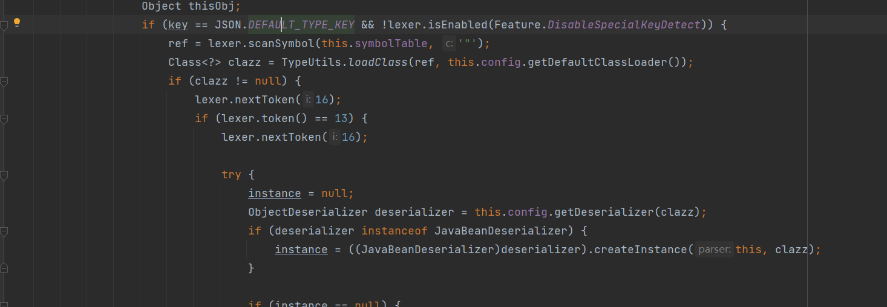

### fastjson RCE 原理分析

#### 环境配置

这里我们用最早的漏洞版本，1.2.24，jdk 版本任意。

#### 漏洞分析

我们先来看下 fastjson 的最普通用法。

就是解析一个字符串为 json 格式，所以一个 json 解析库为什么会有命令执行的问题？究其原因是 fastjson 是支持解析类对象的。

可以看到，我们可以把一个字符串当作一个指定类来进行解析，对他进行赋值，同时还能调用它的方法，到这里还是没有问题的，因为我们只能解析指定的类。但是 fastjson 还支持另一种方式。

我们可以指定字符串的处理类，并且在这个过程中调用了类的构造函数，而且可以调用的更多的方法，所有的 set，get 方法都被调用过了。这里就暴露了很多安全问题。接下来我们看看具体过程。

下断点，第一步来到了 parseObject 方法，可以看到它接受一个我们穿的字符串并解析。跟进一下 parse 方法。

这里 new 了一个解析器，下一步就是核心逻辑了 parse()，前面有一大堆解析的过程，我们就不看了。

这里他会判断解析出来的 key 是不是 @type，然后做对应的类加载，然后又是一大串的解析过程。

我们直接来看最后的反序列化过程。

