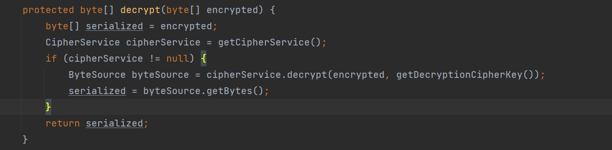

### shiro 550 反序列化漏洞

#### 环境搭建

```
git clone https://github.com/apache/shiro.git
cd shiro
git checkout shiro-root-1.2.4
```
打开 shiro/samples/web 项目，编辑 pom.xml ，将 jstl 的版本改成 1.2，默认是没有这个版本的。


配置一下 tomcat，即可配置好环境。


尝试登陆，选择 rememberMe。


就会返回我们一个 cookie ，接下来每次就会带上这个 cookie，这个 cookie 这么长，明显是使用了某个技术存储了一定信息。全局搜索一下可以找到这么一个文件。


这个类明显是用来管理 rememberme 功能的。可以看下它是怎么处理 rememberme 的。


先做了 base64 的解码，我们往前找一下哪里调用了这个方法。


我们跟进看一下 convertBytesToPrincipals。


我们就来到了解密的地方，最后返回一个序列化的东西。我们先跟一下反序列化的地方。


可以看到就是个原生的序列化过程，如果它有依赖库比如说 CC，我们就可以尝试使用 CC 链进行攻击。我们再跟下解密的地方。



先执行 getCipherService，然后来到 decrypt 。


可以看到这是一个接口，两个参数，一个就是被加密的数据了，一个是加密用的密钥，也就是说这是一个对称加密。那我们如果能获取到 key，那么我们就可以构造一个数据包了，那我们跟进一下 getDecryptionCipherKey 。


可以看到它返回了一个常量，我们一路跟上去，最后来到了这。


我们跟一下变量赋值的地方。


可以看到，key 是一个常量，也就是说 shiro 1.24 这个版本下跟有关 rememberme 有关的功能使用的 key 都是固定的，也就是说，只要我们构造一个恶意的反序列化包，然后使用固定的 key 进行 AES 加密，即可攻击服务。

有一个点需要注意，那就是虽然 shiro 自带一个有漏洞版本的 CC 包。


但是它是一个 test 包，也就是说如果你在真实环境下是打不到的，真正能打的是 shiro 自带的CB 包。


