### 使用 ROP 绕过 DEP

数据执行保护 (DEP) 作为一种保护机制，使部分内存不可执行，因此尝试在堆栈上执行指令的攻击将导致异常。但是网络安全研究人员已经找到绕过它的方法。

尽管 Windows 具有其他保护机制来保护系统免受类似攻击场景的影响，但对于网络安全爱好者来说，及时了解可用于绕过这些保护机制的各种技术是有益的。

前提条件

1. 理解缓冲区溢出漏洞利用开发
2. 一些汇编语言的知识

用到工具

- 安装了 mona 的 Immunity Debugger
- windows 虚拟机
- kali
- 一个漏洞程序

绕过 DEP 的最简单方法是使用（Return-Oriented Programming）面向返回的编程。它也可以用来绕过代码签名。

ROP 背后的主要思想是控制堆栈，以进一步将来自内存中子程序的机器指令链接在一起。

这些现有的汇编代码被称为 gadgets ，每个都以返回指令（RET）结束，然后指向下一个gadgets ，因此命名为 ROP 链。

我们可以将这些小工具链接在一起来开发我们的 shellcode，但这需要花费大量的时间和精力，所以聪明的方法是要么在运行时禁用 DEP，要么在内存中分配一些不受 DEP 保护的空间，我们可以在其中放置我们的 shellcode。

由于我们正在执行系统内存中已经可用的指令，因此基本的要求是熟悉 Windows 中可以用来绕过 DEP 的 API。

下表列出了可用于实现此目的的 API 及其功能

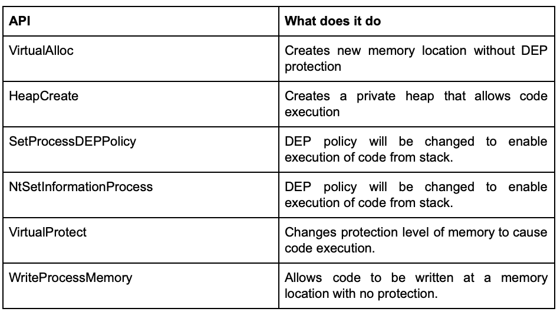)

可以开发 ROP 链来使用上述任何功能，前提是它可用于受害机器的 Windows 版本。

听起来很复杂吧？这要归功于 mona 的作者。他使这件事情变得简单。

#### 攻击环境

##### 打开DEP

虽然默认情况下已经启用了 DEP，但为了确认，让我们检查它是否已打开。

导航至：Control Panel -> System and Security -> System -> Advanced System Settings

选择“为除我选择的程序和服务之外的所有程序和服务启用 DEP”

选择 Apply 和 Okay 并重新启动系统。

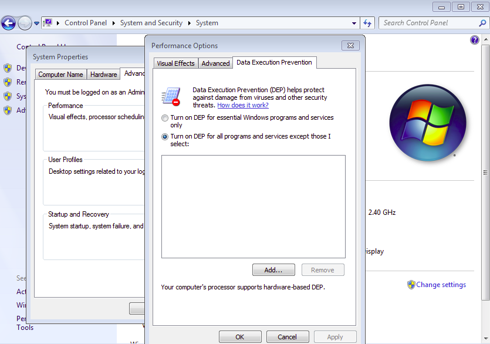)

##### 设置漏洞利用开发环境

具有基于堆栈的缓冲区溢出漏洞利用开发经验的人会熟悉这些步骤。

1. 启动测试 Windows 机器，我们将在其中调试易受攻击的程序并开发我们功能齐全的漏洞利用程序。
2. 确保易受攻击的应用程序已安装并正常运行。
3. 确保 Immunity 调试器正常工作，并且 mona.py 存在于 Immunity Debugger Application 的 PyCommands 文件夹中。

##### 找到偏移量

现在一切都已启动并运行，让我们进入有趣的部分——漏洞利用开发过程。

我们正在使用的应用程序称为 vulnserver，顾名思义，它是易受攻击的。

在 vulnserver 中发现 TRUN 命令容易受到基于堆栈的缓冲区溢出的影响，通俗地说，就是当通过 TRUN 命令发送一个程序无法处理的长输入字符串时，程序将崩溃。更专业一点，因为程序对它可以接收的输入长度没有进行限制，所以内存空间（缓冲区）和 EIP（指令指针）被覆盖

为了验证这一点，让我们从攻击者机器发送一个字符串 3000 到应用程序，以验证。

```python
#!/usr/bin/python
import socket,sys
host=”192.168.2.135"
port=9999

buffer = “TRUN /.:/” + “A” * 3000
expl = socket.socket(socket.AF_INET, socket.SOCK_STREAM)
expl.connect((host, port))
expl.send(buffer)
expl.close()
```

正如预期的那样，应用程序崩溃了

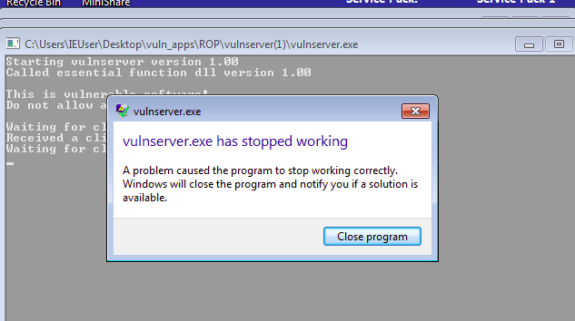)

在将程序附加到 Immunity Debugger 并运行相同的脚本时，我们可以看到 EIP 被四个（指令长度）41 覆盖，这是 A 的十六进制。

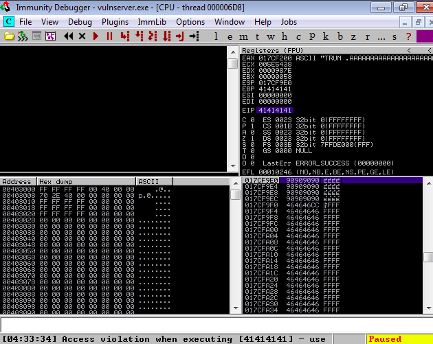)

我们的目标是控制 EIP 并将其指向我们的 shellcode 所在的位置。

为此，我们的目标是能够覆写 EIP 的字符串长度（偏移量）。

我们将利用 metasploit 的脚本来解决这个问题。在kali终端中运行以下命令生成长度为3000的随机字符串

```
/usr/share/metasploit-framework/tools/pattern_create.rb -l 3000
```

现在，我们将发送这个相同长度的随机字符串，而不是发送用于使程序崩溃的 AAA，并找出在 EIP 中的字符。

我们从 Immunity Debugger (Debugger->Restart) 重新启动应用程序，并从攻击者机器上运行以下脚本。

程序将再次崩溃，但这次 EIP 将被我们从攻击者机器发送的随机字符串的一部分覆盖。

在我们的例子中是 396F4338

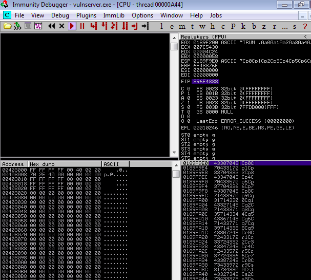)

我们将再次使用 metasploit 来计算确切的偏移量。

从 Kali 终端运行以下命令

```bash
/usr/share/metasploit-framework/tools/pattern_offset.rb -q 386f4338 -l 3000
```

输出将告诉我们偏移量，使我们能够在 EIP 中写入我们想要的任何内容。

对于 vulnserver，它是 2006。这意味着在 2006 个字符之后，接下来的四个字符会覆盖 EIP。

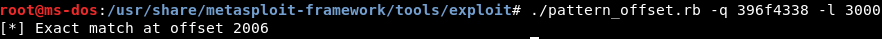)

现在我们将发送给受害者的有效负载将类似于缓冲区溢出的有效负载。

```python
padding = ‘F’ * (3000–2006–4 — len(padding))
prefix = A*2006
attack = prefix + ‘\x42\x42\x42\x42’+padding
```

例如，在发送上述有效负载时，EIP 将被四个 B(\x42) 覆盖，如下所示。padding 将确保有效负载长度为 3000。

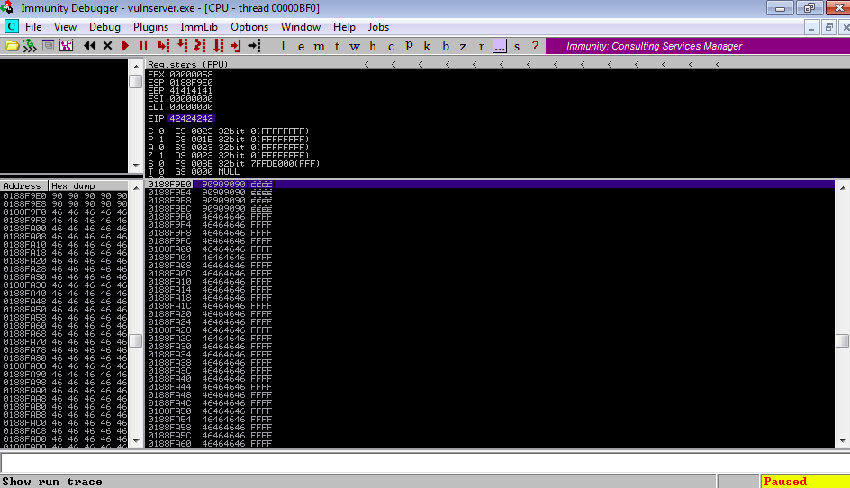)

##### 开发 ROP chain

现在我们已经控制了 EIP，我们将它指向我们接下来要执行的任何指令的地址。对于正常的缓冲区溢出，EIP 将指向一条 JUMP 指令，该指令将进一步跳转到堆栈中存在的 shellcode，从而为我们从受害系统返回一个 shell。

但是在打开 DEP 的情况下，每当漏洞利用尝试执行堆栈中的某些指令时，就会发生访问冲突，因此正常的缓冲区溢出漏洞利用现在是无用的。

为了绕过这个，我们将构建 ROP 链。

虽然整个 ROP 概念一开始听上去让人不知所措，但实际执行过程并不难。

我们只需要从 Immunity Debugger 指令栏运行以下命令。

```
!mona rop -m *.dll -cp nonul
```

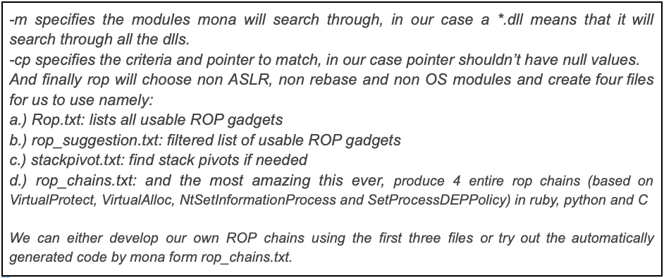)

然后等待该过程结束，大约需要 3 分钟。与此同时，Mona 将检查所有 dll (*.dll) 并构建一系列可用的 gadgets。

我们将使用 rop_chains.txt 中的 VirtualProtect() 的 python 代码并进行利用。

但在继续我们准备使用的代码之前，让我们暂停一下，尝试了解到底发生了什么。

VirtualProtect() 将关闭部分内存的 DEP，因此放置在该部分内存中的代码可以执行

VirtualProtect() 需要五个参数

* IpAddress：指向必须关闭 DEP 的区域，这将是堆栈上的 shell 代码的基地址
* dwsize：关闭 DEP 的区域大小
* flNewProtect：将保护级别更改为的 Memory protection constant
* ReturnAddress：指向 VirtualProtect() 执行后将返回的位置的指针，即我们的 shellcode。

现在，ROP gadgets 将用于实现 VirtualProtect() 函数需要的上述参数，根据需要设置值并执行函数。

让我们看一下 mona 生成的 ROP 函数，并尝试了解它是如何工作的。

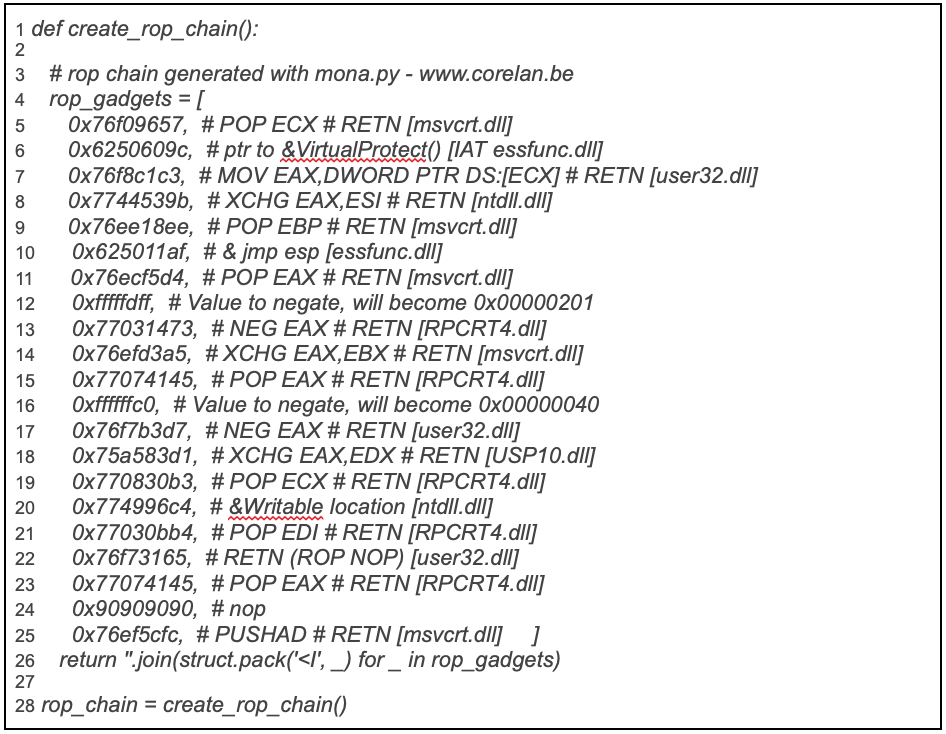)

第 11、12、13、14 行 — 0X201 的 dwSize 被放入 EAX，然后转移到 EBX。

第 15、16、17、18 行 — 将 Memory Protection constant0x40（读写权限）放入 EAX，然后转移到 EDX 用于 flNewProtect。

第 19,20 行 — 在 ECX 中为 IpflOldProtect 设置了指向可写位置的指针。

第 7,8 和 21,22 行 — 填充 ESI 和 EDI 以执行 PUSHAD 调用。

第 9,10 行 — EBP 设置为跳转指令，用于 ReturnAddress。

第 5 行和第 6 行——ECX 被设置为调用 VirtualProtect()

第 23,24,25 行——最后在 EAX 中放置了一个 PUSHAD 调用，这会将放入寄存器中的所有值刷新到堆栈中。

现在我们的代码已经准备好了，让我们尝试在受害机器上执行一些恶意代码。

让我们试着打开一个计算器。 我们将恶意代码与 ROP 链一起放入我们的漏洞利用中。

接着是 mona 生成的ROP函数的声明，然后我们调用 create_rop_chain 函数，去掉坏字符（\x00 for vulnserver）并存入变量 rop_chain 。

现在我们已经声明了所有重要的东西，我们只需要拼凑我们的有效载荷并将其发送到受害机器。

```python
padding = ‘F’ * (3000–2006–16 — len(shellcode))
attack = prefix + rop_chain +nops + calc + padding
```

我们 prefix 是 A*2006，所以 EIP 将指向 ROP 链码。 ROP 链代码将执行 VirtualProtect() API，该 API 会分配一块关闭 DEP 的内存，我们将在其中放置恶意代码。

我们将恶意代码附加到 nops 并在末尾添加填充以确保有效负载长度为 3000。

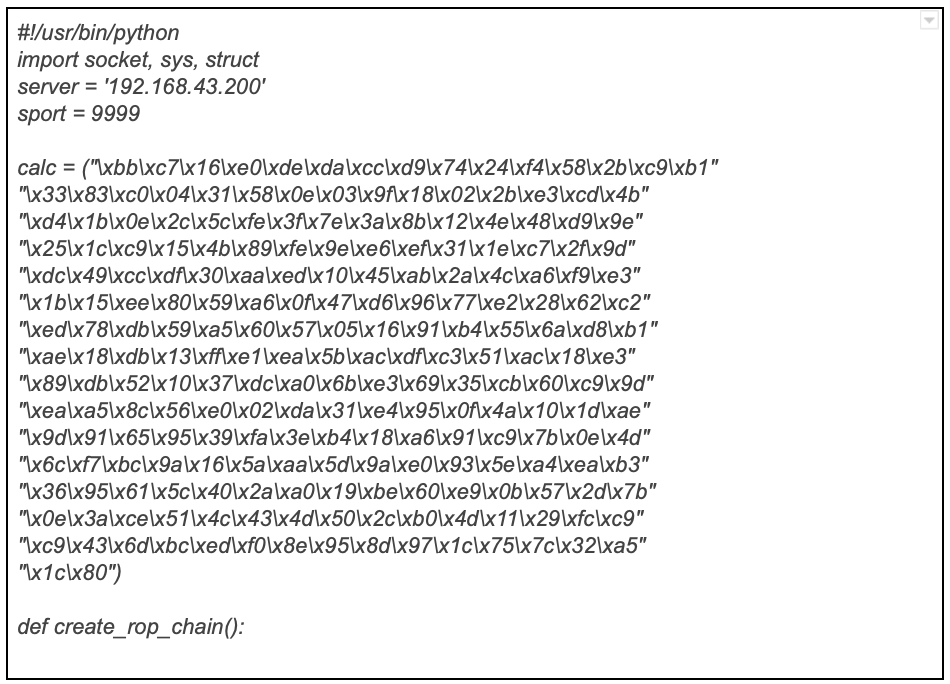)

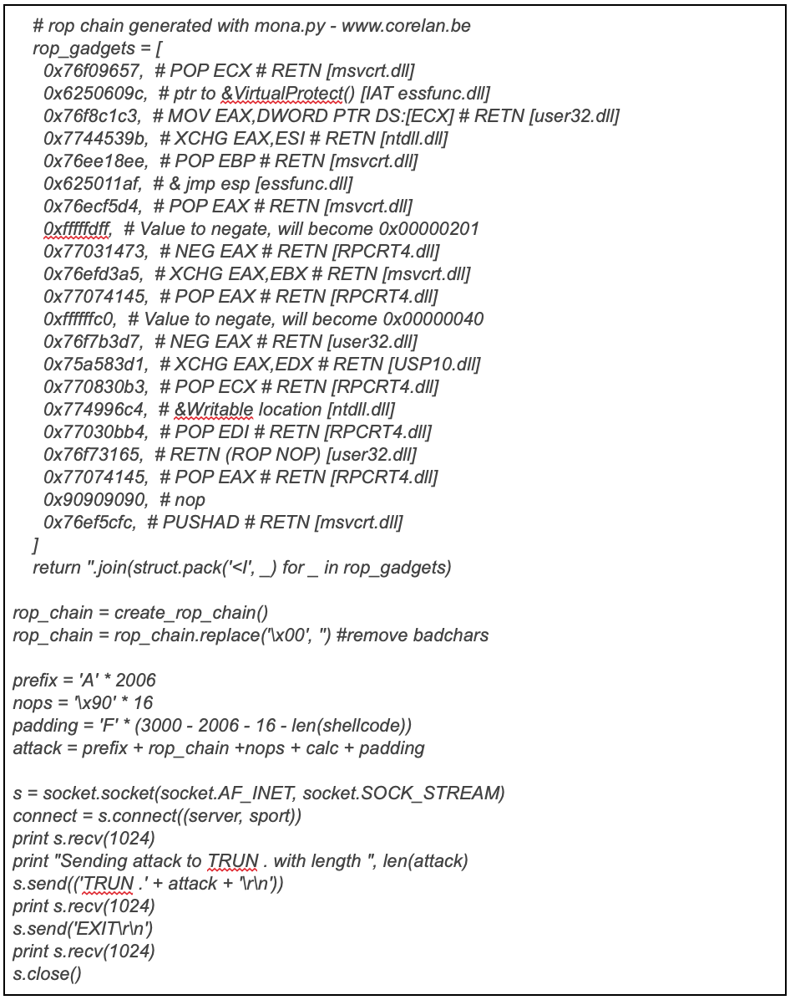)

然后我们发送漏洞利用，计算器将在受害者 Windows 机器中打开。

因此，我们的漏洞利用成功绕过 DEP 并在受害机器上执行命令。

